# Mybatis-Plus（三）批量插入功能（上篇）SQL 注入器功能的实现与分析
- - -
## 前言
### 关于 SQL 注入器
在上篇研究多租户插件功能的时候注意到这个功能，所以想要看看这个功能的作用。去找了官方文档和 Demo 来看，结合框架中的代码实现，是用来做批量插入功能，主要应用场景应该是数据导入。

> <br>


如果是用来做批量插入的话，以前一般用这个功能我都是通过MP中 `service.saveBatch()` 方法实现，所以一开始不理解为什么要用这个注入器。

（But，注入器只在框架 V3.5.0 版本以及以前的旧版本中有，新的版本 V4.X 都用回了原生的 `service.saveBatch()` 方法，当然也有不同的地方，至于原因还有改动的地方我打算方法下一篇文章再作详细说明。）

后面在群里向 [狮子大佬](https://blog.csdn.net/weixin_40461281) 讨教了一下，他的回答也证实了上面 Demo 说明中的用法：

> 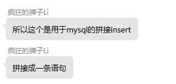<br>


所以这篇文章主要来分析下这个 SQL 注入器在框架中的实现。

## 参考目录
- [MP官方文档 - SQL注入器](https://baomidou.com/pages/42ea4a/)
- [MP官方 Demo](https://gitee.com/baomidou/mybatis-plus-samples/blob/master/mybatis-plus-sample-deluxe/README.md)

## SQL 注入器的代码实现
按照官方文档的说明，主要是以下几个步骤：

1. 定义 SQL<br>
   `InsertAll`<br>
   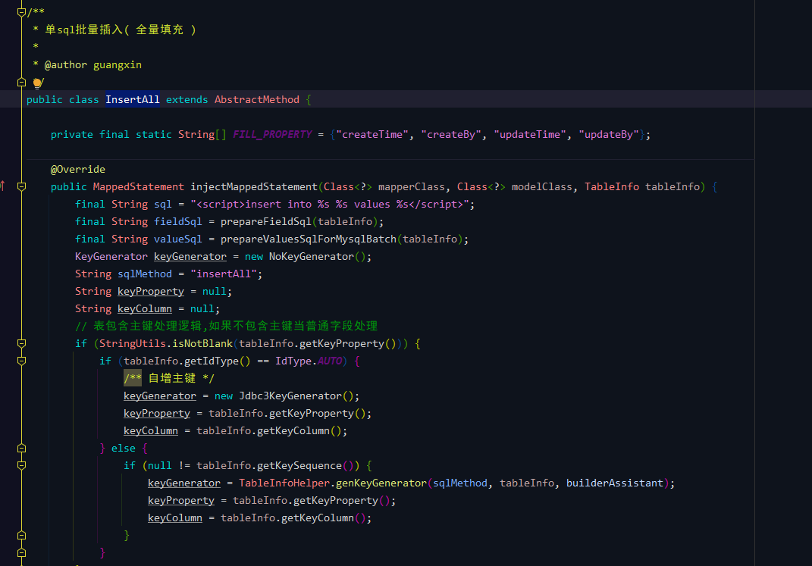

2. 注册自定义方法<br>
   `MybatisPlusConfig#sqlInjector`<br>
   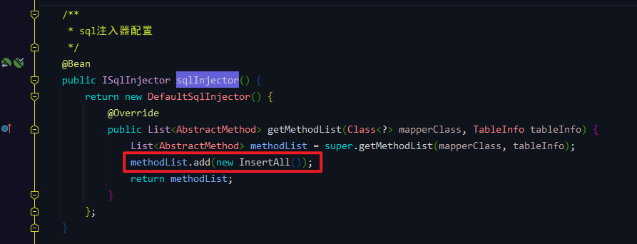

3. 把方法定义到 `BaseMapper`<br>
   `BaseMapperPlus`<br>
   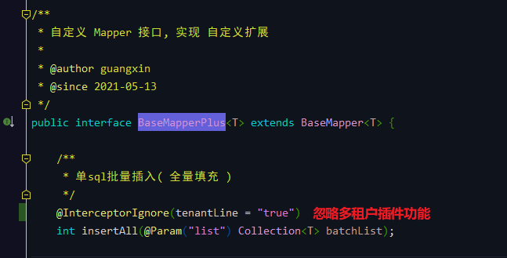
   在这个版本 V3.5.0 中我引入了多租户插件，所以加上注解 `@InterceptorIgnore(tenantLine = "true")` 代表忽略插件功能，否则执行会报错。

## SQL 注入器测试
### 测试方法
`TestBatchController#add`<br>
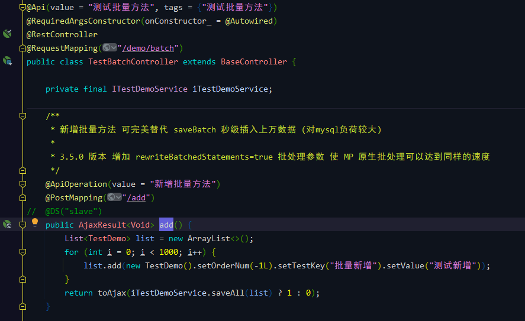

`ServicePlusImpl#saveAll`<br>
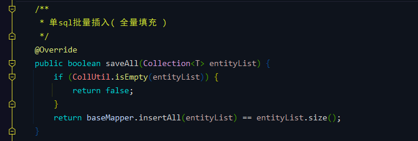
### Debug & 测试结果


循环生成的集合：<br>
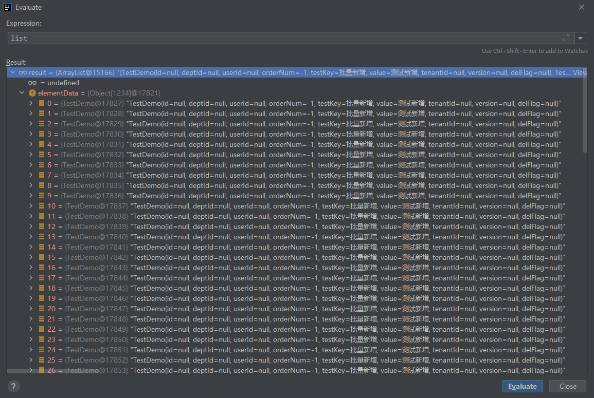


控制台打印结果（太长了没有完全截完）：<br>
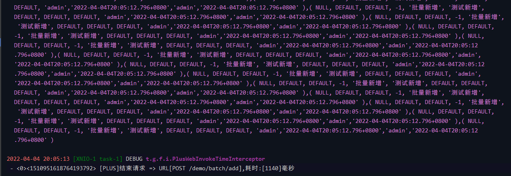

放到 MySQL console 优化一下执行代码如下（只截取前三条，内容都是一样的）：<br>


从这里可以看出来，SQL 执行就是按照前面所说将所有需要插入的数据拼接成一条来执行。

数据库表数据：<br>
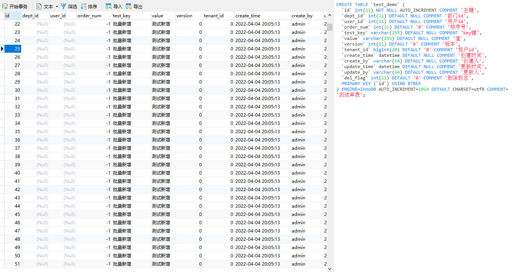

至此功能测试完成。<br>

我一开始以为这个拼接功能是会在代码执行中去拼接，试了几次，打了断点到 `InsertAll` 的方法里面都没有进到断点，后面重启代码的时候才发现是一开始就注册到了容器中，所以下面就看看注册的时候主要是干了什么。

## SQL 注入器的注册
`InsertAll` 继承了 `AbstractMethod`，重写了 `injectMappedStatement` 方法，翻译过来就是注入映射语句，下面还有两个方法 `prepareFieldSql` （准备字段 SQL）和 `prepareValuesSqlForMysqlBatch`（为 Mysql Batch 准备 Values SQL）。

`injectMappedStatement`<br>
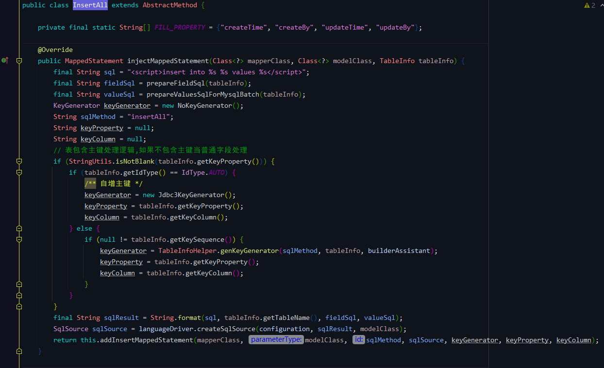

`prepareFieldSql`<br>


`prepareValuesSqlForMysqlBatch`<br>
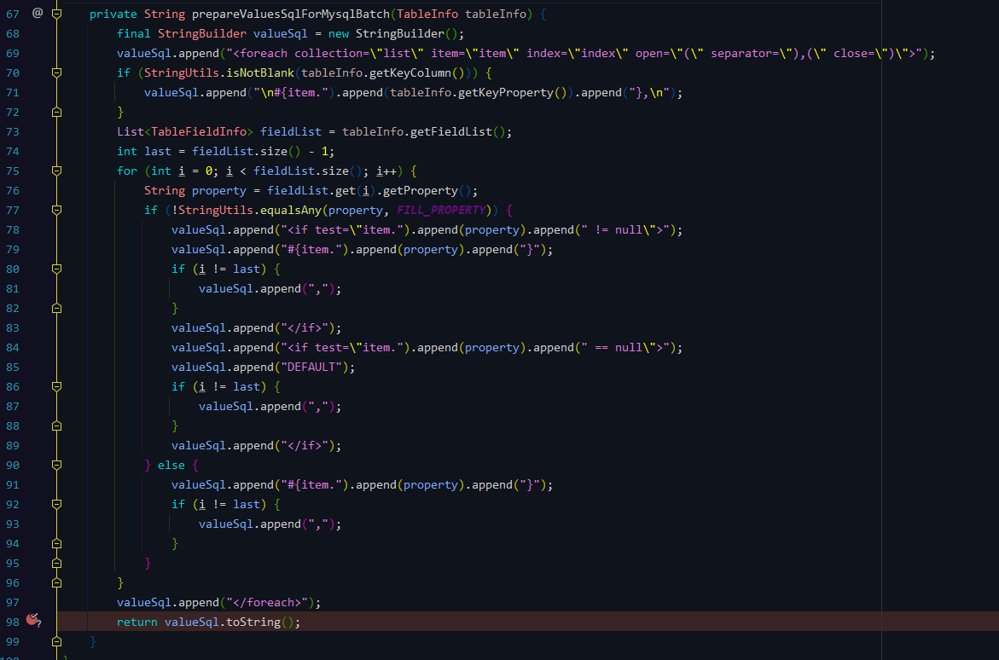

在两个子方法中我都打了 Debug，并且带有条件，因为所有数据库表在注册的时候都会调用这个方法。

条件如下（只看表 `test_demo`）：<br>
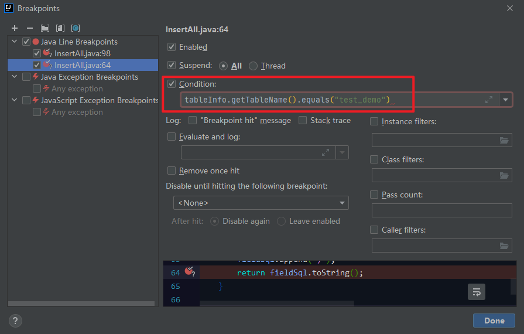
### `prepareFieldSql`


`prepareFieldSql`  最终的输出结果：
```
// fieldSql:
(id,dept_id,user_id,order_num,test_key,value,tenant_id,version,del_flag,create_by,create_time,update_by,update_time)
```
### `prepareValuesSqlForMysqlBatch`
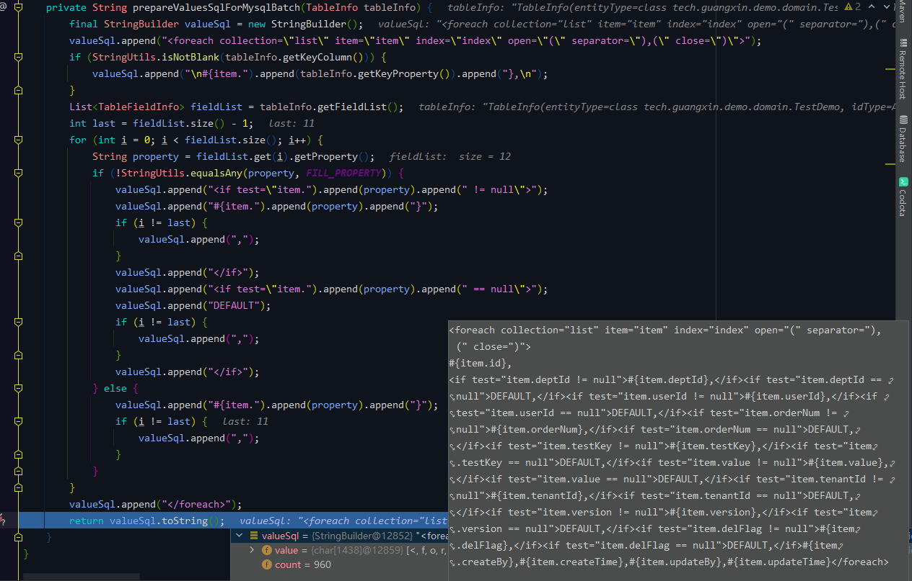

`prepareValuesSqlForMysqlBatch` 最终的输出结果（格式化后）：
```xml
<!-- fieldSql -->
<foreach collection="list" item="item" index="index" open="(" separator="),(" close=")">
	#{item.id},
	<if test="item.deptId != null">#{item.deptId},</if>
	<if test="item.deptId == null">DEFAULT,</if>
	<if test="item.userId != null">#{item.userId},</if>
	<if test="item.userId == null">DEFAULT,</if>
	<if test="item.orderNum != null">#{item.orderNum},</if>
	<if test="item.orderNum == null">DEFAULT,</if>
	<if test="item.testKey != null">#{item.testKey},</if>
	<if test="item.testKey == null">DEFAULT,</if>
	<if test="item.value != null">#{item.value},</if>
	<if test="item.value == null">DEFAULT,</if>
	<if test="item.tenantId != null">#{item.tenantId},</if>
	<if test="item.tenantId == null">DEFAULT,</if>
	<if test="item.version != null">#{item.version},</if>
	<if test="item.version == null">DEFAULT,</if>
	<if test="item.delFlag != null">#{item.delFlag},</if>
	<if test="item.delFlag == null">DEFAULT,</if>
	#{item.createBy},
	#{item.createTime},
	#{item.updateBy},
	#{item.updateTime}
</foreach>
```
### `injectMappedStatement`
解析完 SQL 后处理主键：<br>
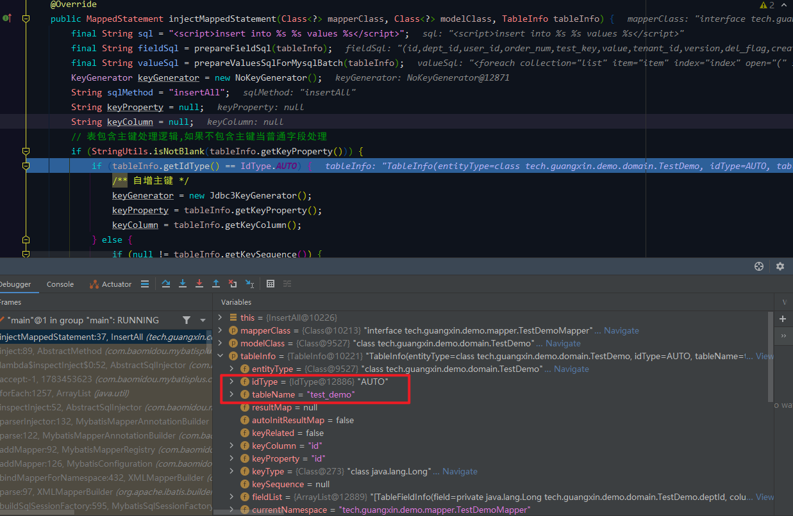

继续往下执行，可以看到 `sqlSource` 对象保存了拼接的节点参数：<br>
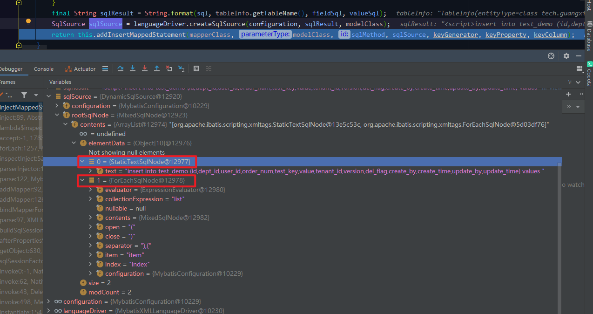

最后方法执行完成的参数：<br>


`sqlResult` 参数（格式化后）：

```xml
<!-- sqlResult -->
<script>
	insert into test_demo(id, dept_id, user_id, order_num, test_key, value, tenant_id, version, del_flag, create_by,
		create_time, update_by, update_time) values 
	<foreach collection = "list" item = "item" index = "index" open = "(" separator = "),(" close = ")">
		#{item.id}, 
		<if test="item.deptId != null">#{item.deptId},</if>
		<if test="item.deptId == null">DEFAULT,</if> 
		<if test= "item.userId != null">#{item.userId},</if>
		<if test="item.userId == null">DEFAULT,</if>
		<if test= "item.orderNum != null">#{item.orderNum},</if>
		<if test="item.orderNum == null">DEFAULT,</if> 
		<if test= "item.testKey != null">#{item.testKey},</if>
		<if test="item.testKey == null">DEFAULT,</if> 
		<if test= "item.value != null">#{item.value},</if>
		<if test="item.value == null">DEFAULT,</if> 
		<if test= "item.tenantId != null">#{item.tenantId},</if>
		<if test="item.tenantId == null">DEFAULT,</if> 
		<if test= "item.version != null">#{item.version},</if>
		<if test="item.version == null">DEFAULT,</if> 
		<if test= "item.delFlag != null">#{item.delFlag},</if>
		<if test="item.delFlag == null">DEFAULT,</if> 
		#{item.createBy}, 
		#{item.createTime}, 
		#{item.updateBy}, 
		#{item.updateTime} 
	</foreach>
</script>
```
这就是最终的 SQL 批量插入语句。

至此完成了 SQL 注入器的注册。

在测试方法执行时很无奈没有找到底层这个注入映射语句是怎么去替换的，所以就没有放底层的源码出来，如果有大神知道的话欢迎在评论指点一二，感谢~