# Mybatis-Plus（四）批量插入功能（中篇）saveBatch 实现与分析

## 前言
承接上篇，继续聊聊批量插入功能。

其实这个功能本身不算太难，所以本文会对比一下框架 V3.5.0 以及 V4.0.1 两个版本之间的差异。

## 参考目录
- [MP官方文档 - Service CRUD 接口](https://baomidou.com/pages/49cc81/#service-crud-%E6%8E%A5%E5%8F%A3)

## 批量插入功能的代码实现
参照官方文档： 
> 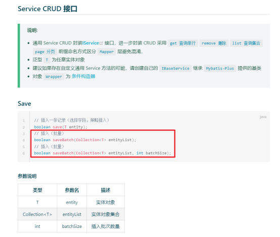

以框架中 `TestDemo` 为例。
### V3.X 版本使用

1. 实现类中继承 `ServicePlusImpl`（`IServicePlus` 实现类） 
   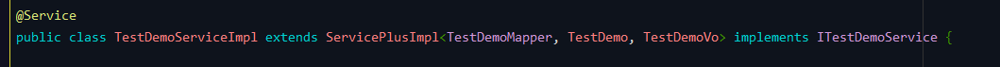 
   这一步一般是框架中使用代码生成功能时就会做好，如果是自己添加的实现类也是继承相应类即可。
2. 调用方法 `service.saveBatch`
   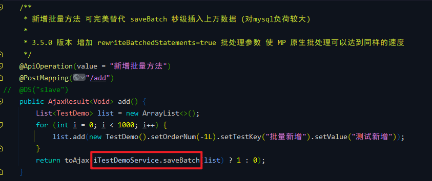
### V4.X 版本使用
1. Mapper 继承 `BaseMapperPlus`
   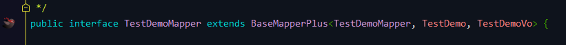 
   这一步同样是框架中使用代码生成功能时就会做好。
2. 调用方法 `mapper.insertBatch`
   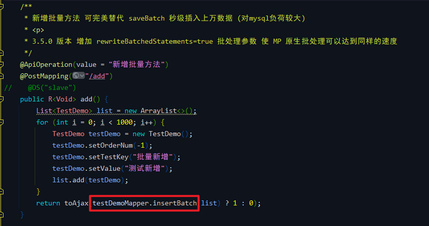

### Debug & 测试结果（V4.X）
`BaseMapperPlus#insertBatch` 
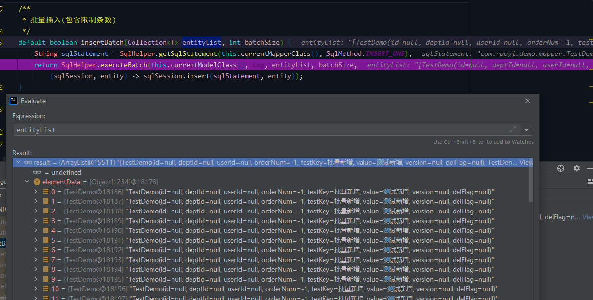

`SqlHelper#executeBatch` 
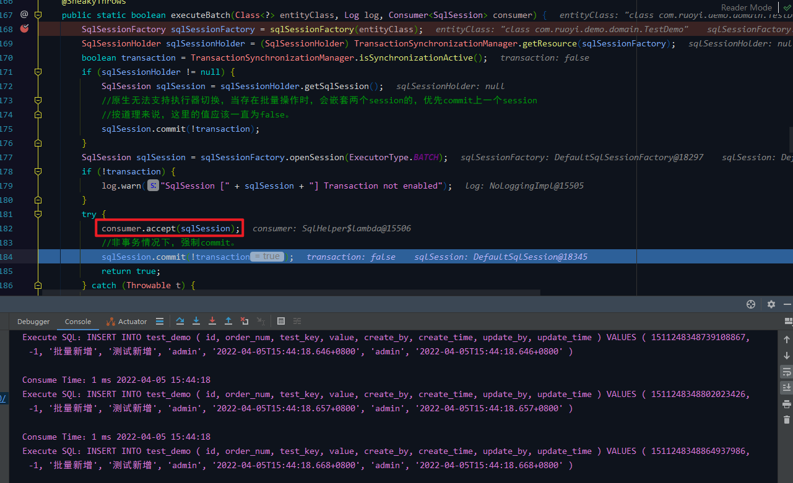

可以看到控制台的输出是单条的，注意这里是一个 sqlSession 完成所有插入，并不是 1000 个sqlSession 来执行。

数据库表数据： 
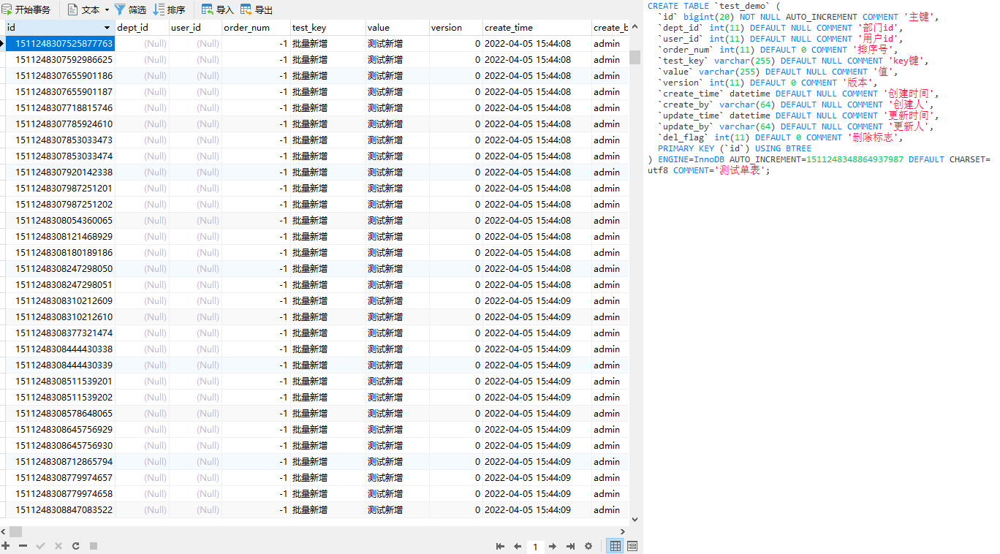

至此功能测试完成。

因为底层执行流程一样，所以 V3.X 版本就不再赘述了。

## 批量插入功能的调用流程分析
### ##、流程简图（重点）
因为是不同版本对比进行说明，所以画了简图方便说明。 
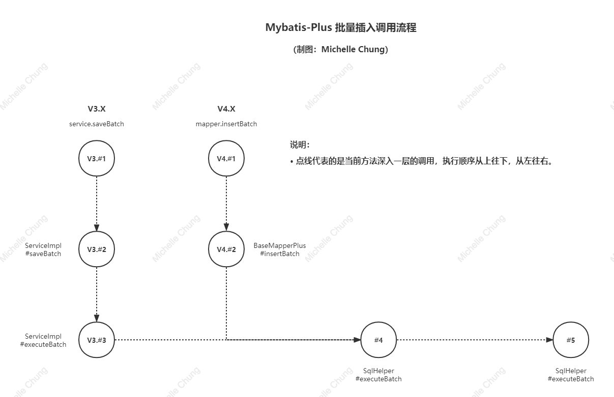
### ##、版本差异及其原因
`Service` 差异： 
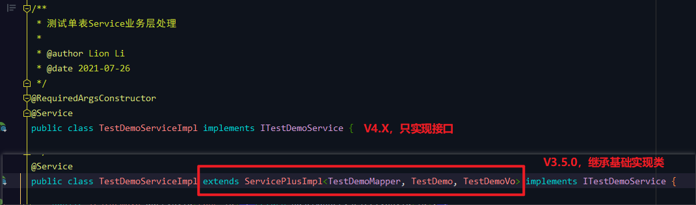

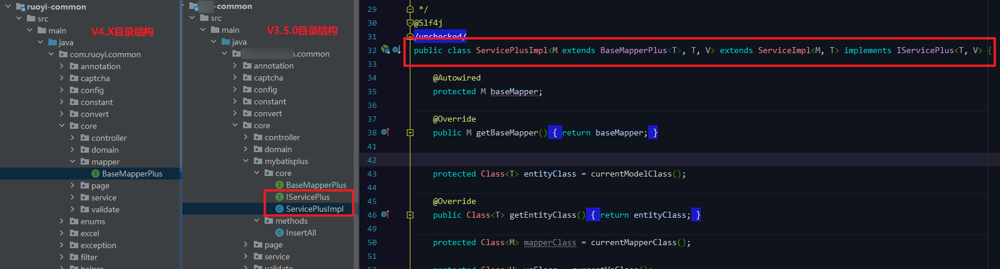

差异原因： 

从上面简图可以看出来，底层的调用流程并不复杂，并且底层方法都是一样的，在群里 [狮子大佬](https://blog.csdn.net/weixin_40461281) 也说过：

> 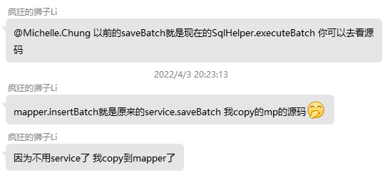

至于为什么不用 Service 的而要重新写到 Mapper 中，在框架更新日志中可以找到答案：

> 

### V3.#2、`ServicePlusImpl#saveBatch`
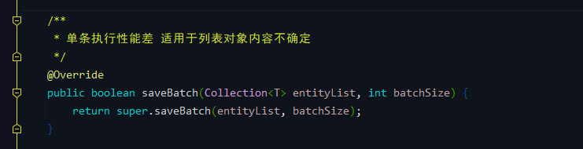
### V3.#3、`ServiceImpl#executeBatch`
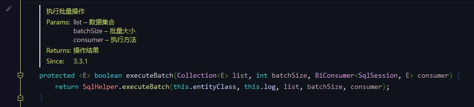

### V4.#2、`BaseMapperPlus#insertBatch`
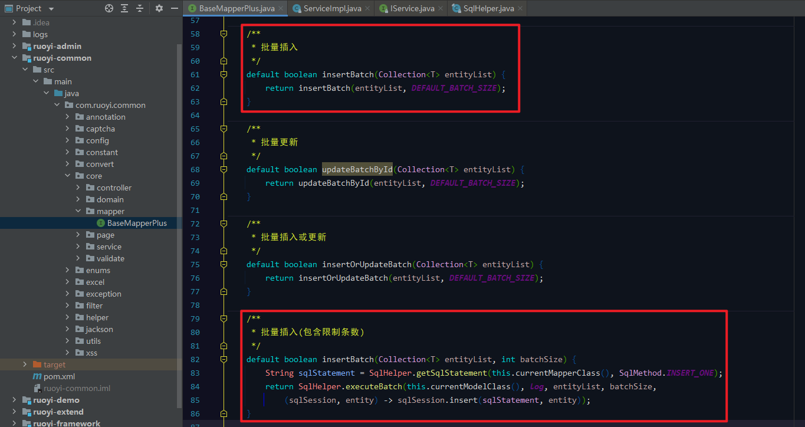

在下面的 `insertBatch` 方法其实和 `ServiceImpl#executeBatch`（V3.#3）调用的方法就是同一个了。
### #4、`SqlHelper#executeBatch`
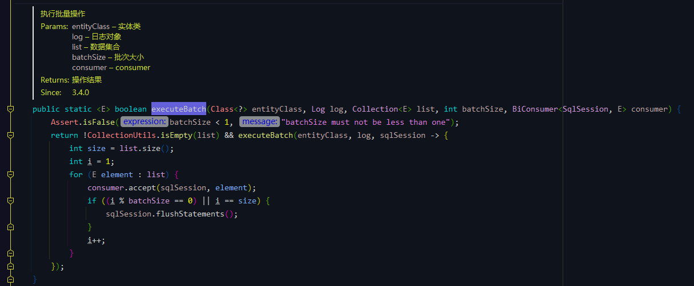
### #5、`SqlHelper#executeBatch`
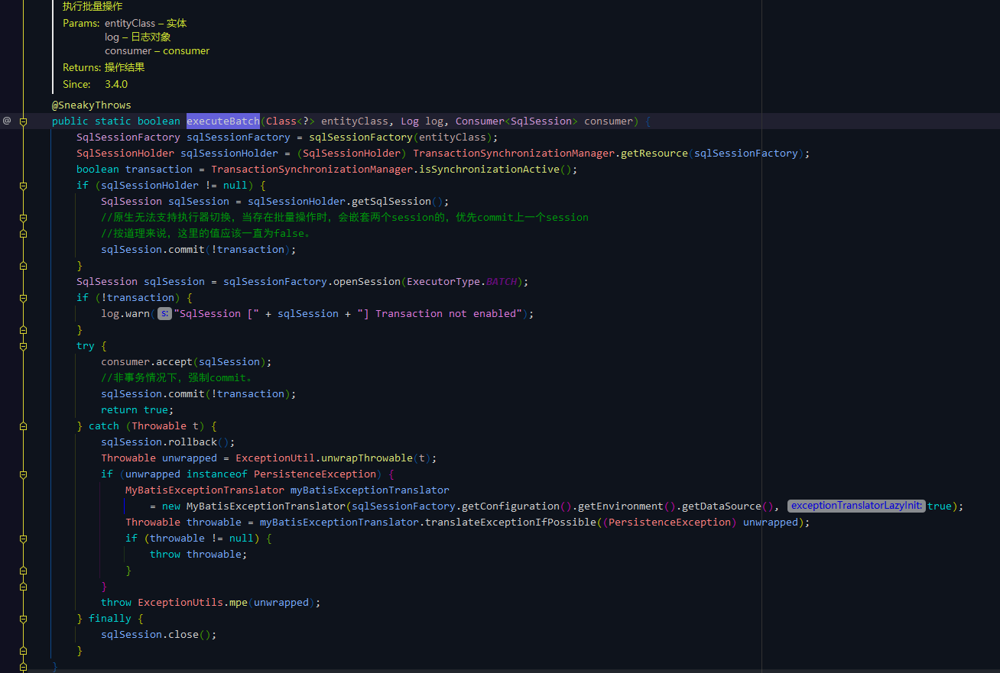

所有的流程到这里就结束了。

## 需要注意的点（下篇主要内容）

1. 要使用批处理功能，需要在配置文件中（`spring.datasource.dynamic.datasource.master.url`）添加以下参数：`rewriteBatchedStatements=true`
2. 相比起 SQL 注入器，两种插入方式哪个速度更优？

以上两点，我会放到下篇去进行说明。