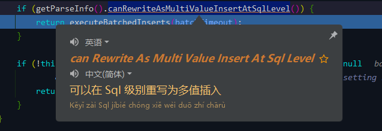
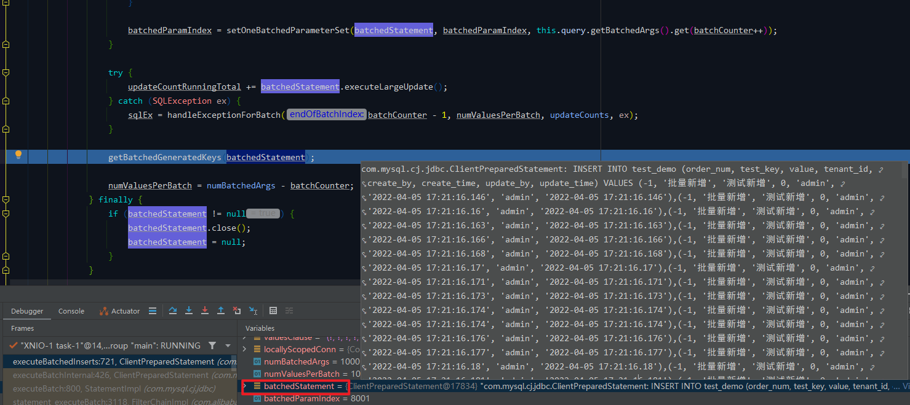

# Mybatis-Plus（五）批量插入功能（下篇）批处理参数 rewriteBatchedStatements

## 前言
中篇最后留了两个点：
- 批处理参数 `rewriteBatchedStatements`
- SQL 注入器 与 saveBatch 哪个插入方式更优？

说实话这篇我感觉有点超出我的能力了（哭），特别是关于批处理参数，源码看得我有点头大，所以这篇如果有不足的地方还请多多包涵。

## 参考目录
- [MySQL之rewriteBatchedStatements](https://www.jianshu.com/p/04d3d235cb9f)
  强烈建议去看看这篇关于 rewriteBatchedStatements 参数的说明，写得很详细。
- [JDBC 所有参数说明(最全)](https://lionli.blog.csdn.net/article/details/122018562)

## 速度测试
### `rewriteBatchedStatements` 开启 / 关闭 速度对比（V4.0.1）

| 次数 	 | rewriteBatchedStatements=false 关闭耗时（毫秒） | rewriteBatchedStatements=true 开启耗时（毫秒）  |
|------|-----------------------------------------|-----------------------------------------|
| 1    | 	14121	                                 | 2145                                    |
| 2    | 	16359	                                 | 2246                                    |
| 3    | 	12596	                                 | 1706                                    |
| 4    | 	12559	                                 | 2260                                    |
| 5    | 	11504	                                 | 2051                                    |
| 6    | 	14591	                                 | 1987                                    |
| 7    | 	13614	                                 | 2061                                    |
| 8    | 	13354	                                 | 1818                                    |
| 9	   | 12189	                                  | 1935                                    |
| 10   | 	12267	                                 | 1880                                    |
| AVG  | 	13315.4                                | 	2008.9                                 |

这个速度测试没啥争议的，而且速度差真的很明显。

### SQL 注入器 / `saveBatch` 速度对比 （V3.5.0）

| 次数   | 	SQL 注入器 耗时（毫秒）  | 	Service.saveBatch （rewriteBatchedStatements=true ）耗时（毫秒）   |
|------|------------------|-------------------------------------------------------------|
| 1	   | 732              | 	811                                                        |
| 2	   | 1162             | 	681                                                        |
| 3    | 	1281            | 	628                                                        |
| 4	   | 648              | 	661                                                        |
| 5    | 	598             | 	647                                                        |
| 6	   | 589              | 	600                                                        |
| 7    | 	595             | 	613                                                        |
| 8    | 	569             | 	629                                                        |
| 9    | 	1278	           | 629                                                         |
| 10   | 	628             | 	627                                                        |
| AVG	 | 808	             | 652.6                                                       |

这个结果呢，有点出乎我的意料，我原以为是 SQL 注入器会更快一点。

不过可能因为测试的次数不算很多，也存在偶然性，而且注入器的速度浮动有点大，有 4 次进入 600ms 内的，也有 3 次超过 1s，相对而言，`saveBatch` 则速度很稳定。

非常欢迎各位大佬自行测试，在评论区分享测试结果~

V3.5.0 `saveBatch` 速度比 V4.0.1 快应该是主键的原因，新版的主键用了雪花id，旧版还是自增id。

## 批处理参数底层执行过程
这一块我放一些关键方法的截图出来，以免太绕。

批处理参数（默认值为 `false`）： 

在底层执行时，最主要的区别是方法 `ClientPreparedStatement#executeBatchInternal` 

### 设置 `rewriteBatchedStatements=false`

如果观察控制台输出的话，可以看到 SQL 语句是滚动打印的，一直持续到方法结束，换句话说，是执行一条 commit 一条，有多少数据就要提交多少次，所以效率很慢。 

在上图的判断中，会判断参数 `rewriteBatchedStatements` 值为 false，所以没有进到方法体内执行 SQL 优化方法。

### 设置 `rewriteBatchedStatements=true`

`ClientPreparedStatement#executeBatchedInserts` 

这个方法下面有一个循环过程，将 SQL 进行替换优化。 
### 优化过程 `ClientPreparedStatement#setOneBatchedParameterSet`

进入其中一个循环过程。

需要替换的模板： 

执行的单条 SQL： 

在 for 循环中将单条 SQL 中的参数一个一个替换到模板中。 

替换完成： 

全部替换完成的结果： 

优化完成后，一次性将 SQL 语句返回到 sqlSession 执行并 commit。因此测试时可以看到控制台的 SQL 打印是一次性打印完成的。故执行效率上得到很大的提升。