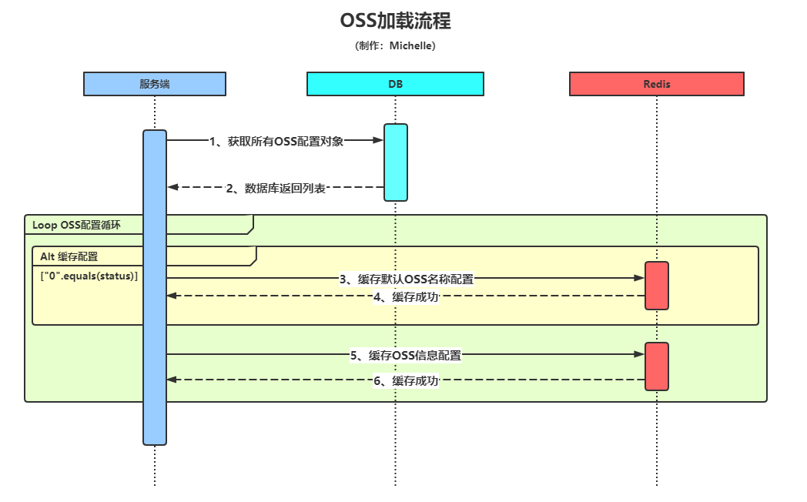

# OSS模块（一）OSS加载流程
- - -
## 前言
首先需要说明一下，前面写过几篇若依框架的笔记，从这篇开始转为 `RuoYi-Vue-Plus` 。<br>
其实前面的笔记也是使用的 Plus 框架，这是 [狮子大神](https://blog.csdn.net/weixin_40461281)<br>
在原若依框架基础之上升级而来，目前该框架已经脱离了原框架做了更多的优化升级。

项目源码：<br>
https://gitee.com/dromara/RuoYi-Vue-Plus

## 一、概述
本篇文章主要从代码角度分析OSS配置加载流程。
## 二、流程图

## 三、流程分析
### 1、加载配置类
方法：`SysOssConfigServiceImpl#init()`

```java
	/**
     * 项目启动时，初始化参数到缓存，加载配置类
     */
    @PostConstruct
    public void init() {
    	// 获取数据库所有配置信息列表
        List<SysOssConfig> list = list();
        for (SysOssConfig config : list) {
            String configKey = config.getConfigKey();
            // 判断 OSS 配置状态
            if ("0".equals(config.getStatus())) {
                // 缓存默认 OSS 配置名称
                RedisUtils.setCacheObject(CloudConstant.CACHE_CONFIG_KEY, configKey);
            }
            // 缓存 OSS 配置信息
            setConfigCache(true, config);
        }
    }
```
### 2、缓存配置信息
方法：`SysOssConfigServiceImpl#setConfigCache()`

```java
	/**
     * 如果操作成功 则更新缓存
     *
     * @param flag   操作状态
     * @param config 配置
     * @return 返回操作状态
     */
    private boolean setConfigCache(boolean flag, SysOssConfig config) {
        if (flag) {
        	// 缓存配置信息
            RedisUtils.setCacheObject(
                    getCacheKey(config.getConfigKey()),
                    JsonUtils.toJsonString(config));
            // 发布
            RedisUtils.publish(CloudConstant.CACHE_CONFIG_KEY, config.getConfigKey(), msg -> {
                log.info("发布刷新OSS配置 => " + msg);
            });
        }
        return flag;
    }
```
## 四、结果展示
### 1、数据库表

### 2、Redis 缓存
<br>

`sys_oss:CloudStorageConfig`<br>
<br>

`sys_oss:minio`<br>

