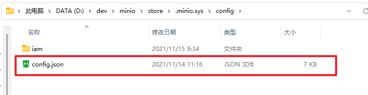

# OSS模块（二）之文件上传（使用MinIO基于Win10环境）
- - -
## 一、概述
本篇文章主要内容是 `RuoYi-Vue-Plus` 框架中的OSS模块的文件上传内容。
## 二、功能
### 0、前提
关于OSS模块使用：[文档说明地址](https://gitee.com/dromara/RuoYi-Vue-Plus/wikis/%E6%A1%86%E6%9E%B6%E5%8A%9F%E8%83%BD/OSS%E5%8A%9F%E8%83%BD)
### 1、Web端页面


### 2、MinIO页面

### 3、本地文件


## 三、MinIO安装使用（基于Win10）
### 0、前提
关于MinIO：<br>
A. [官方网站](https://min.io/)<br>
B. [中文文档](http://docs.minio.org.cn/docs/)<br>
### 1、MinIO安装使用
#### 1.1、文件目录
store是自定义的存储路径。<br>

#### 1.2、版本

#### 1.3、运行
根据命令行运行：
```bash
minio.exe server  D:\dev\minio\store --console-address "127.0.0.1:9000"  --address "127.0.0.1:9090"
```
指定存储路径 `D:\dev\minio\store`<br>
指定控制台路径 `--console-address "127.0.0.1:9000"`<br>
指定API路径 `--address "127.0.0.1:9090"`<br>

**注：没有指定路径登录会报错。**


此时可以通过 `http://127.0.0.1:9000` 登录控制台。账号密码也已经展示在CMD中。


登录成功界面如下。<br>

#### 1.4、可能出现的错误
运行如下命令：
```bash
minio.exe server  D:\dev\minio\store 
```

出现如下结果：<br>


无法登录页面：<br>


一开始测试的时候，根据网上的教程没有指定路径，导致无法登录（可能是版本原因）。因此在运行时需要指定路径。

### 2、配置修改
#### 2.1、修改 MinIO 控制台账号密码
修改文件config.json。<br>
<br>

修改文件中 `access_key` 以及 `secret_key` 的值即可。<br>
<br>
#### 2.2、修改项目配置
**注：项目配置需要与 MinIO 运行配置匹配，否则无法上传。**


## 四、代码实现
#### 上传方法：`SysOssController#upload()`
```java
	/**
     * 上传OSS对象存储
     */
    @ApiOperation("上传OSS对象存储")
    @ApiImplicitParams({
            @ApiImplicitParam(name = "file", value = "文件", dataType = "java.io.File", required = true),
    })
    @PreAuthorize("@ss.hasPermi('system:oss:upload')")
    @Log(title = "OSS对象存储", businessType = BusinessType.INSERT)
    @RepeatSubmit
    @PostMapping("/upload")
    public AjaxResult<Map<String, String>> upload(@RequestPart("file") MultipartFile file) {
        if (ObjectUtil.isNull(file)) {
            throw new ServiceException("上传文件不能为空");
        }
        SysOss oss = iSysOssService.upload(file);
        Map<String, String> map = new HashMap<>(2);
        map.put("url", oss.getUrl());
        map.put("fileName", oss.getFileName());
        return AjaxResult.success(map);
    }
```
#### 上传实现类：`SysOssServiceImpl#upload()`

```java
	@Override
    public SysOss upload(MultipartFile file) {
    	// 获取文件原名称
        String originalfileName = file.getOriginalFilename();
        // 获取文件后缀
        String suffix = StringUtils.substring(originalfileName, originalfileName.lastIndexOf("."), originalfileName.length());
        // 获取存储实例
        ICloudStorageStrategy storage = OssFactory.instance();
        UploadResult uploadResult;
        try {
        	// 文件上传
            uploadResult = storage.uploadSuffix(file.getBytes(), suffix, file.getContentType());
        } catch (IOException e) {
            throw new ServiceException(e.getMessage());
        }
        // 保存文件信息
        SysOss oss = new SysOss()
                .setUrl(uploadResult.getUrl())
                .setFileSuffix(suffix)
                .setFileName(uploadResult.getFilename())
                .setOriginalName(originalfileName)
                .setService(storage.getServiceType());
        save(oss);
        return oss;
    }
```
#### 获取存储实例：`OssFactory#instance()`

```java
	/**
	 * 获取默认实例
	 */
	public static ICloudStorageStrategy instance() {
		// 获取redis 默认类型
		String type = Convert.toStr(RedisUtils.getCacheObject(CloudConstant.CACHE_CONFIG_KEY));
		if (StringUtils.isEmpty(type)) {
			throw new OssException("文件存储服务类型无法找到!");
		}
		return instance(type);
	}

	/**
	 * 根据类型获取实例
	 */
	public static ICloudStorageStrategy instance(String type) {
		ICloudStorageStrategy service = SERVICES.get(type);
		if (service == null) {
			refreshService(type);
			service = SERVICES.get(type);
		}
		return service;
	}

	private static void refreshService(String type) {
		Object json = RedisUtils.getCacheObject(CloudConstant.SYS_OSS_KEY + type);
		CloudStorageProperties properties = JsonUtils.parseObject(json.toString(), CloudStorageProperties.class);
		if (properties == null) {
			throw new OssException("系统异常, '" + type + "'配置信息不存在!");
		}
		// 获取redis配置信息 创建对象 并缓存
		ICloudStorageStrategy service = (ICloudStorageStrategy) ReflectUtils.newInstance(CloudServiceEnumd.getServiceClass(type));
		((AbstractCloudStorageStrategy)service).init(properties);
		SERVICES.put(type, service);
	}
```
#### Redis中实例缓存信息：
<br>

<br>
#### MinIO 文件上传业务实现：`MinioCloudStorageStrategy#uploadSuffix()`


```java
	@Override
	public UploadResult uploadSuffix(byte[] data, String suffix, String contentType) {
		return upload(data, getPath(properties.getPrefix(), suffix), contentType);
	}

	@Override
	public UploadResult upload(byte[] data, String path, String contentType) {
		return upload(new ByteArrayInputStream(data), path, contentType);
	}

	@Override
	public UploadResult upload(InputStream inputStream, String path, String contentType) {
		try {
			minioClient.putObject(PutObjectArgs.builder()
				.bucket(properties.getBucketName())
				.object(path)
				.contentType(StringUtils.blankToDefault(contentType, MediaType.APPLICATION_OCTET_STREAM_VALUE))
				.stream(inputStream, inputStream.available(), -1)
				.build());
		} catch (Exception e) {
			throw new OssException("上传文件失败，请核对Minio配置信息:[" + e.getMessage() + "]");
		}
		return new UploadResult().setUrl(getEndpointLink() + "/" + path).setFilename(path);
	}
```
