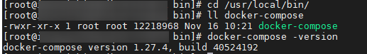
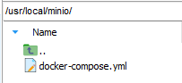
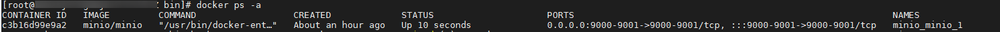
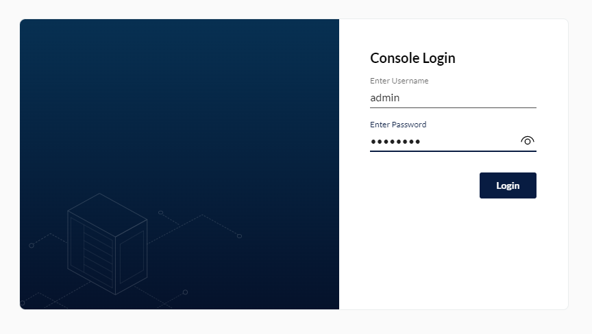
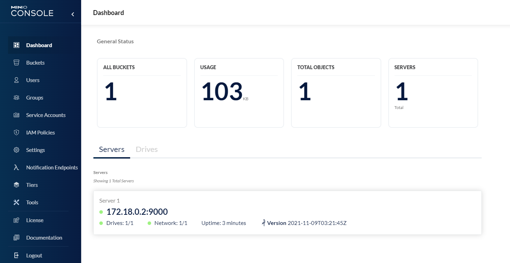
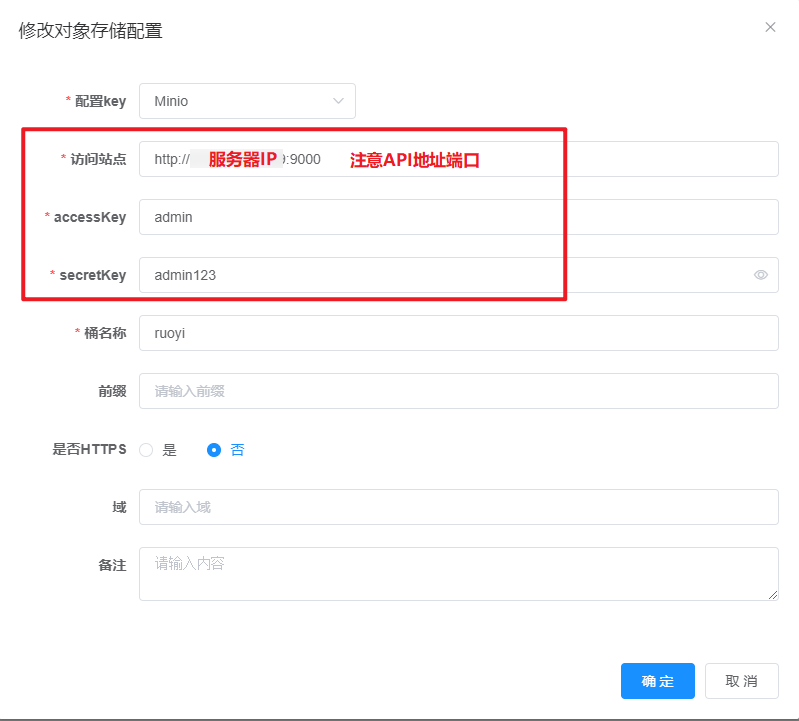
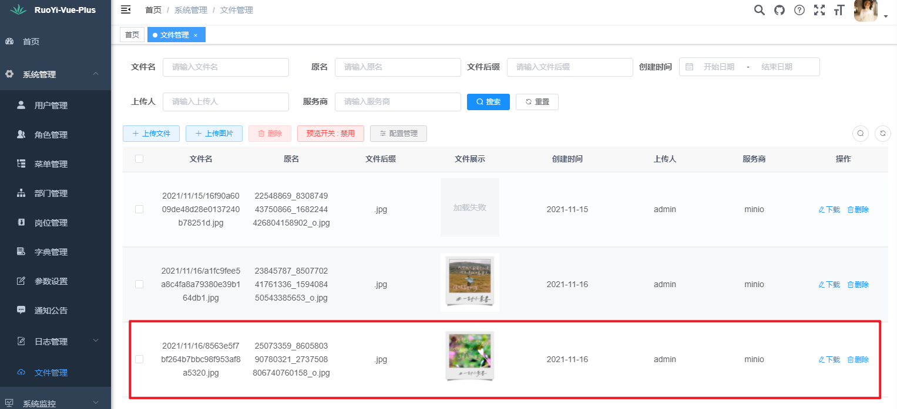
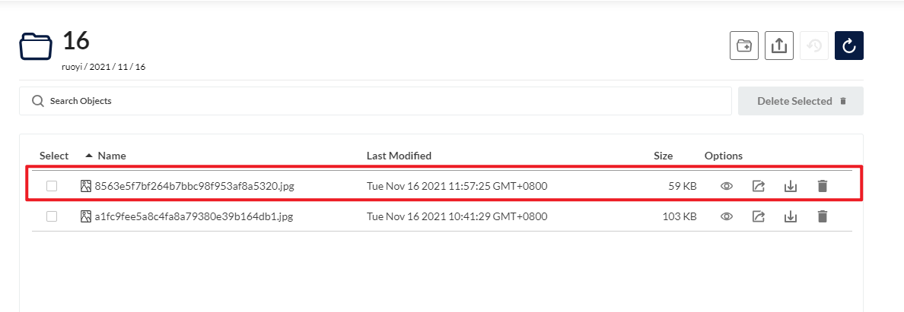

# OSS模块（三）CentOS8 部署 MinIO（使用 docker-compose 搭建）
- - -
## 参考资料
首先本文是参照了 [狮子大佬](https://lionli.blog.csdn.net/) 的博客文章进行操作，特此感谢。<br>
- [Linux 安装 docker-compose](https://lionli.blog.csdn.net/article/details/111220320)
- [docker-compose 搭建 minio 分布式对象存储 最新版(使用教程)](https://lionli.blog.csdn.net/article/details/118568289)

## 一、概述
在上一篇文章 [文件上传（使用MinIO基于Win10环境）](/ruoyi-vue-plus/oss/02_file_upload.md)中有关于在本机安装使用MinIO的内容，但是一般来说应用场景都是服务器，因此本文主要说明的是在服务器中搭建MinIO的过程。
## 二、安装步骤
### 1、安装 docker-compose 并授权


### 2、创建编排 yml 文件
服务器文件地址（可以自定义）<br>
<br>

yml 文件内容（使用的是单机编排模式）

```yaml
version: '3'
services:
  minio:
    image: minio/minio
    hostname: "minio"
    ports:
      - 9000:9000 # api 端口
      - 9001:9001 # 控制台端口
    environment:
      MINIO_ACCESS_KEY: admin    #管理后台用户名
      MINIO_SECRET_KEY: admin123 #管理后台密码，最小8个字符
    volumes:
      - /docker/minio/data:/data               #映射当前目录下的data目录至容器内/data目录
      - /docker/minio/config:/root/.minio/     #映射配置目录
    command: server --console-address ':9001' /data  #指定容器中的目录 /data
    privileged: true
    restart: always

```
### 3、执行文件
在yml文件所在目录执行以下命令，等待执行完毕 `created...done`
```bash
docker-compose up -d
```

查看运行结果<br>

### 4、登录控制台
控制台路径：`http://ip:9001/` <br>



### 5、测试项目文件上传（RuoYi-Vue-Plus）
#### 5.1、修改OSS配置

#### 5.2、上传文件



#### 5.3、查看MinIO控制台


至此，文件上传成功。