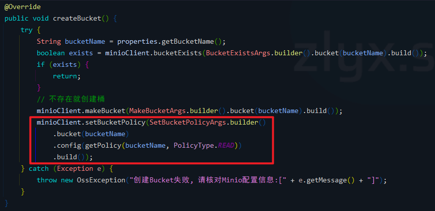

# OSS模块（四）MinIO 桶策略
@[TOC]
## 参考资料
- [MinIO中文文档 - Java Client API参考文档](http://docs.minio.org.cn/docs/master/java-client-api-reference)
- [MinIO中文文档 - 适用于与Amazon S3兼容的云存储的MinIO Java SDK](http://docs.minio.org.cn/docs/master/java-client-quickstart-guide)
- [亚马逊官方文档 - Amazon S3 中的策略和权限](https://docs.aws.amazon.com/zh_cn/AmazonS3/latest/userguide/access-policy-language-overview.html)
- [操作存储桶策略Demo](https://github.com/minio/minio-java/blob/master/examples/SetBucketPolicy.java)
- [minio文件桶策略设置](https://www.jianshu.com/p/8d710aba0bab)

## 一、概述
这篇文章主要是整理记录一下框架中关于 MinIO 桶策略的相关内容。
## 二、MinIO 桶策略
### 1、问题引出
前面几篇笔记主要是着重在MinIO使用上，但是还有一些细节的地方需要整理一下。

如下代码：<br>


在 MinIO 创建桶时，调用了方法 `MinioCloudStorageStrategy#getPolicy()`

```java
private String getPolicy(String bucketName, PolicyType policyType) {
		StringBuilder builder = new StringBuilder();
		builder.append("{\n");
		builder.append("    \"Statement\": [\n");
		builder.append("        {\n");
		builder.append("            \"Action\": [\n");
		if (policyType == PolicyType.WRITE) {
			builder.append("                \"s3:GetBucketLocation\",\n");
			builder.append("                \"s3:ListBucketMultipartUploads\"\n");
		} else if (policyType == PolicyType.READ_WRITE) {
			builder.append("                \"s3:GetBucketLocation\",\n");
			builder.append("                \"s3:ListBucket\",\n");
			builder.append("                \"s3:ListBucketMultipartUploads\"\n");
		} else {
			builder.append("                \"s3:GetBucketLocation\"\n");
		}
		builder.append("            ],\n");
		builder.append("            \"Effect\": \"Allow\",\n");
		builder.append("            \"Principal\": \"*\",\n");
		builder.append("            \"Resource\": \"arn:aws:s3:::");
		builder.append(bucketName);
		builder.append("\"\n");
		builder.append("        },\n");
		if (PolicyType.READ.equals(policyType)) {
			builder.append("        {\n");
			builder.append("            \"Action\": [\n");
			builder.append("                \"s3:ListBucket\"\n");
			builder.append("            ],\n");
			builder.append("            \"Effect\": \"Deny\",\n");
			builder.append("            \"Principal\": \"*\",\n");
			builder.append("            \"Resource\": \"arn:aws:s3:::");
			builder.append(bucketName);
			builder.append("\"\n");
			builder.append("        },\n");
		}
		builder.append("        {\n");
		builder.append("            \"Action\": ");
		switch (policyType) {
			case WRITE:
				builder.append("[\n");
				builder.append("                \"s3:AbortMultipartUpload\",\n");
				builder.append("                \"s3:DeleteObject\",\n");
				builder.append("                \"s3:ListMultipartUploadParts\",\n");
				builder.append("                \"s3:PutObject\"\n");
				builder.append("            ],\n");
				break;
			case READ_WRITE:
				builder.append("[\n");
				builder.append("                \"s3:AbortMultipartUpload\",\n");
				builder.append("                \"s3:DeleteObject\",\n");
				builder.append("                \"s3:GetObject\",\n");
				builder.append("                \"s3:ListMultipartUploadParts\",\n");
				builder.append("                \"s3:PutObject\"\n");
				builder.append("            ],\n");
				break;
			default:
				builder.append("\"s3:GetObject\",\n");
				break;
		}
		builder.append("            \"Effect\": \"Allow\",\n");
		builder.append("            \"Principal\": \"*\",\n");
		builder.append("            \"Resource\": \"arn:aws:s3:::");
		builder.append(bucketName);
		builder.append("/*\"\n");
		builder.append("        }\n");
		builder.append("    ],\n");
		builder.append("    \"Version\": \"2012-10-17\"\n");
		builder.append("}\n");
		return builder.toString();
	}
```
### 2、不同的读写策略

针对不同的读写方式有不同的策略：

```java
	/**
	 * 只读
	 */
	READ("read-only"),

	/**
	 * 只写
	 */
	WRITE("write-only"),

	/**
	 * 读写
	 */
	READ_WRITE("read-write");
```
在控制台打印了一下不同策略的生成结果如下：<br>
#### 只读 `PolicyType.READ`
```json
{
    "Statement": [
        {
            "Action": [
                "s3:GetBucketLocation"
            ],
            "Effect": "Allow",
            "Principal": "*",
            "Resource": "arn:aws:s3:::ruoyi"
        },
        {
            "Action": [
                "s3:ListBucket"
            ],
            "Effect": "Deny",
            "Principal": "*",
            "Resource": "arn:aws:s3:::ruoyi"
        },
        {
            "Action": "s3:GetObject",
            "Effect": "Allow",
            "Principal": "*",
            "Resource": "arn:aws:s3:::ruoyi/*"
        }
    ],
    "Version": "2012-10-17"
}
```
#### 只写 `PolicyType.WRITE`
```json
{
    "Statement": [
        {
            "Action": [
                "s3:GetBucketLocation",
                "s3:ListBucketMultipartUploads"
            ],
            "Effect": "Allow",
            "Principal": "*",
            "Resource": "arn:aws:s3:::ruoyi"
        },
        {
            "Action": [
                "s3:AbortMultipartUpload",
                "s3:DeleteObject",
                "s3:ListMultipartUploadParts",
                "s3:PutObject"
            ],
            "Effect": "Allow",
            "Principal": "*",
            "Resource": "arn:aws:s3:::ruoyi/*"
        }
    ],
    "Version": "2012-10-17"
}
```
#### 读写 `PolicyType.READ_WRITE`
```json
{
    "Statement": [
        {
            "Action": [
                "s3:GetBucketLocation",
                "s3:ListBucket",
                "s3:ListBucketMultipartUploads"
            ],
            "Effect": "Allow",
            "Principal": "*",
            "Resource": "arn:aws:s3:::ruoyi"
        },
        {
            "Action": [
                "s3:AbortMultipartUpload",
                "s3:DeleteObject",
                "s3:GetObject",
                "s3:ListMultipartUploadParts",
                "s3:PutObject"
            ],
            "Effect": "Allow",
            "Principal": "*",
            "Resource": "arn:aws:s3:::ruoyi/*"
        }
    ],
    "Version": "2012-10-17"
}
```
### 3、读写策略解析
来自亚马逊官方文档的解析：<br>
[亚马逊官方文档 - Amazon S3 中的策略和权限](https://docs.aws.amazon.com/zh_cn/AmazonS3/latest/userguide/access-policy-language-overview.html)<br>

