# OSS 模块（五）简单分析多文件/图片上传的实现
- - -
## 前言
今天遇到关于多图上传的需求，大致是：同时上传多张图片，拿到图片访问路径然后保存到数据库中。

其实这个也不算难题，解决思路也比较多，我一开始想到的是：后端接收一个待上传文件的集合，然后通过循环或者多线程的方式进行上传。

然后突然想到之前项目更新日志里面有提及支持多文件上传，再去看了一下。

> V4.0.1 更新日志 
> 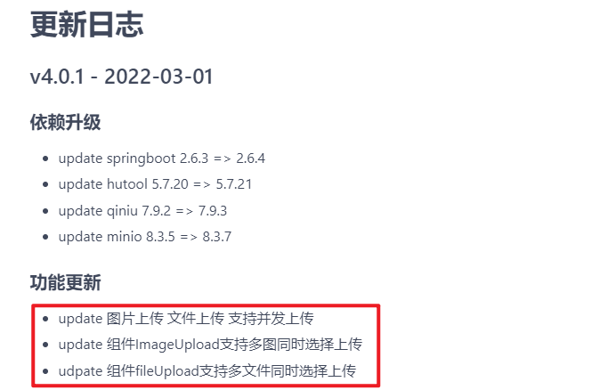

一开始没有注意这里说的是前端组件，所以我以为后端的代码也做了更新，看了一眼 OSS 模块里面上传的代码发现没变化，然后我就有点懵了，去群里问了[狮子大佬](https://blog.csdn.net/weixin_40461281)，大佬“一语惊醒梦中人”。

> 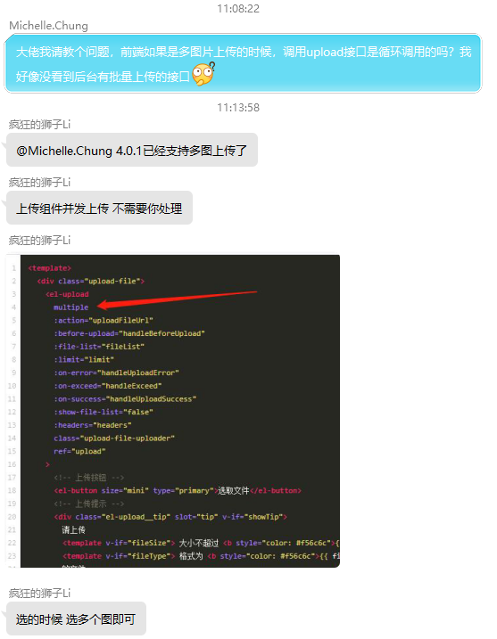 
> 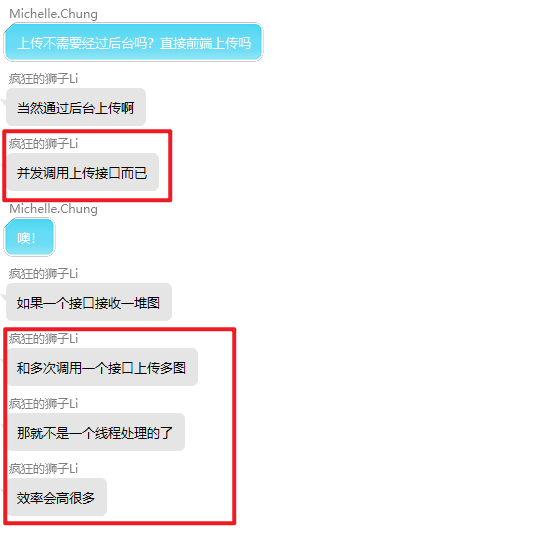

所以基于这个思路，我去找了一下资料来看，在这里小小总结一下。

## 参考目录
- [element 官方文档 - Upload 上传](https://element.eleme.cn/#/zh-CN/component/upload)
  这是前端组件的官方文档，也有实例源码。
- [踩坑总结！elementUI组件之upload上传控件的multiple属性，设置false报错！](https://cloud.tencent.com/developer/article/1623061)
  这是组件使用的示例博客，也有对官方文档 demo 的小分析。
- [并发任务执行的几种方法 (同时上传多张图片请求）](https://blog.csdn.net/alcoholdi/article/details/107132324)
  这是后端实现并发上传的几种方法，有兴趣可以看看。

## 多文件/图片上传的实现
上传组件的代码文件：`ruoyi-ui/src/components/FileUpload/index.vue`

> 组件属性 
> 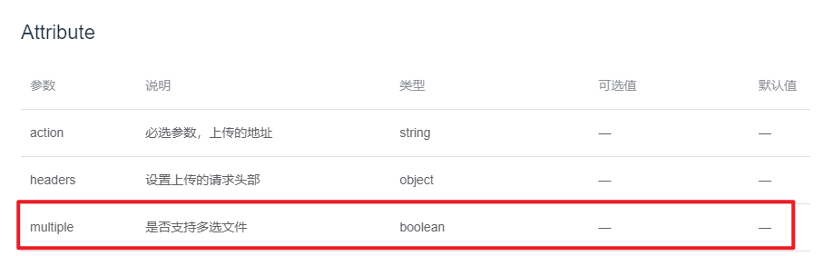

实现起来其实比较简单，在前端组件中加入 `multiple` 属性即可。（因为本人不是前端，所以就不在此分析底层逻辑了）

关于 OSS 模块上传的实现，在专栏之前的文章里面有过详细的分析，所以这里就不再赘述了。

## 流程测试
### 1、Web端
- 首页/系统管理/文件管理

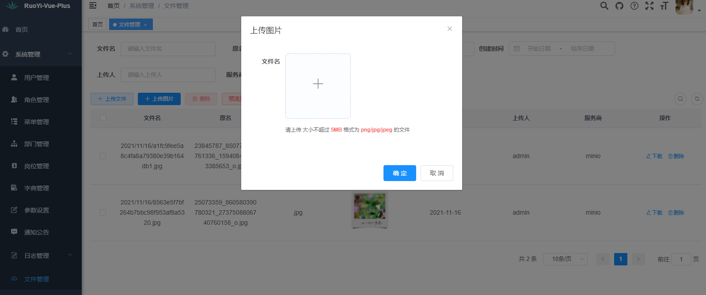

选择多张图片： 
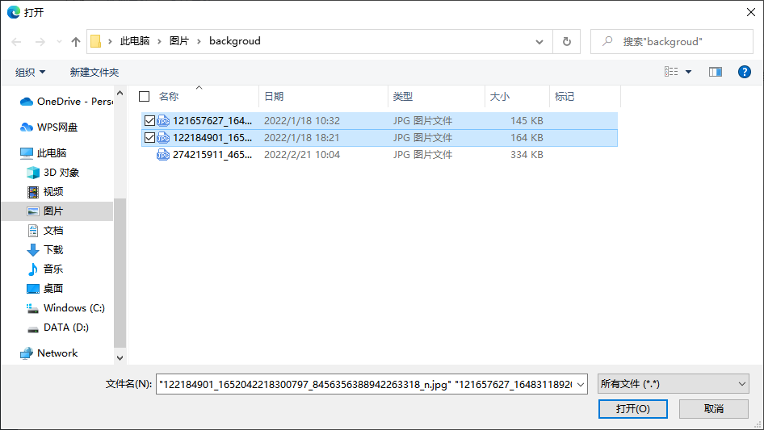

上传示意： 
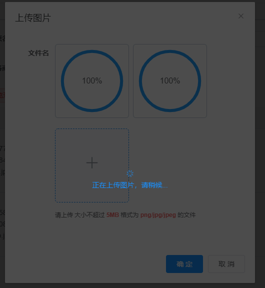

上传完成： 
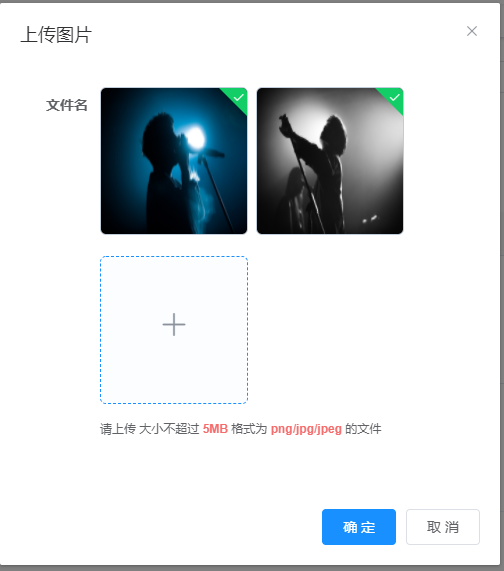

查看控制台可以看到请求了两次 `/system/oss/upload` 接口： 
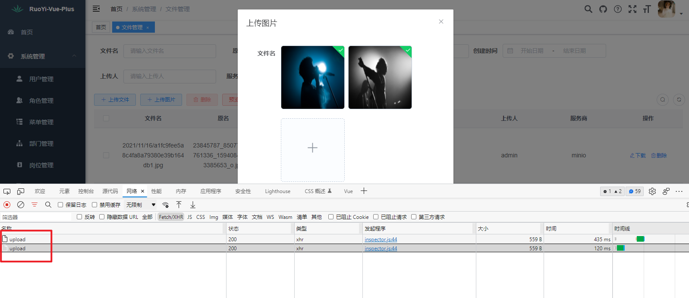

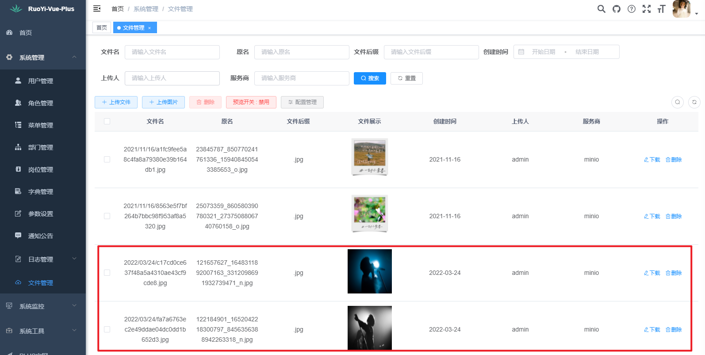

### 2、MinIO页面
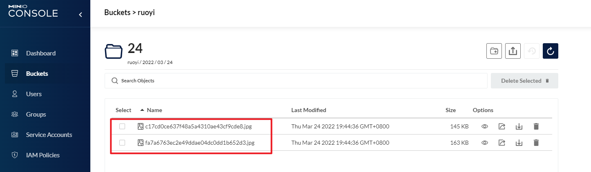

对比发现，上传成功。

## 小结
对于并发请求不大的情况下，使用这种并发上传的方式可以减少前后端的代码工作量，效率也高，还是比较值得推荐的方式。