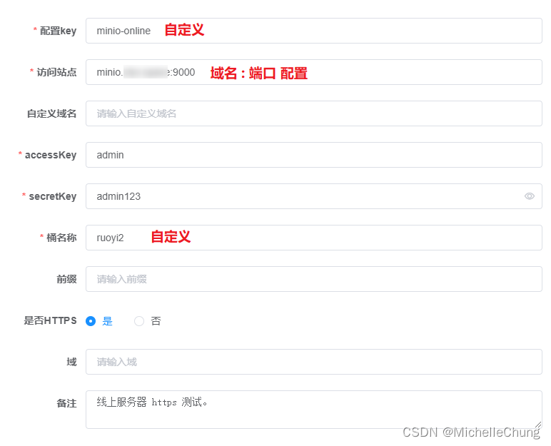

# OSS 模块（六）V4.2.0+ 版本三种方式配置使用
- - -
## 前言
OSS 功能几乎是每个框架都会集成使用的功能，在本专栏最开始学习【RuoYi-Vue-Plus】框架的文章就是关于 OSS 功能的。随着框架升级，该功能在 V4.2.0 版本也迎来了一次重构升级，所以打算再写一下这个功能的相关使用以及原理分析。


本篇先从简单的使用配置入手，后续会再分析 OSS 加载流程等。其实在框架 wiki 中也有关于此功能的使用说明，我之前的专栏也写过一部分，本篇做一下整合，讲述三种配置方式的使用（==**顺序由简单到复杂**==）：

- 方式一：云服务商
- 方式二：MinIO + Nginx（Https）
- 方式三： MinIO（Https）【V4.3.0 新功能】

## 参考目录
- [框架 wiki - OSS功能](https://gitee.com/dromara/RuoYi-Vue-Plus/wikis/%E6%A1%86%E6%9E%B6%E5%8A%9F%E8%83%BD/OSS%E5%8A%9F%E8%83%BD)
  框架 wiki OSS 模块使用说明。
- [【RuoYi-Vue-Plus】学习笔记 03 - OSS模块（三）CentOS8 部署 MinIO（使用 docker-compose 搭建）](/ruoyi-vue-plus/oss/03_MinIO_CentOS8_deploy.md)
  以前写过的 MinIO 搭建步骤，实际上就是第二种配置方式，只是少了 Nginx 相关配置，是使用 IP 的。
- [踩坑记录之MinIO添加HTTPS访问](https://blog.csdn.net/weixin_40461281/article/details/124260888)
  [狮子大佬](https://lionli.blog.csdn.net/) 分享的第三种搭建方式的参考文章，属实是很多坑。
- [MinIO官方文档](http://docs.minio.org.cn/docs/)

## 准备目录
### 方式一：云服务商（以腾讯云为例）
- 访问站点（endpoint）
- accessKey
- secretKey
- 桶名称
- 域（region）
### 方式二：MinIO + Nginx（Https）
- 服务器（安装好 Nginx）
- Https 证书
### 方式三：MinIO（Https）
- 服务器
- Https 证书
## 配置方式一：云服务商（以腾讯云为例）
**氪金的好处就是啥也不用管，拿到相关参数一顿配置就打完收工了。**


域实际上是包含在 endpoint 里面的，如果是旧版，endpoint 需要写上 http 或者 https 前缀。

其他云厂商的配置可以参考框架 wiki 说明。

## 配置方式二：MinIO + Nginx（Https）
如果是自己 **个人学习使用** 的话，我个人最为推荐的方式是这个，简单、方便，最主要是免费（懂的都懂）。

如果是生产环境还是建议选择方式一，减少不必要的维护成本。

这一部分和以前的步骤大致相同，我就直接复制了，后面加上 Nginx 相关配置。

### 1、安装 docker-compose 并授权
<br>

### 2、创建编排 yml 文件
服务器文件地址（可以自定义）<br>
<br>

yml 文件内容（使用的是单机编排模式）<br>

```yaml
version: '3'
services:
  minio:
    image: minio/minio
    hostname: "minio"
    ports:
      - 9000:9000 # api 端口
      - 9001:9001 # 控制台端口
    environment:
      MINIO_ACCESS_KEY: admin    #管理后台用户名
      MINIO_SECRET_KEY: admin123 #管理后台密码，最小8个字符
    volumes:
      - /docker/minio/data:/data               #映射当前目录下的data目录至容器内/data目录
      - /docker/minio/config:/root/.minio/     #映射配置目录
    command: server --console-address ':9001' /data  #指定容器中的目录 /data
    privileged: true
    restart: always

```
### 3、执行文件
在yml文件所在目录执行以下命令，等待执行完毕 `created...done`
```bash
docker-compose up -d
```

查看运行结果<br>
<br>
### 4、Nginx 配置 Https 证书
如果是用 ip 进行访问，可以跳过该步骤直接往下。

用 Nginx 的好处之一是可以配置多个证书（**MinIO 只能配置一个证书**），我这里配置用了两个：

- MinIO 服务（minio.xxx.xxx）
- MinIO 控制台（miniodashboard.xxx.xxx）

```bash
http {
	# 省略默认配置

	# MinIO 服务
	server {
        listen       443 ssl;
        server_name  minio.xxx.xxx;

        #证书文件名称
        ssl_certificate minio.xxx.xxx_bundle.crt;
        #私钥文件名称
        ssl_certificate_key minio.xxx.xxx.key;
        ssl_session_timeout 5m;
        #请按照以下协议配置
        ssl_protocols TLSv1.2 TLSv1.3;
        #请按照以下套件配置，配置加密套件，写法遵循 openssl 标准。
        ssl_ciphers ECDHE-RSA-AES128-GCM-SHA256:HIGH:!aNULL:!MD5:!RC4:!DHE;
        ssl_prefer_server_ciphers on;

        location / {
            proxy_pass  http://127.0.0.1:9000/;
        }
    }

	# MinIO 控制台
	server {
        listen       443 ssl;
        server_name  miniodashboard.xxx.xxx;

        #证书文件名称
        ssl_certificate miniodashboard.xxx.xxx_bundle.crt;
        #私钥文件名称
        ssl_certificate_key miniodashboard.xxx.xxx.key;
        ssl_session_timeout 5m;
        #请按照以下协议配置
        ssl_protocols TLSv1.2 TLSv1.3;
        #请按照以下套件配置，配置加密套件，写法遵循 openssl 标准。
        ssl_ciphers ECDHE-RSA-AES128-GCM-SHA256:HIGH:!aNULL:!MD5:!RC4:!DHE;
        ssl_prefer_server_ciphers on;

        location / {
            proxy_pass  http://127.0.0.1:9001/;
        }
    }
}
```
### 5、OSS 配置


站点直接填 `IP:端口`，是否 HTTPS 选 `否`。

如果选 `是` 会报错：<br>
<br>

来自狮子大佬的解释：<br>
<br>

Nginx 配置 http 转 https：<br>

```bash
server {
    listen 80;
    # 多域名直接写到 server_name 后面，用空格区分
    server_name  minio.xxx.xxx www.xxx.xxx;
    rewrite ^(.*) https://$server_name$1 permanent;
}
```

对于配置的解释：<br>
<br>

举个例子补充一下，使用 http 的配置方式，数据库保存的是 http 开头的url，如果域名过期了，把 Nginx 的证书相关配置去掉之后，依然能够访问原来的 url。

### 6、设置公有读权限
如果使用 OSS 功能时遇到 403 错误，一般是没有配置公有读权限，可以在桶设置中进行配置。<br>

## 配置方式三：MinIO（Https）【V4.3.0 新功能】
这种方式我之前没有用过，但是刚好最近有在群里讨论，所以就上手试了一下，在此要感谢一下狮子大佬的鼎力相助，少走了很多弯路。

>  <br>
> （图源网络，侵删）

**在说配置之前，其实我很疑惑的是，为什么要用这种方式，好处我实在是想不到，虽然俗话说 “存在即合理”，欢迎大佬在评论区答疑解惑。**

### 1、安装 docker-compose 并授权
这一步与上面一样，就不再赘述了。
### 2、创建编排 yml 文件
服务器文件地址（可以自定义）<br>
<br>

yml 文件内容（使用的是单机编排模式）<br>

```yaml
version: '3'
services:
  minio:
    image: minio/minio:RELEASE.2022-05-26T05-48-41Z
    container_name: minio
    ports:
      # api 端口
      - "9000:9000"
      # 控制台端口
      - "9001:9001"
    environment:
      # 时区上海
      TZ: Asia/Shanghai
      # 管理后台用户名
      MINIO_ACCESS_KEY: admin
      # 管理后台密码，最小8个字符
      MINIO_SECRET_KEY: admin123
      # https需要指定域名
      MINIO_SERVER_URL: "https://minio.xxx.xxx:9000"
      MINIO_BROWSER_REDIRECT_URL: "https://minio.xxx.xxx:9001"
      # 开启压缩 on 开启 off 关闭
      MINIO_COMPRESS: "off"
      # 扩展名 .pdf,.doc 为空 所有类型均压缩
      MINIO_COMPRESS_EXTENSIONS: ""
      # mime 类型 application/pdf 为空 所有类型均压缩
      MINIO_COMPRESS_MIME_TYPES: ""
    volumes:
      # 映射当前目录下的data目录至容器内/data目录
      - /docker/minio/data:/data
      # 映射配置目录
      - /docker/minio/config:/root/.minio/
    command: server --address ':9000' --console-address ':9001' /data  # 指定容器中的目录 /data
    privileged: true
    network_mode: "host"

```
两个URL也可以写在下面命令行中：

> <br>
> （来自狮子大佬的图）

### 3、放置 Https 证书
将证书放置到映射目录下：<br>

`/docker/minio/config/certs`<br>

<br>

从云服务商处下载证书后，放到指定目录中，注意证书需要改名为 `private.key`、`public.crt`。<br>

除此之外，有两个点需要注意：
- 证书只能设置一个，不能像 Nginx 那样配置两个证书。
- 如果有其他域名证书解析到同一个ip时，需要在编排文件中写上 MinIO 端口号，否则会报错。

报错信息：

```bash
certificate is valid for www.xxx.xxx, xxx.xxx, not minio.xxx.xxx
```

这里的坑点比较多，所以一定要按照步骤进行操作。

### 4、执行编排文件
在前面的配置都做完之后再启动编排文件。

在yml文件所在目录执行以下命令，等待执行完毕 `created...done`
```bash
docker-compose up -d
```

### 5、OSS 配置

### 6、设置公有读权限
与上面操作方式一致。

至此，三种方式都说明完毕，请结合自身实际情况自行测试配置使用。