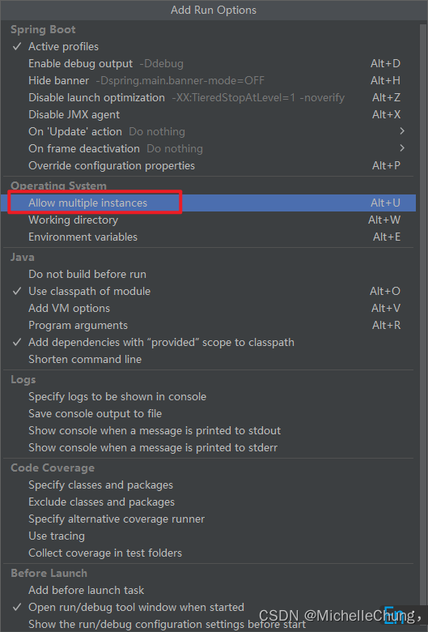

# OSS模块（七）V4.2.0+ 版本OSS加载流程
- - -
## 前言
上一篇 OSS 模块相关的文章有说到版本升级之后 OSS 模块进行了重构，因为这一部分的代码写法我个人觉得是很值得学习的，因此有了今天这篇文章。

在准备本文的时候，相关方法有用到 Redis 发布订阅的功能，因此先对发布订阅功能进行了简单的分析，再回到这篇文章来。

## 参考目录
- [Spring Boot 整合 AWS S3协议 OSS功能 支持 七牛、阿里、Minio等一切支持S3协议的云厂商](https://blog.csdn.net/weixin_40461281/article/details/124971280?ops_request_misc=%257B%2522request%255Fid%2522%253A%2522166121944716782395372354%2522%252C%2522scm%2522%253A%252220140713.130102334.pc%255Fblog.%2522%257D&request_id=166121944716782395372354&biz_id=0&utm_medium=distribute.pc_search_result.none-task-blog-2~blog~first_rank_ecpm_v1~rank_v31_ecpm-1-124971280-null-null.nonecase&utm_term=aws&spm=1018.2226.3001.4450)
  狮子大佬的集成博客。
- [OSS功能](https://gitee.com/dromara/RuoYi-Vue-Plus/wikis/%E6%A1%86%E6%9E%B6%E5%8A%9F%E8%83%BD/OSS%E5%8A%9F%E8%83%BD)
  框架 wiki 中对 OSS 模块的使用说明。
- [什么是 Amazon S3？](https://docs.aws.amazon.com/zh_cn/AmazonS3/latest/userguide/Welcome.html)
  亚马逊官方文档说明。
- [一文读懂 AWS S3](https://zhuanlan.zhihu.com/p/112057573)
  知乎上对于 AWS S3 的说明。
- [【RuoYi-Vue-Plus】学习笔记 01 - OSS模块（一）OSS加载流程](/ruoyi-vue-plus/oss/01_oss_init.md)
  旧版加载流程分析指路。

## 简单的新旧对比
### 旧版目录结构

### 新版目录结构（V4.2.0+）

显而易见的是，新版的代码量减少了。我们再来看看序列图，序列图省略了一些细节的方法调用，只保留了主要方法。

### 旧版序列图（简化版）

### 新版序列图（简化版）（V4.2.0+）

下面通过 debug 方式来看下 V4.2.0+ 版本的加载流程。

## 调用流程分析
### 1、`SystemApplicationRunner#run`
 

基础数据的缓存都是在这个方法里面完成的。 
### 2、`SysOssConfigServiceImpl#init`

这是初始化配置的主要方法：

1. 查询所有的 OSS 配置
2. 遍历并缓存所有配置，如果是默认配置，会缓存到 Redis 中

此处设置的默认配置是 `minio`：

### 2.1、配置缓存 `SysOssConfigServiceImpl#setConfigCache`

每一个配置都使用 Spring Cache 缓存，并发布订阅消息。缓存结果如下： 

### 3、`OssFactory#init`

这个方法打印了日志，并且订阅了默认配置的通道。

**如果是单机部署，这里就已经执行结束了。**

订阅的功能去请教了狮子大佬，这里是给 **集群** 用的，一个机器修改了配置，会通知其他机器。光说不练假把式，这里来实验一下，修改一下服务端口，启动两次，模拟一下集群。

### 3.1、模拟集群配置 8080 | 8181
目前的端口是 `8080`： 
 

修改 idea 配置（我测试的版本是 `2022.2`）： 
 

 

 

配置完成后： 
 

复制一个启动配置，设置启动端口号为 `8181`，并启动： 
 

 

`8181` 服务启动完成后，发布订阅消息，`8080` 服务就会接收到。
### 3.2、8080 收到 8181 发布的订阅消息

`8080` 服务启动后，如果没有进行任何 OSS 操作直接启动 `8181`，则 if 判断为 `false`，没有初始化 OssClient，换句话说，`getClient(configKey)` 获取到的对象为空，所以不会刷新配置。

初始化是在上传时进行的，这个会放在下一篇文件上传流程时再详细展开，这里只演示 `refresh` 方法的逻辑。

操作步骤：

1. 启动 `8080` 服务。
2. 在 `/系统管理/文件管理` 上传一张图片（目的：完成 OssClient 初始化）。
3. 启动 `8181` 服务。
4. 观察 `8080` 服务接收订阅消息的逻辑。

 

刷新配置： 
 

这里也是 `new OssClient` 再重新放到缓存里面。控制台打印： 
 

如果不想启动两个服务也想看到效果的话，可以在配置管理里面新增默认配置或者修改默认配置的信息（注意是默认配置），也能进入 `refresh` 方法。
