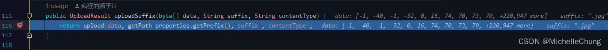
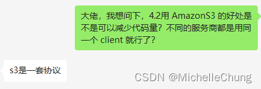

# OSS模块（八）V4.2.0+ 版本OSS文件上传流程
- - -
## 前言
### 一般的小型开发
OSS 功能其实算是后台管理框架中比较基础的功能，一般小型项目开发中，很常是对接一家云厂商，把一些相关的参数配置到配置文件中（或者持久化到数据库，在系统参数中进行管理），然后对接相关的 SDK 即可完成功能。

这样开发的好处是快速、简单。大型云厂商的文档配置都很全面，甚至像阿里、鹅这种大厂可以直接在调试控制台根据测试的参数直接生成代码，直接复制粘贴即可使用。

但是这样的操作，说句不好听的，有手都能做，甚至不需要去看到底是经历了什么过程，因为这些底层都已经做好了。

那为什么还要写呢？
### 为什么要写 OSS 上传？
其实这个功能不复杂，但是如果让我设计像【RuoYi-Vue-Plus】框架中的结构我是肯定设计不出来的，正因为好所以才值得学习。

坦白说，能一直坚持写博客的原因是因为能够督促自己去学习框架中用到的不同的东西，去吸收所有好的，对我而言，能够站在巨人的肩膀上去学习是一件很幸福的事情。

扯远了，回到本文，一起来看看新版本 V4.2.0+ 的 OSS 上传功能。

## 参考目录
- [Spring Boot 整合 AWS S3协议 OSS功能 支持 七牛、阿里、Minio等一切支持S3协议的云厂商](https://blog.csdn.net/weixin_40461281/article/details/124971280?ops_request_misc=%257B%2522request%255Fid%2522%253A%2522166121944716782395372354%2522%252C%2522scm%2522%253A%252220140713.130102334.pc%255Fblog.%2522%257D&request_id=166121944716782395372354&biz_id=0&utm_medium=distribute.pc_search_result.none-task-blog-2~blog~first_rank_ecpm_v1~rank_v31_ecpm-1-124971280-null-null.nonecase&utm_term=aws&spm=1018.2226.3001.4450)
  狮子大佬的集成博客。
- [OSS功能](https://gitee.com/JavaLionLi/RuoYi-Vue-Plus/wikis/%E6%A1%86%E6%9E%B6%E5%8A%9F%E8%83%BD/OSS%E5%8A%9F%E8%83%BD)
  框架 wiki 中对 OSS 模块的使用说明。
- [什么是 Amazon S3？](https://docs.aws.amazon.com/zh_cn/AmazonS3/latest/userguide/Welcome.html)
  亚马逊官方文档说明。
- [一文读懂 AWS S3](https://zhuanlan.zhihu.com/p/112057573)
  知乎上对于 AWS S3 的说明。

## 调用流程分析
上传流程并不复杂，本文以 MinIO 为例进行说明。

### 1、`SysOssController#upload`

### 2、`SysOssServiceImpl#upload`

这里主要有几个步骤：

1. 获取文件后缀
2. 通过 OssFactory 实例化 OssClient
3. 通过 OssClient 实现上传
4. 保存文件信息

### 2.1、OssClient 实例化 `OssFactory#instance`

项目启动之后没有实例化 OssClient，所以第一次执行上传时需要进行实例化。 

`OssClient#OssClient` 

创建桶 `OssClient#createBucket` 

### 2.2、OssClient 实现上传 `OssClient#uploadSuffix`
 

 

`OssClient#upload` 

### 2.3、上传成功保存文件信息

控制台打印： 

## 扩展分析
### 扩展1、新旧版本的设计对比
上一篇对这个问题讲得比较简单，可能不够直观，这一篇再来补充一下。从上面的流程可以看到，无论是对接哪个云服务商，走的都是同一套实例化流程代码。

而在旧版本中，是对接不同的云服务商 SDK 来进行实现，缺点是如果增加一个云服务商，就需要多实现一套相应的策略，如下图： 
 

`IOssStrategy` 定义了一套对象存储策略，里面有不同的功能接口（上传、删除等），不同的 SDK 都实现相同的接口来完成相同的功能。

新版本使用的是 AmazonS3 ，关于这个我去请教了狮子大佬，所以这里直接贴出他的回答：

>
>  
>  
> 
