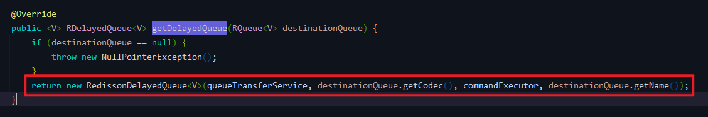

# Redisson（一） 延迟队列 Delayed Queue 添加队列数据

## 前言
这段时间在补 Spring Cloud 的视频，本来是打算为了学习【RuoYi-Cloud-Plus】做准备的。然后今天在群里被狮子大佬催更了（捂脸），大佬说可以分析一下【RuoYi-Vue-Plus】4.0版本新增功能，**Redisson 分布式队列**。

其实之前还没正式发布的时候，我在 dev 分支就看了一下这块内容，但是打开源码全是 Lua 脚本，我就默默关掉了……

不过前段时间补了一下 Redis 6 的一些相关知识，里面有讲过关于 Lua 脚本的内容，虽然讲得比较简单，不过还算是能听懂一些，趁着有些时间，又去找了一些资料，发现慢慢看还是可以看懂大概，所以就赶紧写一下这篇博客，当然只是从比较简单的延迟队列开始，后续有时间会继续分析其他队列。

## 参考目录
- [Redisson 官方文档 - 7.15. 延迟队列（Delayed Queue）](https://github.com/redisson/redisson/wiki/7.-%E5%88%86%E5%B8%83%E5%BC%8F%E9%9B%86%E5%90%88#715-%E5%BB%B6%E8%BF%9F%E9%98%9F%E5%88%97delayed-queue)
- [微服务应用(十九)：延时队列 之 Redisson DelayedQueue 实现](http://www.gxitsky.com/article/1615808250172713#menu_4)<br>
  很详细的一篇博客，这篇文章也是基于这个再结合框架进行了整理分析。
- [聊聊redisson的DelayedQueue](https://www.modb.pro/db/120068)

## 代码实现
官方文档的demo（比较简单）：<br>
<br>

框架实现：
- 添加队列数据

`DelayedQueueController#add`<br>
<br>
`QueueUtils#addDelayedQueueObject`<br>
<br>
## 功能调用
流程：

1. 登录前端页面，获取 token，设置接口文档全局参数。

2. 接口文档中调用【延迟队列 - 订阅队列】接口

3. 接口文档中调用【延迟队列 - 添加队列数据】接口

4. 查看控制台参数打印

## 源码分析
### 1、新建延迟队列
参考 `QueueUtils#addDelayedQueueObject` 方法可知，在添加数据前，先调用了 `getDelayedQueue` 方法获取一个延迟队列。

`RedissonDelayedQueue#RedissonDelayedQueue`


### 2、添加数据

### 3、Lua 脚本分析
这两个方法主要的操作步骤都是由 Lua 脚本来完成的，一开始就看脚本会容易懵逼，要看懂的话可以借助反向推导的方式，直接先看 Redis 做了什么操作。

操作方式：

1. `redis-cli` 打开 Redis 控制台。
如果是和我一样是 windows 本地的，可以直接打开 `redis-cli.exe`。

2. 输入命令 `minitor` 监控 Redis 操作。

3. 直接调用添加队列数据接口，可以看到以下输出：

这里图不太直观，所以我在前面单独整理了一份，可能某些时间参数不一样，但是总体的过程是一样的。<br>

 
总体执行分成两部分：第一部分是添加数据，第二部分是获取数据。

#### 第一部分
输出结果：
```bash
1645518012.326477 [0 127.0.0.1:50852] "EVAL" "local value = struct.pack('dLc0', tonumber(ARGV[2]), string.len(ARGV[3]), ARGV[3]);redis.call('zadd', KEYS[2], ARGV[1], value);redis.call('rpush', KEYS[3], value);local v = redis.call('zrange', KEYS[2], 0, 0); if v[1] == value then redis.call('publish', KEYS[4], ARGV[1]); end;" "4" "zlyx" "redisson_delay_queue_timeout:{zlyx}" "redisson_delay_queue:{zlyx}" "redisson_delay_queue_channel:{zlyx}" "1645518017326" "2476180431764309577" "\"0001\""

1645518012.326784 [0 lua] "zadd" "redisson_delay_queue_timeout:{zlyx}" "1645518017326" "\xe3\x8a\xdd}\x94.\xc1C\x06\x00\x00\x00\"0001\""

1645518012.326868 [0 lua] "rpush" "redisson_delay_queue:{zlyx}" "\xe3\x8a\xdd}\x94.\xc1C\x06\x00\x00\x00\"0001\""

1645518012.326925 [0 lua] "zrange" "redisson_delay_queue_timeout:{zlyx}" "0" "0"

1645518012.326988 [0 lua] "publish" "redisson_delay_queue_channel:{zlyx}" "1645518017326"
```
参数分析：<br>
<br>

脚本调用的方法参数对照表：

| 脚本参数名   | Java参数名        | 参数值                                               |
|---------|----------------|---------------------------------------------------|
| KEYS[1] | getRawName()   | "zlyx"                                            |
| KEYS[2] | timeoutSetName | "redisson_delay_queue_timeout:{zlyx}"             |
| KEYS[3] | queueName      | "redisson_delay_queue:{zlyx}"                     |
| KEYS[4] | channelName    | "redisson_delay_queue_channel:{zlyx}"             |
| ARGV[1] | timeout        | "1645518017326"                                   |
| ARGV[2] | randomId       | "2476180431764309577"                             |
| ARGV[3] | encode(e)      | "\xe3\x8a\xdd}\x94.\xc1C\x06\x00\x00\x00\"0001\"" |

脚本分析：
```bash
# struct.pack 用于数据打包, struct.pack(格式化字符串,需要打包的数据1,需要打包的数据2…), 此处打包队列内容信息为 value
local value = struct.pack('dLc0', tonumber(ARGV[2]), string.len(ARGV[3]), ARGV[3]); 

# 将元素 value 加入到 Sorted Set, KEY 为 "timeoutSetName" 的延时队列, "timeout" 为延时时间
redis.call('zadd', KEYS[2], ARGV[1], value);

## 转换为简易命令： "zadd" "timeoutSetName" "timeout" value
## 实际输出： "zadd" "redisson_delay_queue_timeout:{zlyx}" "1645518017326" "\xe3\x8a\xdd}\x94.\xc1C\x06\x00\x00\x00\"0001\""

# 将元素 value 加入到 List, KEY 为 queueName, 从右侧加入, 这是个普通 List
redis.call('rpush', KEYS[3], value);

## 转换为简易命令： "rpush" queueName value
## 实际输出： "rpush" "redisson_delay_queue:{zlyx}" "\xe3\x8a\xdd}\x94.\xc1C\x06\x00\x00\x00\"0001\""

# 延时队列 Sorted Set (KEY 为 "timeoutSetName") 从小到大排序, 并从中取出第一个元素
local v = redis.call('zrange', KEYS[2], 0, 0); 

## 转换为简易命令： "zrange" "timeoutSetName" "0" "0"
## 实际输出： "zrange" "redisson_delay_queue_timeout:{zlyx}" "0" "0"

if v[1] == value 
    then 
    # 如果第一个元素为当前新增的元素, 发布到 channel 中 "channelName"
    redis.call('publish', KEYS[4], ARGV[1]); 
end;

## 转换为简易命令： "publish" "channelName" "timeout"
## 实际输出： "publish" "redisson_delay_queue_channel:{zlyx}" "1645518017326"
```
#### 第二部分
输出结果：
```bash
1645518017.426758 [0 127.0.0.1:50849] "EVAL" "local expiredValues = redis.call('zrangebyscore', KEYS[2], 0, ARGV[1], 'limit', 0, ARGV[2]); if #expiredValues > 0 then for i, v in ipairs(expiredValues) do local randomId, value = struct.unpack('dLc0', v);redis.call('rpush', KEYS[1], value);redis.call('lrem', KEYS[3], 1, v);end; redis.call('zrem', KEYS[2], unpack(expiredValues));end; local v = redis.call('zrange', KEYS[2], 0, 0, 'WITHSCORES'); if v[1] ~= nil then return v[2]; end return nil;" "3" "zlyx" "redisson_delay_queue_timeout:{zlyx}" "redisson_delay_queue:{zlyx}" "1645518017426" "100"

1645518017.426955 [0 lua] "zrangebyscore" "redisson_delay_queue_timeout:{zlyx}" "0" "1645518017426" "limit" "0" "100"

1645518017.426997 [0 lua] "rpush" "zlyx" "\"0001\""

1645518017.427013 [0 lua] "lrem" "redisson_delay_queue:{zlyx}" "1" "\xe3\x8a\xdd}\x94.\xc1C\x06\x00\x00\x00\"0001\""

1645518017.427033 [0 lua] "zrem" "redisson_delay_queue_timeout:{zlyx}" "\xe3\x8a\xdd}\x94.\xc1C\x06\x00\x00\x00\"0001\""

1645518017.427054 [0 lua] "zrange" "redisson_delay_queue_timeout:{zlyx}" "0" "0" "WITHSCORES"

1645518017.427970 [0 127.0.0.1:50853] "BLPOP" "zlyx" "0"
```
参数分析：<br>
<br>

脚本调用的方法参数对照表：

| 脚本参数名   | Java参数名                    | 参数值                                   |
|---------|----------------------------|---------------------------------------|
| KEYS[1] | getRawName()               | "zlyx"                                |
| KEYS[2] | timeoutSetName             | "redisson_delay_queue_timeout:{zlyx}" |
| KEYS[3] | queueName                  | "redisson_delay_queue:{zlyx}"         |
| ARGV[1] | System.currentTimeMillis() | "1645518017326"                       |
| ARGV[2] | 100                        | 100                                   |

脚本分析：
```bash
## 从 Sorted Set 按 score 从小到大排序，拿出小于当前时间的 100 条数据（已过期的数据）
local expiredValues = redis.call('zrangebyscore', KEYS[2], 0, ARGV[1], 'limit', 0, ARGV[2]); 

## 转换为简易命令： "zrangebyscore" "timeoutSetName" "0" "timeout" "limit" "0" "100"
## 实际输出： "zrangebyscore" "redisson_delay_queue_timeout:{zlyx}" "0" "1645518017426" "limit" "0" "100"

if #expiredValues > 0 
    then 
    ## 循环遍历
    for i, v in ipairs(expiredValues)
    ## struct.unpack 用于数据解包, struct.unpack(格式化字符串,需要解包的字节数组,开始解包的位置), 得到数据 v
    do local randomId, value = struct.unpack('dLc0', v);
	
        ## 加入到阻塞队列 queueName
        redis.call('rpush', KEYS[1], value);
		
## 转换为简易命令： "rpush" getRawName() value
## 实际输出： "rpush" "zlyx" "\"0001\""
		
        ## 删除 queueName 队列 (List) 该元素 v
        redis.call('lrem', KEYS[3], 1, v);
		
## 转换为简易命令： "lrem" queueName "1" v
## 实际输出： "lrem" "redisson_delay_queue:{zlyx}" "1" "\xe3\x8a\xdd}\x94.\xc1C\x06\x00\x00\x00\"0001\""
		
    end; 
	
    ## 删除 Sorted Set 中的该元素
    redis.call('zrem', KEYS[2], unpack(expiredValues));    
	
## 转换为简易命令： "zrem" timeoutSetName unpack(expiredValues)
## 实际输出： "zrem" "redisson_delay_queue_timeout:{zlyx}" "\xe3\x8a\xdd}\x94.\xc1C\x06\x00\x00\x00\"0001\""
	
end; 

## 取出 Sorted Set 中 score 最小的元素返回
local v = redis.call('zrange', KEYS[2], 0, 0, 'WITHSCORES'); 

## 转换为简易命令： "zrange" timeoutSetName "0" "0" "WITHSCORES"
## 实际输出： "zrange" "redisson_delay_queue_timeout:{zlyx}" "0" "0" "WITHSCORES"

if v[1] ~= nil 
    then return v[2];     
end 
return nil;
```