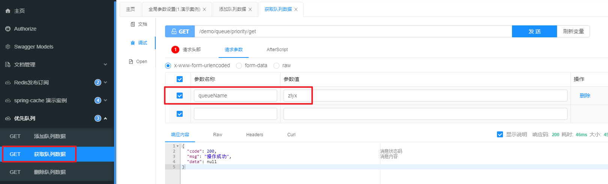

# Redisson（二） 优先队列 Priority Queue 添加队列数据

## 前言
继上一篇延迟队列之后，这一篇文章来说一下优先队列。不过 Redisson 提供的分布式队列是比较轻量级的，如果需要大量使用队列的场景的话，还是建议用专业的MQ。

我个人队列使用得比较少，但是其实队列在生产环境中也很重要，所以我也在补全这方面的知识。

这篇文章主要是记录一下底层 lua 脚本的执行过程。对于 Redisson 源码的部分我还没完整梳理出来，如果后面有机会再分享一下。

## 参考目录
- [Redisson 官方文档 - 7.16. 优先队列（Priority Queue）](https://github.com/redisson/redisson/wiki/7.-%E5%88%86%E5%B8%83%E5%BC%8F%E9%9B%86%E5%90%88#716-%E4%BC%98%E5%85%88%E9%98%9F%E5%88%97priority-queue)

## 代码实现
### 官方文档的demo（比较简单）：

### 框架实现：
#### 添加队列数据

`PriorityQueueController#add`<br>
<br>
框架中的逻辑主要是：

1. 创建一个自定义比较器的优先队列。
2. 循环随机生成10条数据（10以内的的 int 型数据），每生成一条数据就把该数据加入到优先队列中。

####  自定义比较器

`PriorityDemoComparator`<br>
<br>
####  比较对象

`PriorityDemo`<br>
<br>

比较器比较的是对象中的 `orderNum` 参数。<br>
<br>
#### 设置比较器
`QueueUtils#trySetPriorityQueueComparator`<br>
<br>
#### 添加队列数据
`QueueUtils#addPriorityQueueObject`<br>
<br>
## 功能调用
流程：<br>

1. 登录前端页面，获取 token，设置接口文档全局参数。

2. 接口文档中调用【优先队列 - 添加队列数据】接口

3. 查看控制台参数打印

4. 接口文档中调用【优先队列 - 获取队列数据】接口

5. 查看控制台参数打印

可以看到消息按照 orderNum 从小到大进行排列输出。<br>
**注：当 orderNum 相同时，消息的顺序是随机的。**

## 源码分析
### 添加数据
`RedissonPriorityQueue#add`<br>

### Lua 脚本分析
和上一篇类似，我用了测试中的其中一份数据来进行分析，文末有 Redis monitor 模式下控制台输出的内容。（操作方式见上一篇）<br>

脚本调用的方法参数对照表：

| 脚本参数名   | Java参数名       | 参数值    | 
|---------|---------------|--------|
| KEYS[1] | getRawName()  | "zlyx" |
| ARGV[1] | index         | 插入值的下标 |
| ARGV[2] | encode(value) | 解码的参数值 |

发送数据：<br>
<br>

获取数据：<br>
<br>

脚本执行分析：<br>

```bash
local len = redis.call('llen', KEYS[1]);
## "llen" "zlyx"

if tonumber(ARGV[1]) < len then 
    local pivot = redis.call('lindex', KEYS[1], ARGV[1]);
##1 "lindex" "zlyx" "0"
##3 "lindex" "zlyx" "2"
##5 "lindex" "zlyx" "1"
##6 "lindex" "zlyx" "3"
##7 "lindex" "zlyx" "5"
##8 "lindex" "zlyx" "4"
##9 "lindex" "zlyx" "7"
	
    redis.call('linsert', KEYS[1], 'before', pivot, ARGV[2]);
##1 "linsert" "zlyx" "before" 
##  "{\"@class\":\"com.ruoyi.demo.controller.queue.PriorityDemo\",\"name\":\"data-0\",\"orderNum\":2}" 
##  "{\"@class\":\"com.ruoyi.demo.controller.queue.PriorityDemo\",\"name\":\"data-1\",\"orderNum\":0}"
###1 [1-0, 0-2] 
##3 "linsert" "zlyx" "before" 
##  "{\"@class\":\"com.ruoyi.demo.controller.queue.PriorityDemo\",\"name\":\"data-2\",\"orderNum\":4}" 
##  "{\"@class\":\"com.ruoyi.demo.controller.queue.PriorityDemo\",\"name\":\"data-3\",\"orderNum\":2}"
###3 [1-0, 0-2, 3-2, 2-4] 
##5 "linsert" "zlyx" "before" 
##  "{\"@class\":\"com.ruoyi.demo.controller.queue.PriorityDemo\",\"name\":\"data-0\",\"orderNum\":2}" 
##  "{\"@class\":\"com.ruoyi.demo.controller.queue.PriorityDemo\",\"name\":\"data-5\",\"orderNum\":0}"
###5 [1-0, 5-0, 0-2, 3-2, 2-4, 4-8]
##6 "linsert" "zlyx" "before" 
##  "{\"@class\":\"com.ruoyi.demo.controller.queue.PriorityDemo\",\"name\":\"data-3\",\"orderNum\":2}" 
##  "{\"@class\":\"com.ruoyi.demo.controller.queue.PriorityDemo\",\"name\":\"data-6\",\"orderNum\":2}"
###6 [1-0, 5-0, 0-2, 6-2, 3-2, 2-4, 4-8]
##7 "linsert" "zlyx" "before" 
##  "{\"@class\":\"com.ruoyi.demo.controller.queue.PriorityDemo\",\"name\":\"data-2\",\"orderNum\":4}" 
##  "{\"@class\":\"com.ruoyi.demo.controller.queue.PriorityDemo\",\"name\":\"data-7\",\"orderNum\":3}"
###7 [1-0, 5-0, 0-2, 6-2, 3-2, 7-3, 2-4, 4-8]
##8 "linsert" "zlyx" "before" 
##  "{\"@class\":\"com.ruoyi.demo.controller.queue.PriorityDemo\",\"name\":\"data-3\",\"orderNum\":2}" 
##  "{\"@class\":\"com.ruoyi.demo.controller.queue.PriorityDemo\",\"name\":\"data-8\",\"orderNum\":2}"
###8 [1-0, 5-0, 0-2, 6-2, 8-2, 3-2, 7-3, 2-4, 4-8]
##9 "linsert" "zlyx" "before" 
##  "{\"@class\":\"com.ruoyi.demo.controller.queue.PriorityDemo\",\"name\":\"data-2\",\"orderNum\":4}" 
##  "{\"@class\":\"com.ruoyi.demo.controller.queue.PriorityDemo\",\"name\":\"data-9\",\"orderNum\":3}"
###9 [1-0, 5-0, 0-2, 6-2, 8-2, 3-2, 7-3, 9-3, 2-4, 4-8]
	
    return;
end;

redis.call('rpush', KEYS[1], ARGV[2]);
##0 "rpush" "zlyx" "{\"@class\":\"com.ruoyi.demo.controller.queue.PriorityDemo\",\"name\":\"data-0\",\"orderNum\":2}"
###0 [0-2] 
##2 "rpush" "zlyx" "{\"@class\":\"com.ruoyi.demo.controller.queue.PriorityDemo\",\"name\":\"data-2\",\"orderNum\":4}"
###2 [1-0, 0-2, 2-4] 
##4 "rpush" "zlyx" "{\"@class\":\"com.ruoyi.demo.controller.queue.PriorityDemo\",\"name\":\"data-4\",\"orderNum\":8}"
###4 [1-0, 0-2, 3-2, 2-4, 4-8]
```

说明：
- 这是附文简化提炼出来分析的执行内容。
- 为了方便查看所以在中间的循环中把命令分行了，执行是没有分行的。
- `##(数值)` 代表执行到第几个元素，从0开始，后面紧跟着的是底层执行的命令。
- `###(数值)` 代表当前队列中的元素的集合，从0开始。

执行情况：

1. 第一个元素（data-0，orderNum=2）直接插入队列最后面（参考 `##0 "rpush"`）。<br>
   **[0-2]**
2. 第二个元素（data-1，orderNum=0）判断比上一个元素小，所以获取到需要插入的下标位置（参考 `##1 "lindex"`），再执行插入方法（参考 `##1 "linsert"`）。<br>
   **[1-0, 0-2]**
3. 第三个元素（data-2，orderNum=4）判断比前两个元素大，直接插入到队列最后面（参考 `##2 "rpush"`）。<br>
   **[1-0, 0-2, 2-4]**
4. 第四个元素（data-3，orderNum=2）判断比 data-1 大，比 data-2 小，插入到下标为 2（参考 `##3 "lindex"`），再执行插入方法（参考 `##3 "linsert"`）。<br>
   **[1-0, 0-2, 3-2, 2-4]**
5. 第五个元素（data-4，orderNum=8），参考步骤 3。<br>
   **[1-0, 0-2, 3-2, 2-4, 4-8]**
6. 第六个元素（data-5，orderNum=0）判断排序值最小，获取到需要插入的下标位置（参考 `##5 "lindex"`），再执行插入方法（参考 `##5 "linsert"`）插入到 data-0 后面。<br>
   **[1-0, 5-0, 0-2, 3-2, 2-4, 4-8]**
7. 第七个元素（data-6，orderNum=2）判断比 data-1 大，比 data-2 小，插入到下标为 3（参考 `##6 "lindex"`），再执行插入方法（参考 `##6 "linsert"`）。<br>
   **注意这里没有按照顺序插入到 data-3 后面，这里可以证明在相同的排序条件下，不同的没有顺序可言。（有兴趣的话可以自行测试一下）**<br>
   **[1-0, 5-0, 0-2, 6-2, 3-2, 2-4, 4-8]**
8. 第八个元素（data-7，orderNum=3），参考步骤 3。<br>
   **[1-0, 5-0, 0-2, 6-2, 3-2, 7-3, 2-4, 4-8]**
9. 第九个元素（data-8，orderNum=2），参考步骤 7。<br>
   **[1-0, 5-0, 0-2, 6-2, 8-2, 3-2, 7-3, 2-4, 4-8]**
10. 第十个元素（data-9，orderNum=3），参考步骤 6。<br>
    **[1-0, 5-0, 0-2, 6-2, 8-2, 3-2, 7-3, 9-3, 2-4, 4-8]**

至此全部数据插入完成并完成排序，获取数据时就按照该顺序进行输出。

## 附文
### Redis monitor 模式下控制台输出完整内容
```bash
1646811971.584176 [0 127.0.0.1:59375] "DEL" "zlyx" "{zlyx}:redisson_sortedset_comparator"
1646811971.584709 [0 127.0.0.1:59372] "SETNX" "{zlyx}:redisson_sortedset_comparator" "com.ruoyi.demo.controller.queue.PriorityDemoComparator:77a5f57e5635883a9e3177484600654474ba78e9"
1646811971.585341 [0 127.0.0.1:59371] "EVAL" "if (redis.call('exists', KEYS[1]) == 0) then redis.call('hincrby', KEYS[1], ARGV[2], 1); redis.call('pexpire', KEYS[1], ARGV[1]); return nil; end; if (redis.call('hexists', KEYS[1], ARGV[2]) == 1) then redis.call('hincrby', KEYS[1], ARGV[2], 1); redis.call('pexpire', KEYS[1], ARGV[1]); return nil; end; return redis.call('pttl', KEYS[1]);" "1" "redisson_sortedset_lock:{zlyx}" "30000" "218ff15e-1019-4f97-8704-a6ba525b6d08:86"
1646811971.585436 [0 lua] "exists" "redisson_sortedset_lock:{zlyx}"
1646811971.585448 [0 lua] "hincrby" "redisson_sortedset_lock:{zlyx}" "218ff15e-1019-4f97-8704-a6ba525b6d08:86" "1"
1646811971.585465 [0 lua] "pexpire" "redisson_sortedset_lock:{zlyx}" "30000"
1646811971.585782 [0 127.0.0.1:59373] "GET" "{zlyx}:redisson_sortedset_comparator"
1646811971.586064 [0 127.0.0.1:59374] "GET" "{zlyx}:redisson_sortedset_comparator"
1646811971.586892 [0 127.0.0.1:59369] "LLEN" "zlyx"
1646811971.587458 [0 127.0.0.1:59370] "EVAL" "local len = redis.call('llen', KEYS[1]);if tonumber(ARGV[1]) < len then local pivot = redis.call('lindex', KEYS[1], ARGV[1]);redis.call('linsert', KEYS[1], 'before', pivot, ARGV[2]);return;end;redis.call('rpush', KEYS[1], ARGV[2]);" "1" "zlyx" "0" "{\"@class\":\"com.ruoyi.demo.controller.queue.PriorityDemo\",\"name\":\"data-0\",\"orderNum\":2}"
1646811971.587621 [0 lua] "llen" "zlyx"
1646811971.587634 [0 lua] "rpush" "zlyx" "{\"@class\":\"com.ruoyi.demo.controller.queue.PriorityDemo\",\"name\":\"data-0\",\"orderNum\":2}"
1646811971.588151 [0 127.0.0.1:59376] "EVAL" "if (redis.call('hexists', KEYS[1], ARGV[3]) == 0) then return nil;end; local counter = redis.call('hincrby', KEYS[1], ARGV[3], -1); if (counter > 0) then redis.call('pexpire', KEYS[1], ARGV[2]); return 0; else redis.call('del', KEYS[1]); redis.call('publish', KEYS[2], ARGV[1]); return 1; end; return nil;" "2" "redisson_sortedset_lock:{zlyx}" "redisson_lock__channel:redisson_sortedset_lock:{zlyx}" "0" "30000" "218ff15e-1019-4f97-8704-a6ba525b6d08:86"
1646811971.588484 [0 lua] "hexists" "redisson_sortedset_lock:{zlyx}" "218ff15e-1019-4f97-8704-a6ba525b6d08:86"
1646811971.588545 [0 lua] "hincrby" "redisson_sortedset_lock:{zlyx}" "218ff15e-1019-4f97-8704-a6ba525b6d08:86" "-1"
1646811971.588620 [0 lua] "del" "redisson_sortedset_lock:{zlyx}"
1646811971.588675 [0 lua] "publish" "redisson_lock__channel:redisson_sortedset_lock:{zlyx}" "0"
1646811971.589947 [0 127.0.0.1:59375] "EVAL" "if (redis.call('exists', KEYS[1]) == 0) then redis.call('hincrby', KEYS[1], ARGV[2], 1); redis.call('pexpire', KEYS[1], ARGV[1]); return nil; end; if (redis.call('hexists', KEYS[1], ARGV[2]) == 1) then redis.call('hincrby', KEYS[1], ARGV[2], 1); redis.call('pexpire', KEYS[1], ARGV[1]); return nil; end; return redis.call('pttl', KEYS[1]);" "1" "redisson_sortedset_lock:{zlyx}" "30000" "218ff15e-1019-4f97-8704-a6ba525b6d08:86"
1646811971.590128 [0 lua] "exists" "redisson_sortedset_lock:{zlyx}"
1646811971.590156 [0 lua] "hincrby" "redisson_sortedset_lock:{zlyx}" "218ff15e-1019-4f97-8704-a6ba525b6d08:86" "1"
1646811971.590243 [0 lua] "pexpire" "redisson_sortedset_lock:{zlyx}" "30000"
1646811971.590664 [0 127.0.0.1:59372] "GET" "{zlyx}:redisson_sortedset_comparator"
1646811971.591208 [0 127.0.0.1:59371] "GET" "{zlyx}:redisson_sortedset_comparator"
1646811971.591615 [0 127.0.0.1:59373] "LLEN" "zlyx"
1646811971.591873 [0 127.0.0.1:59374] "LINDEX" "zlyx" "0"
1646811971.592474 [0 127.0.0.1:59369] "EVAL" "local len = redis.call('llen', KEYS[1]);if tonumber(ARGV[1]) < len then local pivot = redis.call('lindex', KEYS[1], ARGV[1]);redis.call('linsert', KEYS[1], 'before', pivot, ARGV[2]);return;end;redis.call('rpush', KEYS[1], ARGV[2]);" "1" "zlyx" "0" "{\"@class\":\"com.ruoyi.demo.controller.queue.PriorityDemo\",\"name\":\"data-1\",\"orderNum\":0}"
1646811971.592608 [0 lua] "llen" "zlyx"
1646811971.592623 [0 lua] "lindex" "zlyx" "0"
1646811971.592638 [0 lua] "linsert" "zlyx" "before" "{\"@class\":\"com.ruoyi.demo.controller.queue.PriorityDemo\",\"name\":\"data-0\",\"orderNum\":2}" "{\"@class\":\"com.ruoyi.demo.controller.queue.PriorityDemo\",\"name\":\"data-1\",\"orderNum\":0}"
1646811971.593110 [0 127.0.0.1:59370] "EVAL" "if (redis.call('hexists', KEYS[1], ARGV[3]) == 0) then return nil;end; local counter = redis.call('hincrby', KEYS[1], ARGV[3], -1); if (counter > 0) then redis.call('pexpire', KEYS[1], ARGV[2]); return 0; else redis.call('del', KEYS[1]); redis.call('publish', KEYS[2], ARGV[1]); return 1; end; return nil;" "2" "redisson_sortedset_lock:{zlyx}" "redisson_lock__channel:redisson_sortedset_lock:{zlyx}" "0" "30000" "218ff15e-1019-4f97-8704-a6ba525b6d08:86"
1646811971.593329 [0 lua] "hexists" "redisson_sortedset_lock:{zlyx}" "218ff15e-1019-4f97-8704-a6ba525b6d08:86"
1646811971.593380 [0 lua] "hincrby" "redisson_sortedset_lock:{zlyx}" "218ff15e-1019-4f97-8704-a6ba525b6d08:86" "-1"
1646811971.593428 [0 lua] "del" "redisson_sortedset_lock:{zlyx}"
1646811971.593453 [0 lua] "publish" "redisson_lock__channel:redisson_sortedset_lock:{zlyx}" "0"
1646811971.594555 [0 127.0.0.1:59376] "EVAL" "if (redis.call('exists', KEYS[1]) == 0) then redis.call('hincrby', KEYS[1], ARGV[2], 1); redis.call('pexpire', KEYS[1], ARGV[1]); return nil; end; if (redis.call('hexists', KEYS[1], ARGV[2]) == 1) then redis.call('hincrby', KEYS[1], ARGV[2], 1); redis.call('pexpire', KEYS[1], ARGV[1]); return nil; end; return redis.call('pttl', KEYS[1]);" "1" "redisson_sortedset_lock:{zlyx}" "30000" "218ff15e-1019-4f97-8704-a6ba525b6d08:86"
1646811971.594743 [0 lua] "exists" "redisson_sortedset_lock:{zlyx}"
1646811971.594770 [0 lua] "hincrby" "redisson_sortedset_lock:{zlyx}" "218ff15e-1019-4f97-8704-a6ba525b6d08:86" "1"
1646811971.594811 [0 lua] "pexpire" "redisson_sortedset_lock:{zlyx}" "30000"
1646811971.595201 [0 127.0.0.1:59375] "GET" "{zlyx}:redisson_sortedset_comparator"
1646811971.595480 [0 127.0.0.1:59372] "GET" "{zlyx}:redisson_sortedset_comparator"
1646811971.595865 [0 127.0.0.1:59371] "LLEN" "zlyx"
1646811971.596243 [0 127.0.0.1:59373] "LINDEX" "zlyx" "0"
1646811971.596606 [0 127.0.0.1:59374] "LINDEX" "zlyx" "1"
1646811971.597064 [0 127.0.0.1:59369] "EVAL" "local len = redis.call('llen', KEYS[1]);if tonumber(ARGV[1]) < len then local pivot = redis.call('lindex', KEYS[1], ARGV[1]);redis.call('linsert', KEYS[1], 'before', pivot, ARGV[2]);return;end;redis.call('rpush', KEYS[1], ARGV[2]);" "1" "zlyx" "2" "{\"@class\":\"com.ruoyi.demo.controller.queue.PriorityDemo\",\"name\":\"data-2\",\"orderNum\":4}"
1646811971.597183 [0 lua] "llen" "zlyx"
1646811971.597198 [0 lua] "rpush" "zlyx" "{\"@class\":\"com.ruoyi.demo.controller.queue.PriorityDemo\",\"name\":\"data-2\",\"orderNum\":4}"
1646811971.597612 [0 127.0.0.1:59370] "EVAL" "if (redis.call('hexists', KEYS[1], ARGV[3]) == 0) then return nil;end; local counter = redis.call('hincrby', KEYS[1], ARGV[3], -1); if (counter > 0) then redis.call('pexpire', KEYS[1], ARGV[2]); return 0; else redis.call('del', KEYS[1]); redis.call('publish', KEYS[2], ARGV[1]); return 1; end; return nil;" "2" "redisson_sortedset_lock:{zlyx}" "redisson_lock__channel:redisson_sortedset_lock:{zlyx}" "0" "30000" "218ff15e-1019-4f97-8704-a6ba525b6d08:86"
1646811971.597747 [0 lua] "hexists" "redisson_sortedset_lock:{zlyx}" "218ff15e-1019-4f97-8704-a6ba525b6d08:86"
1646811971.597783 [0 lua] "hincrby" "redisson_sortedset_lock:{zlyx}" "218ff15e-1019-4f97-8704-a6ba525b6d08:86" "-1"
1646811971.597803 [0 lua] "del" "redisson_sortedset_lock:{zlyx}"
1646811971.597811 [0 lua] "publish" "redisson_lock__channel:redisson_sortedset_lock:{zlyx}" "0"
1646811971.598981 [0 127.0.0.1:59376] "EVAL" "if (redis.call('exists', KEYS[1]) == 0) then redis.call('hincrby', KEYS[1], ARGV[2], 1); redis.call('pexpire', KEYS[1], ARGV[1]); return nil; end; if (redis.call('hexists', KEYS[1], ARGV[2]) == 1) then redis.call('hincrby', KEYS[1], ARGV[2], 1); redis.call('pexpire', KEYS[1], ARGV[1]); return nil; end; return redis.call('pttl', KEYS[1]);" "1" "redisson_sortedset_lock:{zlyx}" "30000" "218ff15e-1019-4f97-8704-a6ba525b6d08:86"
1646811971.599187 [0 lua] "exists" "redisson_sortedset_lock:{zlyx}"
1646811971.599209 [0 lua] "hincrby" "redisson_sortedset_lock:{zlyx}" "218ff15e-1019-4f97-8704-a6ba525b6d08:86" "1"
1646811971.599239 [0 lua] "pexpire" "redisson_sortedset_lock:{zlyx}" "30000"
1646811971.599672 [0 127.0.0.1:59375] "GET" "{zlyx}:redisson_sortedset_comparator"
1646811971.600015 [0 127.0.0.1:59372] "GET" "{zlyx}:redisson_sortedset_comparator"
1646811971.600546 [0 127.0.0.1:59371] "LLEN" "zlyx"
1646811971.600858 [0 127.0.0.1:59373] "LINDEX" "zlyx" "1"
1646811971.601565 [0 127.0.0.1:59374] "EVAL" "local len = redis.call('llen', KEYS[1]);if tonumber(ARGV[1]) < len then local pivot = redis.call('lindex', KEYS[1], ARGV[1]);redis.call('linsert', KEYS[1], 'before', pivot, ARGV[2]);return;end;redis.call('rpush', KEYS[1], ARGV[2]);" "1" "zlyx" "2" "{\"@class\":\"com.ruoyi.demo.controller.queue.PriorityDemo\",\"name\":\"data-3\",\"orderNum\":2}"
1646811971.601641 [0 lua] "llen" "zlyx"
1646811971.601663 [0 lua] "lindex" "zlyx" "2"
1646811971.601669 [0 lua] "linsert" "zlyx" "before" "{\"@class\":\"com.ruoyi.demo.controller.queue.PriorityDemo\",\"name\":\"data-2\",\"orderNum\":4}" "{\"@class\":\"com.ruoyi.demo.controller.queue.PriorityDemo\",\"name\":\"data-3\",\"orderNum\":2}"
1646811971.602177 [0 127.0.0.1:59369] "EVAL" "if (redis.call('hexists', KEYS[1], ARGV[3]) == 0) then return nil;end; local counter = redis.call('hincrby', KEYS[1], ARGV[3], -1); if (counter > 0) then redis.call('pexpire', KEYS[1], ARGV[2]); return 0; else redis.call('del', KEYS[1]); redis.call('publish', KEYS[2], ARGV[1]); return 1; end; return nil;" "2" "redisson_sortedset_lock:{zlyx}" "redisson_lock__channel:redisson_sortedset_lock:{zlyx}" "0" "30000" "218ff15e-1019-4f97-8704-a6ba525b6d08:86"
1646811971.602329 [0 lua] "hexists" "redisson_sortedset_lock:{zlyx}" "218ff15e-1019-4f97-8704-a6ba525b6d08:86"
1646811971.602358 [0 lua] "hincrby" "redisson_sortedset_lock:{zlyx}" "218ff15e-1019-4f97-8704-a6ba525b6d08:86" "-1"
1646811971.602446 [0 lua] "del" "redisson_sortedset_lock:{zlyx}"
1646811971.602460 [0 lua] "publish" "redisson_lock__channel:redisson_sortedset_lock:{zlyx}" "0"
1646811971.603543 [0 127.0.0.1:59370] "EVAL" "if (redis.call('exists', KEYS[1]) == 0) then redis.call('hincrby', KEYS[1], ARGV[2], 1); redis.call('pexpire', KEYS[1], ARGV[1]); return nil; end; if (redis.call('hexists', KEYS[1], ARGV[2]) == 1) then redis.call('hincrby', KEYS[1], ARGV[2], 1); redis.call('pexpire', KEYS[1], ARGV[1]); return nil; end; return redis.call('pttl', KEYS[1]);" "1" "redisson_sortedset_lock:{zlyx}" "30000" "218ff15e-1019-4f97-8704-a6ba525b6d08:86"
1646811971.603738 [0 lua] "exists" "redisson_sortedset_lock:{zlyx}"
1646811971.603758 [0 lua] "hincrby" "redisson_sortedset_lock:{zlyx}" "218ff15e-1019-4f97-8704-a6ba525b6d08:86" "1"
1646811971.603796 [0 lua] "pexpire" "redisson_sortedset_lock:{zlyx}" "30000"
1646811971.604413 [0 127.0.0.1:59376] "GET" "{zlyx}:redisson_sortedset_comparator"
1646811971.604868 [0 127.0.0.1:59375] "GET" "{zlyx}:redisson_sortedset_comparator"
1646811971.605400 [0 127.0.0.1:59372] "LLEN" "zlyx"
1646811971.605814 [0 127.0.0.1:59371] "LINDEX" "zlyx" "1"
1646811971.606247 [0 127.0.0.1:59373] "LINDEX" "zlyx" "2"
1646811971.606556 [0 127.0.0.1:59374] "LINDEX" "zlyx" "3"
1646811971.607056 [0 127.0.0.1:59369] "EVAL" "local len = redis.call('llen', KEYS[1]);if tonumber(ARGV[1]) < len then local pivot = redis.call('lindex', KEYS[1], ARGV[1]);redis.call('linsert', KEYS[1], 'before', pivot, ARGV[2]);return;end;redis.call('rpush', KEYS[1], ARGV[2]);" "1" "zlyx" "4" "{\"@class\":\"com.ruoyi.demo.controller.queue.PriorityDemo\",\"name\":\"data-4\",\"orderNum\":8}"
1646811971.607189 [0 lua] "llen" "zlyx"
1646811971.607211 [0 lua] "rpush" "zlyx" "{\"@class\":\"com.ruoyi.demo.controller.queue.PriorityDemo\",\"name\":\"data-4\",\"orderNum\":8}"
1646811971.607738 [0 127.0.0.1:59370] "EVAL" "if (redis.call('hexists', KEYS[1], ARGV[3]) == 0) then return nil;end; local counter = redis.call('hincrby', KEYS[1], ARGV[3], -1); if (counter > 0) then redis.call('pexpire', KEYS[1], ARGV[2]); return 0; else redis.call('del', KEYS[1]); redis.call('publish', KEYS[2], ARGV[1]); return 1; end; return nil;" "2" "redisson_sortedset_lock:{zlyx}" "redisson_lock__channel:redisson_sortedset_lock:{zlyx}" "0" "30000" "218ff15e-1019-4f97-8704-a6ba525b6d08:86"
1646811971.607853 [0 lua] "hexists" "redisson_sortedset_lock:{zlyx}" "218ff15e-1019-4f97-8704-a6ba525b6d08:86"
1646811971.607886 [0 lua] "hincrby" "redisson_sortedset_lock:{zlyx}" "218ff15e-1019-4f97-8704-a6ba525b6d08:86" "-1"
1646811971.607951 [0 lua] "del" "redisson_sortedset_lock:{zlyx}"
1646811971.607976 [0 lua] "publish" "redisson_lock__channel:redisson_sortedset_lock:{zlyx}" "0"
1646811971.608980 [0 127.0.0.1:59376] "EVAL" "if (redis.call('exists', KEYS[1]) == 0) then redis.call('hincrby', KEYS[1], ARGV[2], 1); redis.call('pexpire', KEYS[1], ARGV[1]); return nil; end; if (redis.call('hexists', KEYS[1], ARGV[2]) == 1) then redis.call('hincrby', KEYS[1], ARGV[2], 1); redis.call('pexpire', KEYS[1], ARGV[1]); return nil; end; return redis.call('pttl', KEYS[1]);" "1" "redisson_sortedset_lock:{zlyx}" "30000" "218ff15e-1019-4f97-8704-a6ba525b6d08:86"
1646811971.609055 [0 lua] "exists" "redisson_sortedset_lock:{zlyx}"
1646811971.609070 [0 lua] "hincrby" "redisson_sortedset_lock:{zlyx}" "218ff15e-1019-4f97-8704-a6ba525b6d08:86" "1"
1646811971.609099 [0 lua] "pexpire" "redisson_sortedset_lock:{zlyx}" "30000"
1646811971.609472 [0 127.0.0.1:59375] "GET" "{zlyx}:redisson_sortedset_comparator"
1646811971.609777 [0 127.0.0.1:59372] "GET" "{zlyx}:redisson_sortedset_comparator"
1646811971.610396 [0 127.0.0.1:59371] "LLEN" "zlyx"
1646811971.610715 [0 127.0.0.1:59373] "LINDEX" "zlyx" "2"
1646811971.611298 [0 127.0.0.1:59374] "LINDEX" "zlyx" "0"
1646811971.611942 [0 127.0.0.1:59369] "EVAL" "local len = redis.call('llen', KEYS[1]);if tonumber(ARGV[1]) < len then local pivot = redis.call('lindex', KEYS[1], ARGV[1]);redis.call('linsert', KEYS[1], 'before', pivot, ARGV[2]);return;end;redis.call('rpush', KEYS[1], ARGV[2]);" "1" "zlyx" "1" "{\"@class\":\"com.ruoyi.demo.controller.queue.PriorityDemo\",\"name\":\"data-5\",\"orderNum\":0}"
1646811971.612032 [0 lua] "llen" "zlyx"
1646811971.612047 [0 lua] "lindex" "zlyx" "1"
1646811971.612061 [0 lua] "linsert" "zlyx" "before" "{\"@class\":\"com.ruoyi.demo.controller.queue.PriorityDemo\",\"name\":\"data-0\",\"orderNum\":2}" "{\"@class\":\"com.ruoyi.demo.controller.queue.PriorityDemo\",\"name\":\"data-5\",\"orderNum\":0}"
1646811971.612776 [0 127.0.0.1:59370] "EVAL" "if (redis.call('hexists', KEYS[1], ARGV[3]) == 0) then return nil;end; local counter = redis.call('hincrby', KEYS[1], ARGV[3], -1); if (counter > 0) then redis.call('pexpire', KEYS[1], ARGV[2]); return 0; else redis.call('del', KEYS[1]); redis.call('publish', KEYS[2], ARGV[1]); return 1; end; return nil;" "2" "redisson_sortedset_lock:{zlyx}" "redisson_lock__channel:redisson_sortedset_lock:{zlyx}" "0" "30000" "218ff15e-1019-4f97-8704-a6ba525b6d08:86"
1646811971.612953 [0 lua] "hexists" "redisson_sortedset_lock:{zlyx}" "218ff15e-1019-4f97-8704-a6ba525b6d08:86"
1646811971.613006 [0 lua] "hincrby" "redisson_sortedset_lock:{zlyx}" "218ff15e-1019-4f97-8704-a6ba525b6d08:86" "-1"
1646811971.613040 [0 lua] "del" "redisson_sortedset_lock:{zlyx}"
1646811971.613060 [0 lua] "publish" "redisson_lock__channel:redisson_sortedset_lock:{zlyx}" "0"
1646811971.614961 [0 127.0.0.1:59376] "EVAL" "if (redis.call('exists', KEYS[1]) == 0) then redis.call('hincrby', KEYS[1], ARGV[2], 1); redis.call('pexpire', KEYS[1], ARGV[1]); return nil; end; if (redis.call('hexists', KEYS[1], ARGV[2]) == 1) then redis.call('hincrby', KEYS[1], ARGV[2], 1); redis.call('pexpire', KEYS[1], ARGV[1]); return nil; end; return redis.call('pttl', KEYS[1]);" "1" "redisson_sortedset_lock:{zlyx}" "30000" "218ff15e-1019-4f97-8704-a6ba525b6d08:86"
1646811971.615119 [0 lua] "exists" "redisson_sortedset_lock:{zlyx}"
1646811971.615145 [0 lua] "hincrby" "redisson_sortedset_lock:{zlyx}" "218ff15e-1019-4f97-8704-a6ba525b6d08:86" "1"
1646811971.615179 [0 lua] "pexpire" "redisson_sortedset_lock:{zlyx}" "30000"
1646811971.615706 [0 127.0.0.1:59375] "GET" "{zlyx}:redisson_sortedset_comparator"
1646811971.616552 [0 127.0.0.1:59372] "GET" "{zlyx}:redisson_sortedset_comparator"
1646811971.617291 [0 127.0.0.1:59371] "LLEN" "zlyx"
1646811971.617631 [0 127.0.0.1:59373] "LINDEX" "zlyx" "2"
1646811971.618308 [0 127.0.0.1:59374] "EVAL" "local len = redis.call('llen', KEYS[1]);if tonumber(ARGV[1]) < len then local pivot = redis.call('lindex', KEYS[1], ARGV[1]);redis.call('linsert', KEYS[1], 'before', pivot, ARGV[2]);return;end;redis.call('rpush', KEYS[1], ARGV[2]);" "1" "zlyx" "3" "{\"@class\":\"com.ruoyi.demo.controller.queue.PriorityDemo\",\"name\":\"data-6\",\"orderNum\":2}"
1646811971.618395 [0 lua] "llen" "zlyx"
1646811971.618408 [0 lua] "lindex" "zlyx" "3"
1646811971.618419 [0 lua] "linsert" "zlyx" "before" "{\"@class\":\"com.ruoyi.demo.controller.queue.PriorityDemo\",\"name\":\"data-3\",\"orderNum\":2}" "{\"@class\":\"com.ruoyi.demo.controller.queue.PriorityDemo\",\"name\":\"data-6\",\"orderNum\":2}"
1646811971.619088 [0 127.0.0.1:59369] "EVAL" "if (redis.call('hexists', KEYS[1], ARGV[3]) == 0) then return nil;end; local counter = redis.call('hincrby', KEYS[1], ARGV[3], -1); if (counter > 0) then redis.call('pexpire', KEYS[1], ARGV[2]); return 0; else redis.call('del', KEYS[1]); redis.call('publish', KEYS[2], ARGV[1]); return 1; end; return nil;" "2" "redisson_sortedset_lock:{zlyx}" "redisson_lock__channel:redisson_sortedset_lock:{zlyx}" "0" "30000" "218ff15e-1019-4f97-8704-a6ba525b6d08:86"
1646811971.619261 [0 lua] "hexists" "redisson_sortedset_lock:{zlyx}" "218ff15e-1019-4f97-8704-a6ba525b6d08:86"
1646811971.619360 [0 lua] "hincrby" "redisson_sortedset_lock:{zlyx}" "218ff15e-1019-4f97-8704-a6ba525b6d08:86" "-1"
1646811971.619582 [0 lua] "del" "redisson_sortedset_lock:{zlyx}"
1646811971.619600 [0 lua] "publish" "redisson_lock__channel:redisson_sortedset_lock:{zlyx}" "0"
1646811971.621290 [0 127.0.0.1:59370] "EVAL" "if (redis.call('exists', KEYS[1]) == 0) then redis.call('hincrby', KEYS[1], ARGV[2], 1); redis.call('pexpire', KEYS[1], ARGV[1]); return nil; end; if (redis.call('hexists', KEYS[1], ARGV[2]) == 1) then redis.call('hincrby', KEYS[1], ARGV[2], 1); redis.call('pexpire', KEYS[1], ARGV[1]); return nil; end; return redis.call('pttl', KEYS[1]);" "1" "redisson_sortedset_lock:{zlyx}" "30000" "218ff15e-1019-4f97-8704-a6ba525b6d08:86"
1646811971.621523 [0 lua] "exists" "redisson_sortedset_lock:{zlyx}"
1646811971.621554 [0 lua] "hincrby" "redisson_sortedset_lock:{zlyx}" "218ff15e-1019-4f97-8704-a6ba525b6d08:86" "1"
1646811971.621596 [0 lua] "pexpire" "redisson_sortedset_lock:{zlyx}" "30000"
1646811971.622329 [0 127.0.0.1:59376] "GET" "{zlyx}:redisson_sortedset_comparator"
1646811971.622987 [0 127.0.0.1:59375] "GET" "{zlyx}:redisson_sortedset_comparator"
1646811971.623716 [0 127.0.0.1:59372] "LLEN" "zlyx"
1646811971.624050 [0 127.0.0.1:59371] "LINDEX" "zlyx" "3"
1646811971.625229 [0 127.0.0.1:59373] "LINDEX" "zlyx" "5"
1646811971.626963 [0 127.0.0.1:59374] "LINDEX" "zlyx" "4"
1646811971.627910 [0 127.0.0.1:59369] "EVAL" "local len = redis.call('llen', KEYS[1]);if tonumber(ARGV[1]) < len then local pivot = redis.call('lindex', KEYS[1], ARGV[1]);redis.call('linsert', KEYS[1], 'before', pivot, ARGV[2]);return;end;redis.call('rpush', KEYS[1], ARGV[2]);" "1" "zlyx" "5" "{\"@class\":\"com.ruoyi.demo.controller.queue.PriorityDemo\",\"name\":\"data-7\",\"orderNum\":3}"
1646811971.628032 [0 lua] "llen" "zlyx"
1646811971.628044 [0 lua] "lindex" "zlyx" "5"
1646811971.628052 [0 lua] "linsert" "zlyx" "before" "{\"@class\":\"com.ruoyi.demo.controller.queue.PriorityDemo\",\"name\":\"data-2\",\"orderNum\":4}" "{\"@class\":\"com.ruoyi.demo.controller.queue.PriorityDemo\",\"name\":\"data-7\",\"orderNum\":3}"
1646811971.628521 [0 127.0.0.1:59370] "EVAL" "if (redis.call('hexists', KEYS[1], ARGV[3]) == 0) then return nil;end; local counter = redis.call('hincrby', KEYS[1], ARGV[3], -1); if (counter > 0) then redis.call('pexpire', KEYS[1], ARGV[2]); return 0; else redis.call('del', KEYS[1]); redis.call('publish', KEYS[2], ARGV[1]); return 1; end; return nil;" "2" "redisson_sortedset_lock:{zlyx}" "redisson_lock__channel:redisson_sortedset_lock:{zlyx}" "0" "30000" "218ff15e-1019-4f97-8704-a6ba525b6d08:86"
1646811971.628680 [0 lua] "hexists" "redisson_sortedset_lock:{zlyx}" "218ff15e-1019-4f97-8704-a6ba525b6d08:86"
1646811971.628722 [0 lua] "hincrby" "redisson_sortedset_lock:{zlyx}" "218ff15e-1019-4f97-8704-a6ba525b6d08:86" "-1"
1646811971.628756 [0 lua] "del" "redisson_sortedset_lock:{zlyx}"
1646811971.628774 [0 lua] "publish" "redisson_lock__channel:redisson_sortedset_lock:{zlyx}" "0"
1646811971.629405 [0 127.0.0.1:59376] "EVAL" "if (redis.call('exists', KEYS[1]) == 0) then redis.call('hincrby', KEYS[1], ARGV[2], 1); redis.call('pexpire', KEYS[1], ARGV[1]); return nil; end; if (redis.call('hexists', KEYS[1], ARGV[2]) == 1) then redis.call('hincrby', KEYS[1], ARGV[2], 1); redis.call('pexpire', KEYS[1], ARGV[1]); return nil; end; return redis.call('pttl', KEYS[1]);" "1" "redisson_sortedset_lock:{zlyx}" "30000" "218ff15e-1019-4f97-8704-a6ba525b6d08:86"
1646811971.629552 [0 lua] "exists" "redisson_sortedset_lock:{zlyx}"
1646811971.629569 [0 lua] "hincrby" "redisson_sortedset_lock:{zlyx}" "218ff15e-1019-4f97-8704-a6ba525b6d08:86" "1"
1646811971.629592 [0 lua] "pexpire" "redisson_sortedset_lock:{zlyx}" "30000"
1646811971.629953 [0 127.0.0.1:59375] "GET" "{zlyx}:redisson_sortedset_comparator"
1646811971.630249 [0 127.0.0.1:59372] "GET" "{zlyx}:redisson_sortedset_comparator"
1646811971.630631 [0 127.0.0.1:59371] "LLEN" "zlyx"
1646811971.630945 [0 127.0.0.1:59373] "LINDEX" "zlyx" "3"
1646811971.632219 [0 127.0.0.1:59374] "EVAL" "local len = redis.call('llen', KEYS[1]);if tonumber(ARGV[1]) < len then local pivot = redis.call('lindex', KEYS[1], ARGV[1]);redis.call('linsert', KEYS[1], 'before', pivot, ARGV[2]);return;end;redis.call('rpush', KEYS[1], ARGV[2]);" "1" "zlyx" "4" "{\"@class\":\"com.ruoyi.demo.controller.queue.PriorityDemo\",\"name\":\"data-8\",\"orderNum\":2}"
1646811971.632401 [0 lua] "llen" "zlyx"
1646811971.632425 [0 lua] "lindex" "zlyx" "4"
1646811971.632443 [0 lua] "linsert" "zlyx" "before" "{\"@class\":\"com.ruoyi.demo.controller.queue.PriorityDemo\",\"name\":\"data-3\",\"orderNum\":2}" "{\"@class\":\"com.ruoyi.demo.controller.queue.PriorityDemo\",\"name\":\"data-8\",\"orderNum\":2}"
1646811971.634645 [0 127.0.0.1:59369] "EVAL" "if (redis.call('hexists', KEYS[1], ARGV[3]) == 0) then return nil;end; local counter = redis.call('hincrby', KEYS[1], ARGV[3], -1); if (counter > 0) then redis.call('pexpire', KEYS[1], ARGV[2]); return 0; else redis.call('del', KEYS[1]); redis.call('publish', KEYS[2], ARGV[1]); return 1; end; return nil;" "2" "redisson_sortedset_lock:{zlyx}" "redisson_lock__channel:redisson_sortedset_lock:{zlyx}" "0" "30000" "218ff15e-1019-4f97-8704-a6ba525b6d08:86"
1646811971.634853 [0 lua] "hexists" "redisson_sortedset_lock:{zlyx}" "218ff15e-1019-4f97-8704-a6ba525b6d08:86"
1646811971.634948 [0 lua] "hincrby" "redisson_sortedset_lock:{zlyx}" "218ff15e-1019-4f97-8704-a6ba525b6d08:86" "-1"
1646811971.635033 [0 lua] "del" "redisson_sortedset_lock:{zlyx}"
1646811971.635052 [0 lua] "publish" "redisson_lock__channel:redisson_sortedset_lock:{zlyx}" "0"
1646811971.638259 [0 127.0.0.1:59370] "EVAL" "if (redis.call('exists', KEYS[1]) == 0) then redis.call('hincrby', KEYS[1], ARGV[2], 1); redis.call('pexpire', KEYS[1], ARGV[1]); return nil; end; if (redis.call('hexists', KEYS[1], ARGV[2]) == 1) then redis.call('hincrby', KEYS[1], ARGV[2], 1); redis.call('pexpire', KEYS[1], ARGV[1]); return nil; end; return redis.call('pttl', KEYS[1]);" "1" "redisson_sortedset_lock:{zlyx}" "30000" "218ff15e-1019-4f97-8704-a6ba525b6d08:86"
1646811971.638512 [0 lua] "exists" "redisson_sortedset_lock:{zlyx}"
1646811971.638556 [0 lua] "hincrby" "redisson_sortedset_lock:{zlyx}" "218ff15e-1019-4f97-8704-a6ba525b6d08:86" "1"
1646811971.638615 [0 lua] "pexpire" "redisson_sortedset_lock:{zlyx}" "30000"
1646811971.639866 [0 127.0.0.1:59376] "GET" "{zlyx}:redisson_sortedset_comparator"
1646811971.640295 [0 127.0.0.1:59375] "GET" "{zlyx}:redisson_sortedset_comparator"
1646811971.641206 [0 127.0.0.1:59372] "LLEN" "zlyx"
1646811971.641763 [0 127.0.0.1:59371] "LINDEX" "zlyx" "4"
1646811971.642598 [0 127.0.0.1:59373] "LINDEX" "zlyx" "6"
1646811971.643221 [0 127.0.0.1:59374] "EVAL" "local len = redis.call('llen', KEYS[1]);if tonumber(ARGV[1]) < len then local pivot = redis.call('lindex', KEYS[1], ARGV[1]);redis.call('linsert', KEYS[1], 'before', pivot, ARGV[2]);return;end;redis.call('rpush', KEYS[1], ARGV[2]);" "1" "zlyx" "7" "{\"@class\":\"com.ruoyi.demo.controller.queue.PriorityDemo\",\"name\":\"data-9\",\"orderNum\":3}"
1646811971.643409 [0 lua] "llen" "zlyx"
1646811971.643419 [0 lua] "lindex" "zlyx" "7"
1646811971.643437 [0 lua] "linsert" "zlyx" "before" "{\"@class\":\"com.ruoyi.demo.controller.queue.PriorityDemo\",\"name\":\"data-2\",\"orderNum\":4}" "{\"@class\":\"com.ruoyi.demo.controller.queue.PriorityDemo\",\"name\":\"data-9\",\"orderNum\":3}"
1646811971.644189 [0 127.0.0.1:59369] "EVAL" "if (redis.call('hexists', KEYS[1], ARGV[3]) == 0) then return nil;end; local counter = redis.call('hincrby', KEYS[1], ARGV[3], -1); if (counter > 0) then redis.call('pexpire', KEYS[1], ARGV[2]); return 0; else redis.call('del', KEYS[1]); redis.call('publish', KEYS[2], ARGV[1]); return 1; end; return nil;" "2" "redisson_sortedset_lock:{zlyx}" "redisson_lock__channel:redisson_sortedset_lock:{zlyx}" "0" "30000" "218ff15e-1019-4f97-8704-a6ba525b6d08:86"
1646811971.644424 [0 lua] "hexists" "redisson_sortedset_lock:{zlyx}" "218ff15e-1019-4f97-8704-a6ba525b6d08:86"
1646811971.644475 [0 lua] "hincrby" "redisson_sortedset_lock:{zlyx}" "218ff15e-1019-4f97-8704-a6ba525b6d08:86" "-1"
1646811971.644511 [0 lua] "del" "redisson_sortedset_lock:{zlyx}"
1646811971.644546 [0 lua] "publish" "redisson_lock__channel:redisson_sortedset_lock:{zlyx}" "0"
```
