# Redisson（三）自动配置 RedissonAutoConfiguration

## 前言
本来想着写一下关于 `@RepeatSubmit` 防止重复提交的内容，因为有点久没有更新代码，Redis 一开始连不上（Redis服务和密码也没有问题），后面发现是代码有变动，重新打包就可以了。关于变动的地方去群里问了一下 [狮子大佬](https://blog.csdn.net/weixin_40461281)，他让我看一下 `RedissonAutoConfiguration`，所以就写一下这篇博客。
## 参考目录
[Redisson 官方文档 - 2. 配置方法](https://github.com/redisson/redisson/wiki/2.-%E9%85%8D%E7%BD%AE%E6%96%B9%E6%B3%95)

## 代码变动
变动的类：`com.ruoyi.framework.config.RedisConfig` 

> 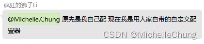

在 V3.5.0 的版本，类里面的方法和 `org.redisson.spring.starter.RedissonAutoConfiguration` 的写法比较相似，相当于直接覆盖了原有的 Bean `redisson`。

但在最新的版本 V4.2.0 中，使用了默认的 `redisson`，只是在配置类里面使用 Redisson 定制器定制了其他的属性。

因为我使用的是单机模式，所以简单截取这一部分来进行对比： 
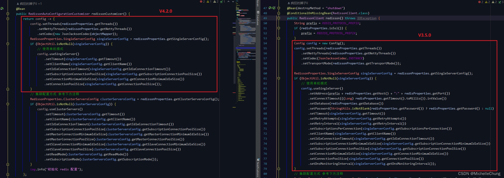

由上图，旧版本中需要自行去创建 `RedissonClient`。

## 源码分析
自动配置类 `org.redisson.spring.starter.RedissonAutoConfiguration`： 
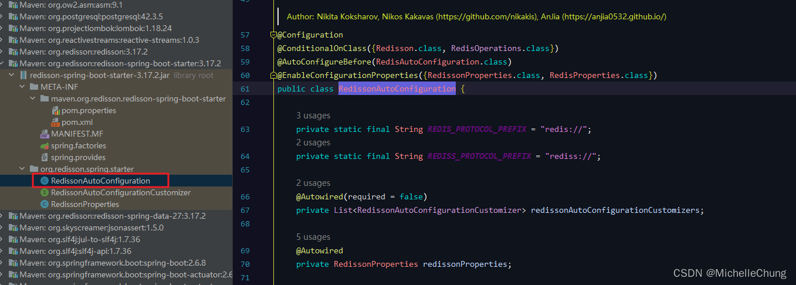

自动配置方法 `RedissonAutoConfiguration#redisson`： 
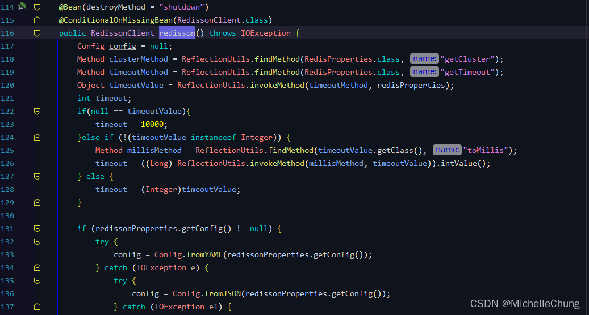

从官方文档可以知道有多种配置方式： 

> 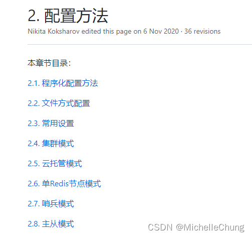 

因此在方法中也根据不同的配置方法进行了判断。

### 0、配置读取
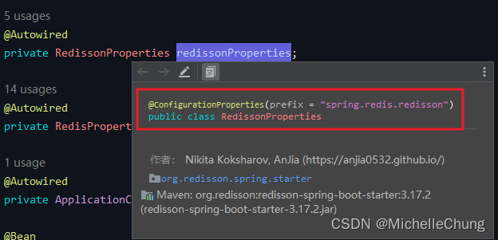 

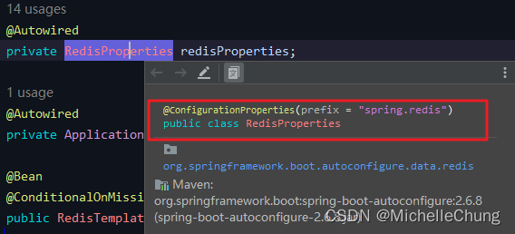 

框架中没有直接配置 RedissonProperties，只有 RedisProperties。

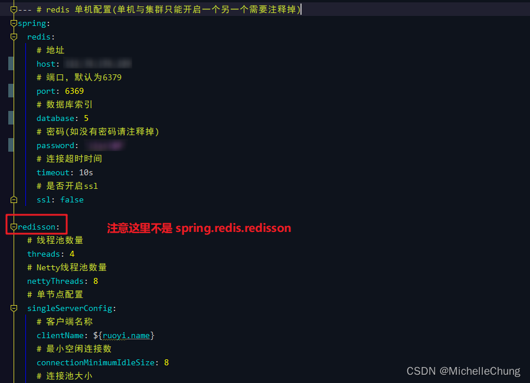
### 1、通过文件或者JSON配置
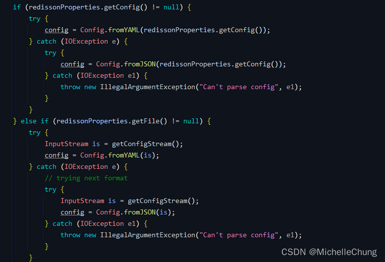

从前面可以知道这里没有配置，运行结果也是 `null`。 
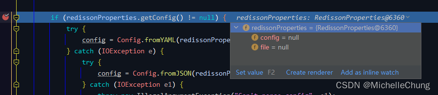
### 2、哨兵模式
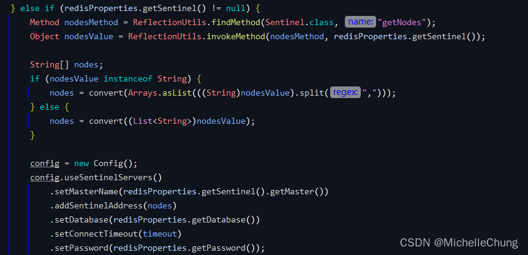
### 3、集群模式
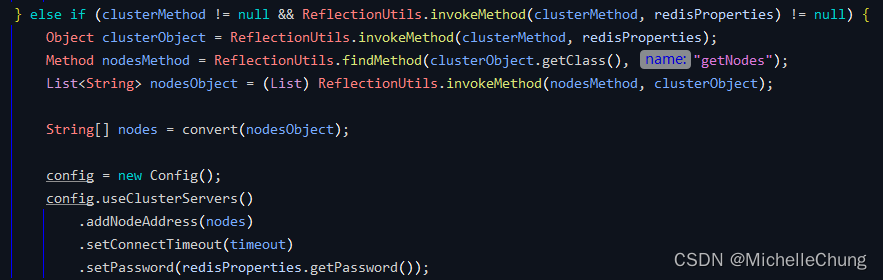
### 4、单Redis节点模式
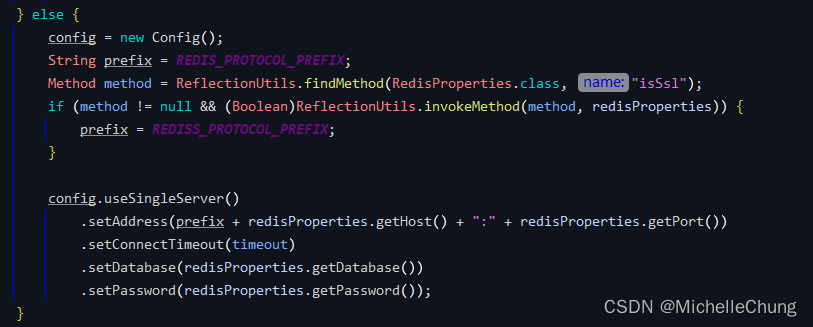

在这里就把原本的路径（Address）、超时时间（ConnectTimeout）、库（Database）、密码（Password）进行了设置。 
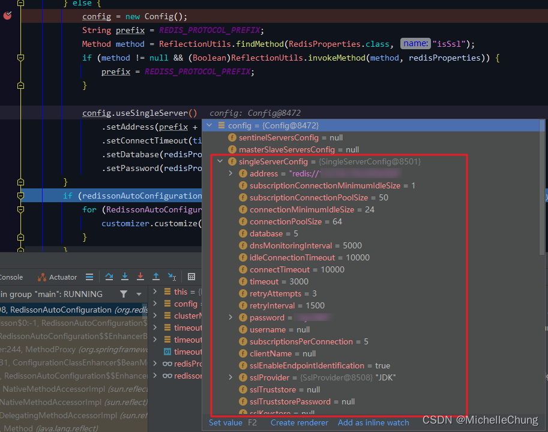
### 5、Redisson 定制器自定义配置
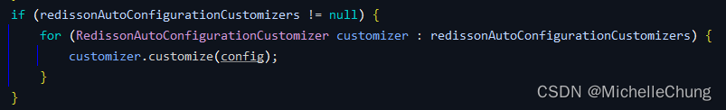 

遍历所有的定制器，进行自定义配置。 
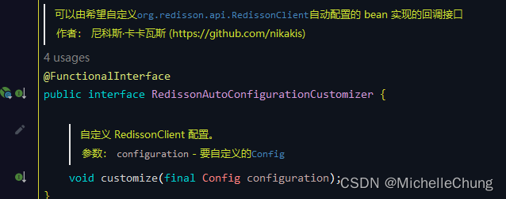

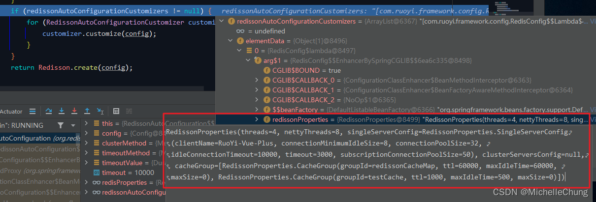

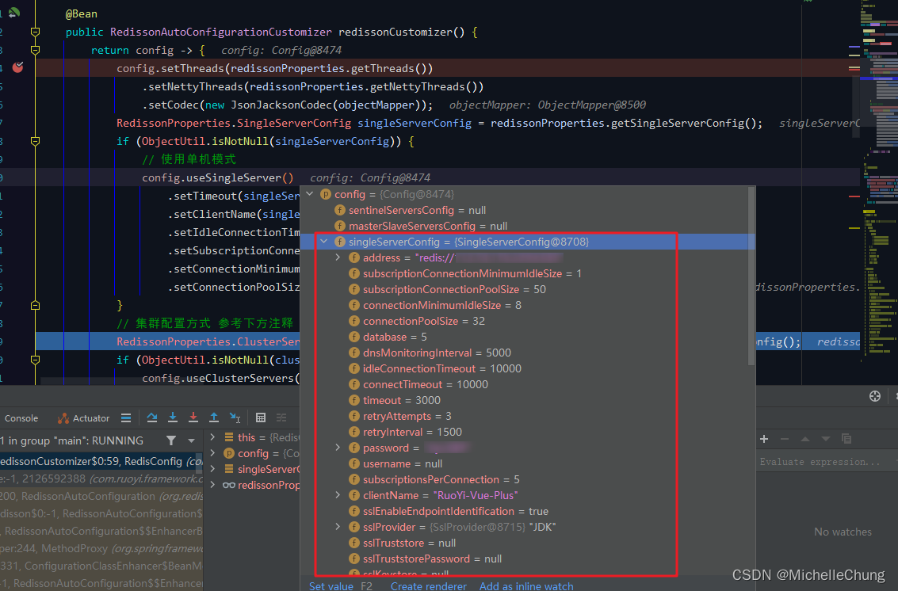

至此，Redisson 自动配置完成。

最后创建 `RedissonClient` 并注入到容器中。

## 变动原因说明

> 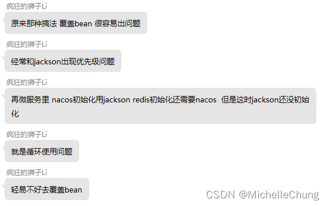
