# Redisson（五） 元素淘汰调度器 EvictionScheduler

## 前言
在上一篇 Redisson 限流器 RateLimiter 的分析过程中，有留意到 Redis monitor 中出现了一段不属于限流器的 Lua 执行脚本，后面去查了一下发现是一个定时调度器 —— 元素淘汰调度器 `EvictionScheduler`。所以本篇就来简单分析一下这个调度器。

## 参考目录
- [Redisson 官方文档 -  映射（Map）的元素淘汰（Eviction），本地缓存（LocalCache）和数据分片（Sharding）](https://github.com/redisson/redisson/wiki/7.-%E5%88%86%E5%B8%83%E5%BC%8F%E9%9B%86%E5%90%88#711-%E6%98%A0%E5%B0%84map%E7%9A%84%E5%85%83%E7%B4%A0%E6%B7%98%E6%B1%B0eviction%E6%9C%AC%E5%9C%B0%E7%BC%93%E5%AD%98localcache%E5%92%8C%E6%95%B0%E6%8D%AE%E5%88%86%E7%89%87sharding)

本文是基于 Redisson 最新版 V3.17.2 来进行说明。

## 源码分析
### ##、流程简图（重点）
首先按照惯例，请记住这张图（后面的流程截图都是基于此）：<br>
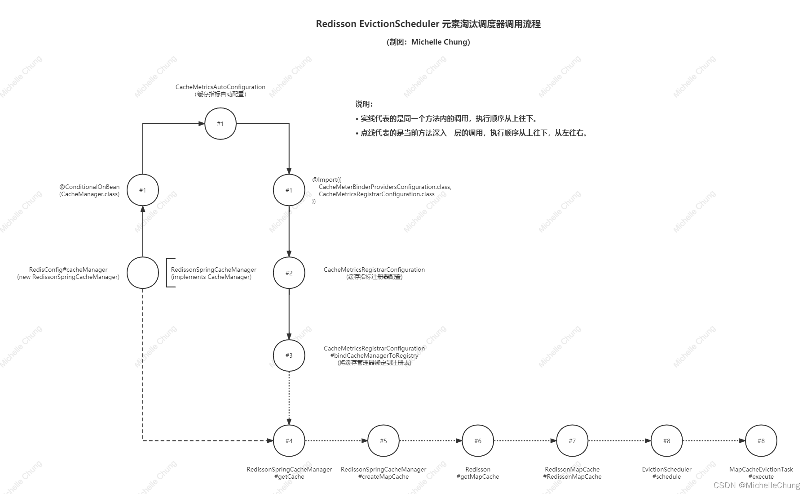

**温馨提醒，结合这张图走不容易迷路。**
### #1、缓存指标自动装配
缓存的自动装配分成了几个步骤执行：

1. Redisson 自动装配 RedissonAutoConfiguration
2. Redis 自动装配 RedisAutoConfiguration
3. 缓存自动装配 CacheAutoConfiguration
4. 缓存指标自动装配 CacheMetricsAutoConfiguration

第一步是之前分析过的 Redisson 自动装配：<br>
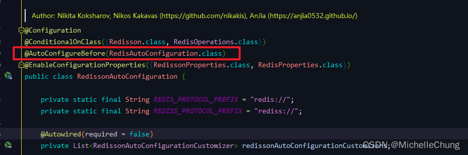<br>

`@AutoConfigureBefore(RedisAutoConfiguration.class)` 这个注解应该不需要翻译了吧？<br>

到第二步 Redis 自动装配：<br>
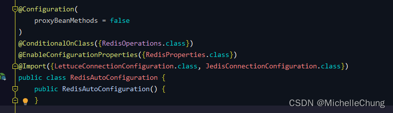<br>

再到第三步缓存自动装配：<br>
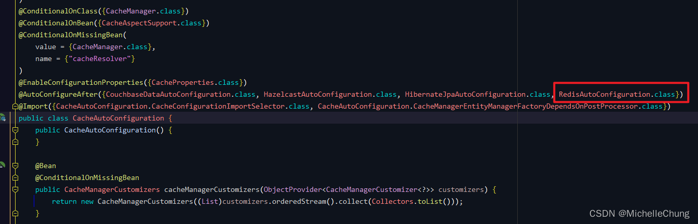<br>

由此可知，缓存装配会在 Redis 之后执行。

最后到缓存指标：<br>
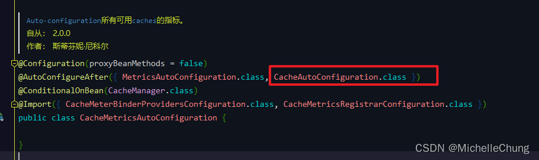<br>
### #1、缓存指标自动装配条件

要装配缓存指标，需要满足的条件是 `@ConditionalOnBean(CacheManager.class)`。<br>

这个条件当然是满足的：<br>
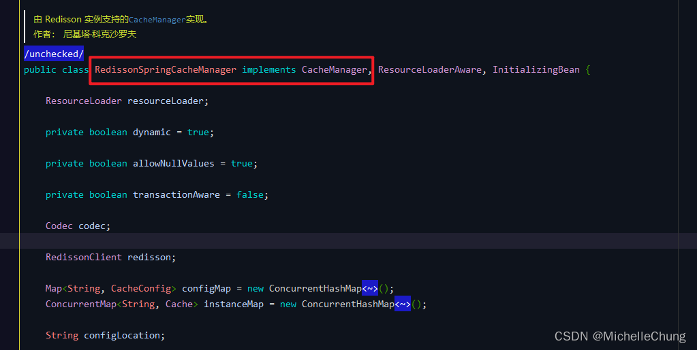

而这个 `RedissonSpringCacheManager` 则是在配置文件 `RedisConfig` 中进行了配置：<br>
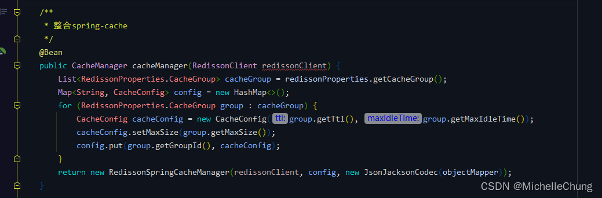
### #1、缓存指标自动装配导入配置
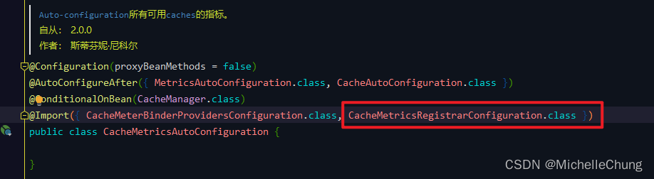
### #2、缓存指标注册器 `CacheMetricsRegistrarConfiguration`
缓存指标自动装配导入配置是配置了一个缓存指标注册器：<br>
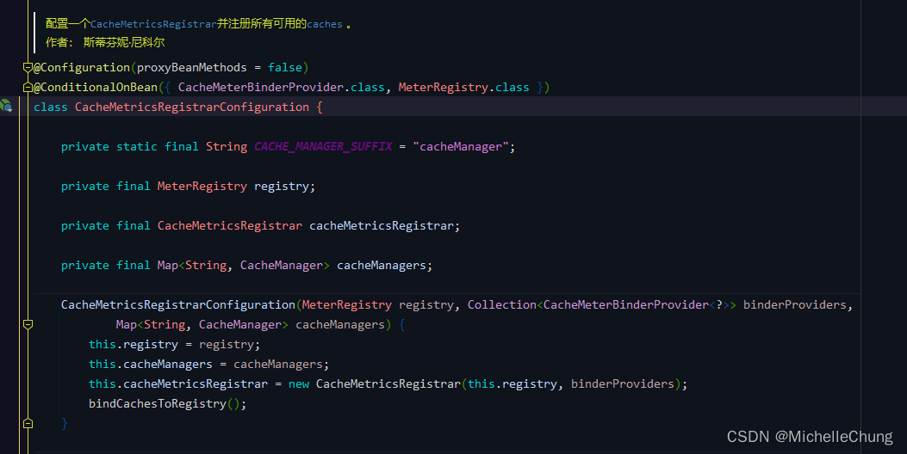

在有参构造器中有一个方法 `bindCachesToRegistry`，将缓存绑定到注册表。<br>

### #3、将缓存绑定到注册表 `bindCachesToRegistry`
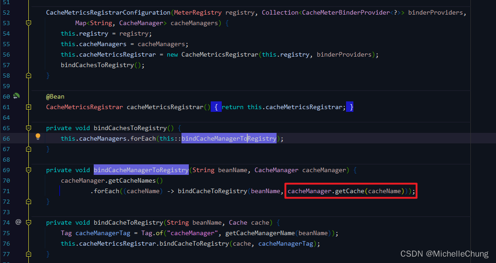
### #4、`RedissonSpringCacheManager#getCache`
前面说到配置文件里面注入了 `RedissonSpringCacheManager`，在 `#3` 要将缓存绑定到注册表，就需要从缓存管理器里面获取所有的缓存。
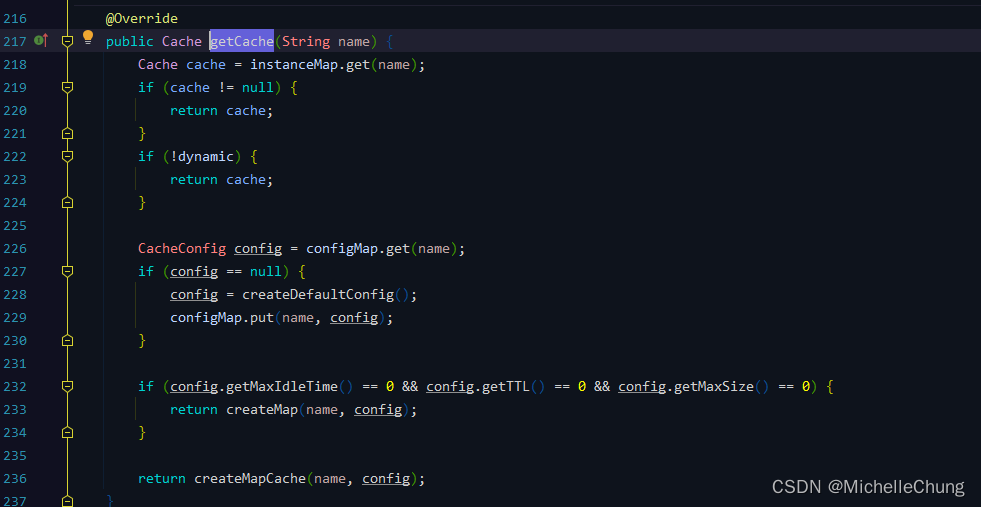

先从实例获取缓存，没有的话就创建映射缓存 `createMapCache`。
### #5、`RedissonSpringCacheManager#createMapCache`
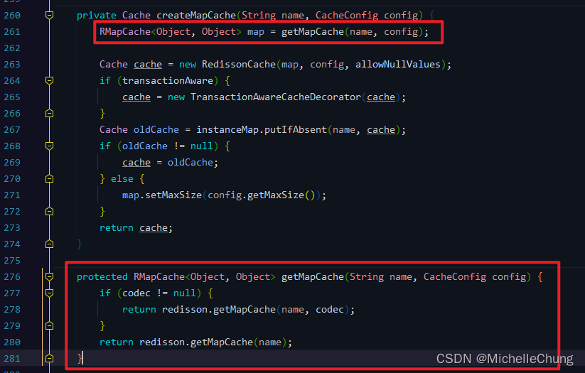
### #6、`Redisson#getMapCache`
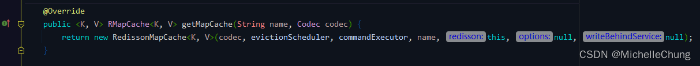

### #7、映射缓存 `RedissonMapCache`
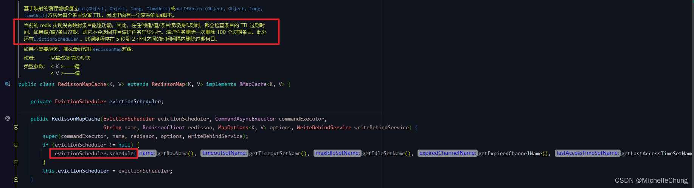

到这一步总算是看到了 `EvictionScheduler`。<br>

`EvictionScheduler` 实例是在最开始 Redisson 自动装配时创建的：

`RedissonAutoConfiguration#redisson`<br>
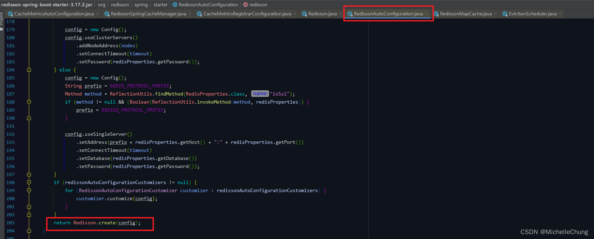

`org.redisson.Redisson#create`<br>
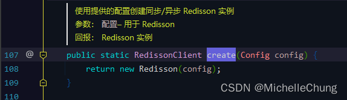

`org.redisson.Redisson#Redisson`
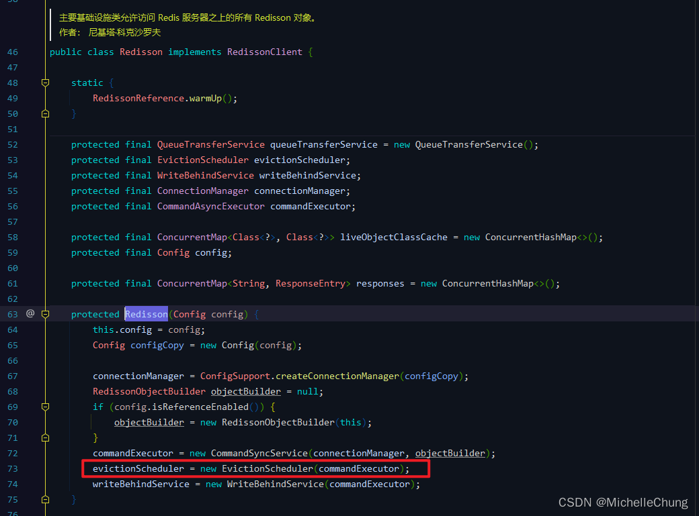
### #8、`EvictionScheduler#schedule`
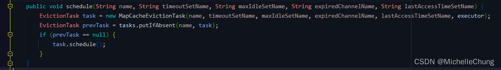
### #9、`MapCacheEvictionTask#execute`
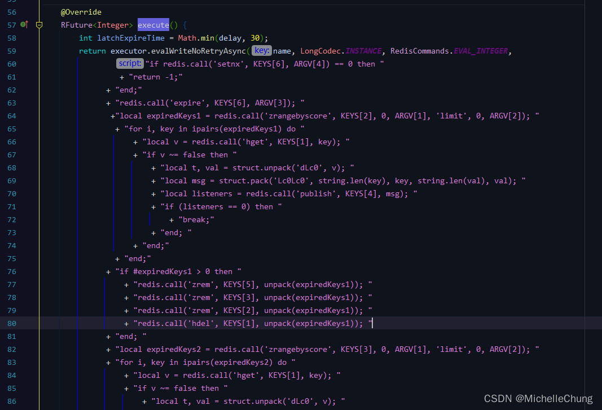

下面就简单分析一下这个脚本的执行内容。
## Lua 脚本分析
### Lua 脚本
```lua
if redis.call('setnx', KEYS[6], ARGV[4]) == 0 then 
	return -1;
end;

redis.call('expire', KEYS[6], ARGV[3]); 

local expiredKeys1 = redis.call('zrangebyscore', KEYS[2], 0, ARGV[1], 'limit', 0, ARGV[2]); 
for i, key in ipairs(expiredKeys1) do 
	local v = redis.call('hget', KEYS[1], key); 
	if v ~= false then 
		local t, val = struct.unpack('dLc0', v); 
		local msg = struct.pack('Lc0Lc0', string.len(key), key, string.len(val), val); 
		local listeners = redis.call('publish', KEYS[4], msg); 
		if (listeners == 0) then 
			break;
		end; 
	end;
end;

if #expiredKeys1 > 0 then 
	redis.call('zrem', KEYS[5], unpack(expiredKeys1)); 
	redis.call('zrem', KEYS[3], unpack(expiredKeys1)); 
	redis.call('zrem', KEYS[2], unpack(expiredKeys1)); 
	redis.call('hdel', KEYS[1], unpack(expiredKeys1)); 
end; 

local expiredKeys2 = redis.call('zrangebyscore', KEYS[3], 0, ARGV[1], 'limit', 0, ARGV[2]); 
for i, key in ipairs(expiredKeys2) do 
	local v = redis.call('hget', KEYS[1], key); 
	if v ~= false then 
		local t, val = struct.unpack('dLc0', v); 
		local msg = struct.pack('Lc0Lc0', string.len(key), key, string.len(val), val); 
		local listeners = redis.call('publish', KEYS[4], msg); 
		if (listeners == 0) then 
			break;
		end; 
	end;
end;

if #expiredKeys2 > 0 then 
	redis.call('zrem', KEYS[5], unpack(expiredKeys2)); 
	redis.call('zrem', KEYS[3], unpack(expiredKeys2)); 
	redis.call('zrem', KEYS[2], unpack(expiredKeys2)); 
	redis.call('hdel', KEYS[1], unpack(expiredKeys2)); 
end; 
return #expiredKeys1 + #expiredKeys2;
```

脚本调用的方法参数对照表：

| 脚本参数名   | Java参数名                    | 参数值                                                        |
|---------|----------------------------|------------------------------------------------------------|
| KEYS[1] | name                       | "redissonCacheMap"                                         |
| KEYS[2] | timeoutSetName             | 过期集合 "redisson__timeout__set:{redissonCacheMap}"           |
| KEYS[3] | maxIdleSetName             | 空闲集合 "redisson__idle__set:{redissonCacheMap}"              |
| KEYS[4] | expiredChannelName         | "redisson_map_cache_expired:{redissonCacheMap}"            |
| KEYS[5] | lastAccessTimeSetName      | "redisson__map_cache__last_access__set:{redissonCacheMap}" |
| KEYS[6] | executeTaskOnceLatchName   | "redisson__execute_task_once_latch:{redissonCacheMap}"     |
| ARGV[1] | System.currentTimeMillis() | 当前时间戳 "1655529796488"                                      |
| ARGV[2] | keysLimit                  | 清理值数量 "100"                                                |
| ARGV[3] | latchExpireTime            | "30"                                                       |
| ARGV[4] | 1                          | "1"                                                        |

### Lua 脚本代码分析
说明：原本想要复现过期执行的逻辑，但是没有找到相关的方法，所以这里只在源码的基础上进行分析。

Redis指令：

| Redis指令       | 语法                                                               | 含义                                                |
|---------------|------------------------------------------------------------------|---------------------------------------------------|
| setnx         | SETNX key_name value                                             | 在指定的 key 不存在时，为 key 设置指定的值（设置成功，返回 1。 设置失败，返回 0。） |
| expire        | EXPIRE key_name time_in_seconds                                  | 用于设置 key 的过期时间，key 过期后将不再可用。单位以秒计。                |
| zrangebyscore | ZRANGEBYSCORE key_name min max [WITHSCORES] [LIMIT offset count] | 返回有序集合中指定分数区间的成员列表。有序集成员按分数值递增(从小到大)次序排列。         |
| hget          | HGET key_name field_name                                         | 用于返回哈希表中指定字段的值。                                   |
| publish       | 	PUBLISH channel message                                         | 将信息发送到指定的频道。                                      |
| zrem          | ZREM key_name member [member ...]                                | 用于移除有序集中的一个或多个成员，不存在的成员将被忽略。                      |
| hdel          | HDEL  key_name member [member ...]                               | 用于删除哈希表 key 中的一个或多个指定字段，不存在的字段将被忽略。               |


```lua
if redis.call('setnx', KEYS[6], ARGV[4]) == 0 then 
	return -1;
end;

-- Redis Setnx (SET if Not eXists) 命令在指定的 key 不存在时，为 key 设置指定的值。
-- 设置成功，返回 1。 设置失败，返回 0。
-- "setnx" "redisson__execute_task_once_latch:{redissonCacheMap}" "1"

redis.call('expire', KEYS[6], ARGV[3]); 

-- Redis Expire 命令用于设置 key 的过期时间，key 过期后将不再可用。单位以秒计。
-- "expire" "redisson__execute_task_once_latch:{redissonCacheMap}" "30"

local expiredKeys1 = redis.call('zrangebyscore', KEYS[2], 0, ARGV[1], 'limit', 0, ARGV[2]); 

-- RedissonMapCache 一次清除 100 个过期条目 (Clean task deletes removes 100 expired entries at once.)
-- "zrangebyscore" "redisson__timeout__set:{redissonCacheMap}" "0" "1655529796488" "limit" "0" "100"

for i, key in ipairs(expiredKeys1) do 
	local v = redis.call('hget', KEYS[1], key); 
	
	-- "hget" "redissonCacheMap" key
	
	if v ~= false then 
		local t, val = struct.unpack('dLc0', v); 
		local msg = struct.pack('Lc0Lc0', string.len(key), key, string.len(val), val); 
		local listeners = redis.call('publish', KEYS[4], msg); 
		
		-- "publish" "redisson_map_cache_expired:{redissonCacheMap}" msg
		
		if (listeners == 0) then 
			break;
		end; 
	end;
end;

if #expiredKeys1 > 0 then 
	redis.call('zrem', KEYS[5], unpack(expiredKeys1)); 
	
	-- "zrem" "redisson__map_cache__last_access__set:{redissonCacheMap}" 
	
	redis.call('zrem', KEYS[3], unpack(expiredKeys1)); 
	
	-- "zrem" "redisson__idle__set:{redissonCacheMap}"
	
	redis.call('zrem', KEYS[2], unpack(expiredKeys1)); 
	
	-- "zrem" "redisson__timeout__set:{redissonCacheMap}"
	
	redis.call('hdel', KEYS[1], unpack(expiredKeys1)); 
	
	-- "hdel" "redissonCacheMap"
	
end; 

local expiredKeys2 = redis.call('zrangebyscore', KEYS[3], 0, ARGV[1], 'limit', 0, ARGV[2]); 

-- "zrangebyscore" "redisson__idle__set:{redissonCacheMap}" "0" "1655529796488" "limit" "0" "100"

for i, key in ipairs(expiredKeys2) do 
	local v = redis.call('hget', KEYS[1], key); 
	
	-- "hget" "redissonCacheMap" key
	
	if v ~= false then 
		local t, val = struct.unpack('dLc0', v); 
		local msg = struct.pack('Lc0Lc0', string.len(key), key, string.len(val), val); 
		local listeners = redis.call('publish', KEYS[4], msg); 
		
		-- "publish" "redisson_map_cache_expired:{redissonCacheMap}" msg
		
		if (listeners == 0) then 
			break;
		end; 
	end;
end;

if #expiredKeys2 > 0 then 
	redis.call('zrem', KEYS[5], unpack(expiredKeys2)); 
	
	-- "zrem" "redisson__map_cache__last_access__set:{redissonCacheMap}" 
	
	redis.call('zrem', KEYS[3], unpack(expiredKeys2)); 
	
	-- "zrem" "redisson__idle__set:{redissonCacheMap}"
	
	redis.call('zrem', KEYS[2], unpack(expiredKeys2)); 
	
	-- "zrem" "redisson__timeout__set:{redissonCacheMap}"
	
	redis.call('hdel', KEYS[1], unpack(expiredKeys2)); 
	
	-- "hdel" "redissonCacheMap"
	
end; 
return #expiredKeys1 + #expiredKeys2;

-- 返回 expiredKeys1 + expiredKeys2 集合长度
```
### Redis 实际执行结果

```bash
1655529796.490178 [0 lua] "setnx" "redisson__execute_task_once_latch:{redissonCacheMap}" "1"
1655529796.490207 [0 lua] "expire" "redisson__execute_task_once_latch:{redissonCacheMap}" "30"
1655529796.490233 [0 lua] "zrangebyscore" "redisson__timeout__set:{redissonCacheMap}" "0" "1655529796488" "limit" "0" "100"
1655529796.490298 [0 lua] "zrangebyscore" "redisson__idle__set:{redissonCacheMap}" "0" "1655529796488" "limit" "0" "100"
```
## 附文
### Redis monitor 模式下控制台输出完整内容
```bash
1655529796.489677 [0 127.0.0.1:64325] "EVAL" "if redis.call('setnx', KEYS[6], ARGV[4]) == 0 then return -1;end;redis.call('expire', KEYS[6], ARGV[3]); local expiredKeys1 = redis.call('zrangebyscore', KEYS[2], 0, ARGV[1], 'limit', 0, ARGV[2]); for i, key in ipairs(expiredKeys1) do local v = redis.call('hget', KEYS[1], key); if v ~= false then local t, val = struct.unpack('dLc0', v); local msg = struct.pack('Lc0Lc0', string.len(key), key, string.len(val), val); local listeners = redis.call('publish', KEYS[4], msg); if (listeners == 0) then break;end; end;end;if #expiredKeys1 > 0 then redis.call('zrem', KEYS[5], unpack(expiredKeys1)); redis.call('zrem', KEYS[3], unpack(expiredKeys1)); redis.call('zrem', KEYS[2], unpack(expiredKeys1)); redis.call('hdel', KEYS[1], unpack(expiredKeys1)); end; local expiredKeys2 = redis.call('zrangebyscore', KEYS[3], 0, ARGV[1], 'limit', 0, ARGV[2]); for i, key in ipairs(expiredKeys2) do local v = redis.call('hget', KEYS[1], key); if v ~= false then local t, val = struct.unpack('dLc0', v); local msg = struct.pack('Lc0Lc0', string.len(key), key, string.len(val), val); local listeners = redis.call('publish', KEYS[4], msg); if (listeners == 0) then break;end; end;end;if #expiredKeys2 > 0 then redis.call('zrem', KEYS[5], unpack(expiredKeys2)); redis.call('zrem', KEYS[3], unpack(expiredKeys2)); redis.call('zrem', KEYS[2], unpack(expiredKeys2)); redis.call('hdel', KEYS[1], unpack(expiredKeys2)); end; return #expiredKeys1 + #expiredKeys2;" "6" "redissonCacheMap" "redisson__timeout__set:{redissonCacheMap}" "redisson__idle__set:{redissonCacheMap}" "redisson_map_cache_expired:{redissonCacheMap}" "redisson__map_cache__last_access__set:{redissonCacheMap}" "redisson__execute_task_once_latch:{redissonCacheMap}" "1655529796488" "100" "30" "1"
1655529796.490178 [0 lua] "setnx" "redisson__execute_task_once_latch:{redissonCacheMap}" "1"
1655529796.490207 [0 lua] "expire" "redisson__execute_task_once_latch:{redissonCacheMap}" "30"
1655529796.490233 [0 lua] "zrangebyscore" "redisson__timeout__set:{redissonCacheMap}" "0" "1655529796488" "limit" "0" "100"
1655529796.490298 [0 lua] "zrangebyscore" "redisson__idle__set:{redissonCacheMap}" "0" "1655529796488" "limit" "0" "100"
```
