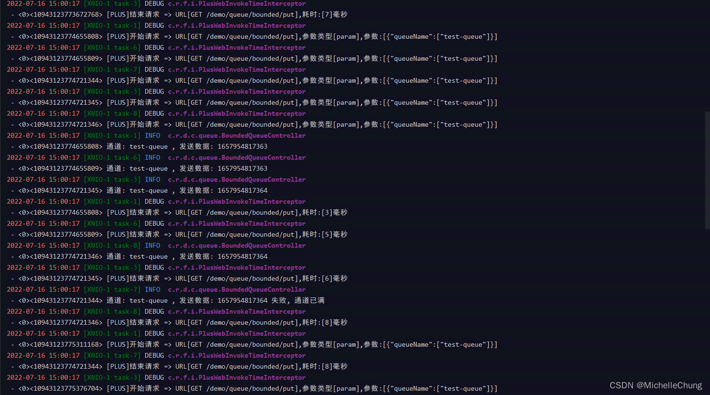

# Redisson（六） 有界阻塞队列 Bounded Blocking Queue
- - -

## 前言
在框架的 Demo 模块中，Redisson 队列相关的示例还有一个有界阻塞队列，这篇文章就来简单分析一下这个队列（拖更了好久终于要把这个坑填了）。

## 参考目录
- [Redisson 官方文档 -  7.11. 有界阻塞队列（Bounded Blocking Queue）](https://github.com/redisson/redisson/wiki/7.-%E5%88%86%E5%B8%83%E5%BC%8F%E9%9B%86%E5%90%88#711-%E6%9C%89%E7%95%8C%E9%98%BB%E5%A1%9E%E9%98%9F%E5%88%97bounded-blocking-queue)
  本文是基于 Redisson 最新版 V3.17.4 来进行说明。
- [Lua 官方文档](https://www.lua.org/docs.html)

## 工具链接
- [ApiFox](https://www.apifox.cn/)
  接口文档工具。
  （使用此工具原因是框架新版 V4.3.0 不再使用 swagger-ui，因此将接口文档导入到 ApiFox 使用，具体导入方法请参考 ApiFox 官方文档以及 [框架 wiki](https://gitee.com/JavaLionLi/RuoYi-Vue-Plus/wikis/%E6%A1%86%E6%9E%B6%E5%8A%9F%E8%83%BD/%E6%8E%A5%E5%8F%A3%E6%96%87%E6%A1%A3)）
- [Lua 在线工具](https://c.runoob.com/compile/66/)
  用于测试 Lua 脚本运行。
- [Apache HTTP Server](https://httpd.apache.org/download.cgi)
  ab工具，用于并发测试。

## 测试代码
为了便于分析，因此在框架基础上重新写了两个简单的测试方法。
### 队列初始化 `BoundedQueueController#init`


请求参数：<br>

初始化队列名称（queueName）：test-queue<br>

有界队列的容量（capacity）：10<br>


### 向队列添加数据 `BoundedQueueController#put`


请求参数：<br>

初始化队列名称（queueName）：test-queue<br>


### ab 工具并发测试
除了可以使用接口文档直接请求外，还可以通过工具进行并发测试，本文使用的版本是 V2.4.52。

测试步骤：

1. 将接口权限放开，在框架配置文件中设置该接口可以匿名访问。
2. 请求接口：`http://127.0.0.1:8080/demo/queue/bounded/init?queueName=test-queue&capacity=10`
3. 使用工具执行命令：`ab -n 20 -c 5 http://127.0.0.1:8080/demo/queue/bounded/put?queueName=test-queue`
   `-n` 代表请求数，`-c` 代表并发数，参数值可以自行修改，具体使用方式以及解析可以自行百度，这里不作详细说明。

测试结果以及控制台输出：<br>





队列数据：<br>

## 源码分析1：队列初始化
### 主要执行步骤
1. 删除原有同名队列。
2. 根据参数（队列名、容量）创建新的有界队列。
3. 根据步骤 2 创建队列结果打印日志，返回方法最终执行结果。

**注：此处主要分析步骤 2 的执行过程。**

### 步骤1：删除原有同名队列

### 步骤2：根据参数（队列名、容量）创建新的有界队列
`QueueUtils#trySetBoundedQueueCapacity`<br>


`RedissonBoundedBlockingQueue#trySetCapacity`<br>


`RedissonBoundedBlockingQueue#trySetCapacityAsync`<br>

### 步骤3：执行结果以及控制台输出

### Lua 脚本
```lua
local value = redis.call('get', KEYS[1]); 
if (value == false) then 
	redis.call('set', KEYS[1], ARGV[1]); 
	redis.call('publish', KEYS[2], ARGV[1]); 
	return 1;
end;
return 0;
```
脚本调用的方法参数对照表：

| 脚本参数名   | Java参数名            | 参数值                                     | 含义     |
|---------|--------------------|-----------------------------------------|--------|
| KEYS[1] | getSemaphoreName() | "redisson_bqs:{test-queue}"             | 有界队列名称 |
| KEYS[2] | channelName        | "redisson_sc:redisson_bqs:{test-queue}" | 通道名称   |
| ARGV[1] | capacity           | "10"                                    | 有界队列容量 |

### Lua 脚本代码分析
```lua
local value = redis.call('get', KEYS[1]); 
-- 获取队列
-- "get" "redisson_bqs:{test-queue}"

-- 判断队列是否存在，如果不存在则新建队列
if (value == false) then 

	redis.call('set', KEYS[1], ARGV[1]); 
	-- 创建有界队列，并设置容量
	-- "set" "redisson_bqs:{test-queue}" "10"
	
	redis.call('publish', KEYS[2], ARGV[1]); 
	-- 发布消息
	-- "publish" "redisson_sc:redisson_bqs:{test-queue}" "10"
	
	return 1;
	
end;

-- 队列存在，直接返回0
return 0;
```
### Redis 实际执行结果
```bash
1657937128.642042 [0 127.0.0.1:13788] "DEL" "test-queue" "redisson_bqs:{test-queue}"
1657937128.643036 [0 127.0.0.1:13792] "EVAL" "local value = redis.call('get', KEYS[1]); if (value == false) then redis.call('set', KEYS[1], ARGV[1]); redis.call('publish', KEYS[2], ARGV[1]); return 1;end;return 0;" "2" "redisson_bqs:{test-queue}" "redisson_sc:redisson_bqs:{test-queue}" "10"
1657937128.643147 [0 lua] "get" "redisson_bqs:{test-queue}"
1657937128.643162 [0 lua] "set" "redisson_bqs:{test-queue}" "10"
1657937128.643176 [0 lua] "publish" "redisson_sc:redisson_bqs:{test-queue}" "10"
```


## 源码分析2：向队列添加数据
添加数据的方法比较简单，获取到系统当前时间戳，然后保存到有界队列中。<br>

### 步骤1：向有界队列添加数据
`QueueUtils#addBoundedQueueObject`<br>


`RedissonQueue#offer`<br>


`RedissonBoundedBlockingQueue#offerAsync`<br>


`RedissonSemaphore#tryAcquireAsync`<br>


`RedissonQueueSemaphore#tryAcquireAsync`<br>

### 步骤2：执行结果以及控制台输出

### Lua 脚本
```lua
local value = redis.call('get', KEYS[1]); 
assert(value ~= false, 'Capacity of queue ' .. KEYS[1] .. ' has not been set'); 
if (tonumber(value) >= tonumber(ARGV[1])) then 
	redis.call('decrby', KEYS[1], ARGV[1]); 
	redis.call('rpush', KEYS[2], unpack(ARGV, 2, #ARGV));
	return 1; 
end; 
return 0;
```
脚本调用的方法参数对照表：

| 脚本参数名   | Java参数名          | 参数值                                      | 含义          |
|---------|------------------|------------------------------------------|-------------|
| KEYS[1] | getRawName()     | "redisson_bqs:{test-queue}"              | 有界队列剩余容量值名称 |
| KEYS[2] | queueName        | "test-queue"                             | 有界队列名称      |
| ARGV[1] | params.toArray() | "1" "[\"java.lang.Long\",1657938341891]" | 需要操作的参数队列值  |

### Lua 脚本代码分析
```lua
local value = redis.call('get', KEYS[1]); 
-- 获取队列（保存有界队列的剩余数量）
-- "get" "redisson_bqs:{test-queue}"

assert(value ~= false, 'Capacity of queue ' .. KEYS[1] .. ' has not been set'); 
-- 断言队列存在

-- 判断有界队列剩余数量是否 >= 1
if (tonumber(value) >= tonumber(ARGV[1])) then 

	redis.call('decrby', KEYS[1], ARGV[1]); 
	-- 有界队列剩余数量 -1
	-- "decrby" "redisson_bqs:{test-queue}" "1"
	
	redis.call('rpush', KEYS[2], unpack(ARGV, 2, #ARGV));
	-- 获取需要保存的数据: unpack(列表, 第二个元素，列表长度) , 向队列中存入新数据
	-- "rpush" "test-queue" "[\"java.lang.Long\",1657938341891]"
	
	return 1; 
	
end; 

-- 有界队列剩余值 < 1，直接返回0
return 0;
```
### Lua 补充说明：`unpack` 函数
脚本中使用了函数 `unpack` 获取列表数据。关于这个函数我查阅了一些资料，在此作为补充说明。

首先，这个函数在新旧版本中写法不同：

> 图片来源参考文章 [【Lua unpack函数用法】](https://www.cnblogs.com/faithfu/p/8876441.html)：<br>
> <br>

我查阅了 Lua 5.1版本以及 5.2版本的官方文档，语法确实不同。

> 5.1 官方文档 unpack：<br>
> <br>
> 5.2 官方文档 table.unpack：<br>
> <br>

在源码脚本中使用的方式是：`unpack(ARGV, 2, #ARGV)`<br>
`ARGV` 即操作的数组，有两个元素：`1` 和 当前时间戳 `1657938341891`。<br>
`#ARGV` 代表数组长度，此参数可以省略不写。<br>

> 5.1 文档说明：<br>
> 

此处 `unpack` 函数作用是取出数组 `ARGV` 第二个元素。

可以使用 [在线工具](https://c.runoob.com/compile/66/) 模拟执行该脚本：<br>
**（注：在线工具不支持 Lua 5.1 版本写法，因此使用 `table.unpack` 代替）**<br>
```lua
local info={1,1657938341891};
local b = table.unpack(info,2,#info);
-- info第二个元素
print(b) 

-- 代表info长度
print(#info) 

-- 省略写法
local c = table.unpack(info,2);
print(c) 
```

执行结果如下：<br>
<br>
### Redis 实际执行结果
```bash
1657938341.893119 [0 lua] "get" "redisson_bqs:{test-queue}"
1657938341.893142 [0 lua] "decrby" "redisson_bqs:{test-queue}" "1"
1657938341.893153 [0 lua] "rpush" "test-queue" "[\"java.lang.Long\",1657938341891]"
```


连续执行10次后结果：<br>


超过10次后不再更新队列，控制台打印失败结果：<br>


Redis 实际执行结果：
```bash
1657938437.712646 [0 127.0.0.1:13795] "EVAL" "local value = redis.call('get', KEYS[1]); assert(value ~= false, 'Capacity of queue ' .. KEYS[1] .. ' has not been set'); if (tonumber(value) >= tonumber(ARGV[1])) then redis.call('decrby', KEYS[1], ARGV[1]); redis.call('rpush', KEYS[2], unpack(ARGV, 2, #ARGV));return 1; end; return 0;" "2" "redisson_bqs:{test-queue}" "test-queue" "1" "[\"java.lang.Long\",1657938437711]"
1657938437.712956 [0 lua] "get" "redisson_bqs:{test-queue}"
```
## 附文
### Redis monitor 模式下控制台输出内容
```bash
1657938341.892969 [0 127.0.0.1:13796] "EVAL" "local value = redis.call('get', KEYS[1]); assert(value ~= false, 'Capacity of queue ' .. KEYS[1] .. ' has not been set'); if (tonumber(value) >= tonumber(ARGV[1])) then redis.call('decrby', KEYS[1], ARGV[1]); redis.call('rpush', KEYS[2], unpack(ARGV, 2, #ARGV));return 1; end; return 0;" "2" "redisson_bqs:{test-queue}" "test-queue" "1" "[\"java.lang.Long\",1657938341891]"
1657938341.893119 [0 lua] "get" "redisson_bqs:{test-queue}"
1657938341.893142 [0 lua] "decrby" "redisson_bqs:{test-queue}" "1"
1657938341.893153 [0 lua] "rpush" "test-queue" "[\"java.lang.Long\",1657938341891]"

......

1657938362.012346 [0 127.0.0.1:14040] "EVAL" "local value = redis.call('get', KEYS[1]); assert(value ~= false, 'Capacity of queue ' .. KEYS[1] .. ' has not been set'); if (tonumber(value) >= tonumber(ARGV[1])) then redis.call('decrby', KEYS[1], ARGV[1]); redis.call('rpush', KEYS[2], unpack(ARGV, 2, #ARGV));return 1; end; return 0;" "2" "redisson_bqs:{test-queue}" "test-queue" "1" "[\"java.lang.Long\",1657938362011]"
1657938362.012421 [0 lua] "get" "redisson_bqs:{test-queue}"
1657938362.012433 [0 lua] "decrby" "redisson_bqs:{test-queue}" "1"
1657938362.012441 [0 lua] "rpush" "test-queue" "[\"java.lang.Long\",1657938362011]"

......

1657938399.720660 [0 127.0.0.1:14894] "ping"
1657938400.016273 [0 127.0.0.1:13795] "EVAL" "local value = redis.call('get', KEYS[1]); assert(value ~= false, 'Capacity of queue ' .. KEYS[1] .. ' has not been set'); if (tonumber(value) >= tonumber(ARGV[1])) then redis.call('decrby', KEYS[1], ARGV[1]); redis.call('rpush', KEYS[2], unpack(ARGV, 2, #ARGV));return 1; end; return 0;" "2" "redisson_bqs:{test-queue}" "test-queue" "1" "[\"java.lang.Long\",1657938400015]"
1657938400.016370 [0 lua] "get" "redisson_bqs:{test-queue}"
1657938400.016387 [0 lua] "decrby" "redisson_bqs:{test-queue}" "1"
1657938400.016396 [0 lua] "rpush" "test-queue" "[\"java.lang.Long\",1657938400015]"
1657938402.683629 [0 127.0.0.1:13794] "EVAL" "local value = redis.call('get', KEYS[1]); assert(value ~= false, 'Capacity of queue ' .. KEYS[1] .. ' has not been set'); if (tonumber(value) >= tonumber(ARGV[1])) then redis.call('decrby', KEYS[1], ARGV[1]); redis.call('rpush', KEYS[2], unpack(ARGV, 2, #ARGV));return 1; end; return 0;" "2" "redisson_bqs:{test-queue}" "test-queue" "1" "[\"java.lang.Long\",1657938402682]"
1657938402.683782 [0 lua] "get" "redisson_bqs:{test-queue}"
1657938402.683806 [0 lua] "decrby" "redisson_bqs:{test-queue}" "1"
1657938402.683815 [0 lua] "rpush" "test-queue" "[\"java.lang.Long\",1657938402682]"
1657938405.407663 [0 127.0.0.1:13788] "EVAL" "local value = redis.call('get', KEYS[1]); assert(value ~= false, 'Capacity of queue ' .. KEYS[1] .. ' has not been set'); if (tonumber(value) >= tonumber(ARGV[1])) then redis.call('decrby', KEYS[1], ARGV[1]); redis.call('rpush', KEYS[2], unpack(ARGV, 2, #ARGV));return 1; end; return 0;" "2" "redisson_bqs:{test-queue}" "test-queue" "1" "[\"java.lang.Long\",1657938405406]"
1657938405.407791 [0 lua] "get" "redisson_bqs:{test-queue}"
1657938405.407809 [0 lua] "decrby" "redisson_bqs:{test-queue}" "1"
1657938405.407821 [0 lua] "rpush" "test-queue" "[\"java.lang.Long\",1657938405406]"
1657938407.950144 [0 127.0.0.1:13792] "EVAL" "local value = redis.call('get', KEYS[1]); assert(value ~= false, 'Capacity of queue ' .. KEYS[1] .. ' has not been set'); if (tonumber(value) >= tonumber(ARGV[1])) then redis.call('decrby', KEYS[1], ARGV[1]); redis.call('rpush', KEYS[2], unpack(ARGV, 2, #ARGV));return 1; end; return 0;" "2" "redisson_bqs:{test-queue}" "test-queue" "1" "[\"java.lang.Long\",1657938407949]"
1657938407.950337 [0 lua] "get" "redisson_bqs:{test-queue}"
1657938407.950348 [0 lua] "decrby" "redisson_bqs:{test-queue}" "1"
1657938407.950356 [0 lua] "rpush" "test-queue" "[\"java.lang.Long\",1657938407949]"
1657938409.724825 [0 127.0.0.1:14894] "ping"
1657938410.337264 [0 127.0.0.1:14041] "EVAL" "local value = redis.call('get', KEYS[1]); assert(value ~= false, 'Capacity of queue ' .. KEYS[1] .. ' has not been set'); if (tonumber(value) >= tonumber(ARGV[1])) then redis.call('decrby', KEYS[1], ARGV[1]); redis.call('rpush', KEYS[2], unpack(ARGV, 2, #ARGV));return 1; end; return 0;" "2" "redisson_bqs:{test-queue}" "test-queue" "1" "[\"java.lang.Long\",1657938410335]"
1657938410.337368 [0 lua] "get" "redisson_bqs:{test-queue}"
1657938410.337385 [0 lua] "decrby" "redisson_bqs:{test-queue}" "1"
1657938410.337396 [0 lua] "rpush" "test-queue" "[\"java.lang.Long\",1657938410335]"
1657938412.557667 [0 127.0.0.1:13793] "EVAL" "local value = redis.call('get', KEYS[1]); assert(value ~= false, 'Capacity of queue ' .. KEYS[1] .. ' has not been set'); if (tonumber(value) >= tonumber(ARGV[1])) then redis.call('decrby', KEYS[1], ARGV[1]); redis.call('rpush', KEYS[2], unpack(ARGV, 2, #ARGV));return 1; end; return 0;" "2" "redisson_bqs:{test-queue}" "test-queue" "1" "[\"java.lang.Long\",1657938412556]"
1657938412.557740 [0 lua] "get" "redisson_bqs:{test-queue}"
1657938412.557752 [0 lua] "decrby" "redisson_bqs:{test-queue}" "1"
1657938412.557759 [0 lua] "rpush" "test-queue" "[\"java.lang.Long\",1657938412556]"
1657938414.873433 [0 127.0.0.1:13796] "EVAL" "local value = redis.call('get', KEYS[1]); assert(value ~= false, 'Capacity of queue ' .. KEYS[1] .. ' has not been set'); if (tonumber(value) >= tonumber(ARGV[1])) then redis.call('decrby', KEYS[1], ARGV[1]); redis.call('rpush', KEYS[2], unpack(ARGV, 2, #ARGV));return 1; end; return 0;" "2" "redisson_bqs:{test-queue}" "test-queue" "1" "[\"java.lang.Long\",1657938414872]"
1657938414.873504 [0 lua] "get" "redisson_bqs:{test-queue}"
1657938414.873517 [0 lua] "decrby" "redisson_bqs:{test-queue}" "1"
1657938414.873526 [0 lua] "rpush" "test-queue" "[\"java.lang.Long\",1657938414872]"
1657938417.311402 [0 127.0.0.1:14040] "EVAL" "local value = redis.call('get', KEYS[1]); assert(value ~= false, 'Capacity of queue ' .. KEYS[1] .. ' has not been set'); if (tonumber(value) >= tonumber(ARGV[1])) then redis.call('decrby', KEYS[1], ARGV[1]); redis.call('rpush', KEYS[2], unpack(ARGV, 2, #ARGV));return 1; end; return 0;" "2" "redisson_bqs:{test-queue}" "test-queue" "1" "[\"java.lang.Long\",1657938417310]"
1657938417.311476 [0 lua] "get" "redisson_bqs:{test-queue}"
1657938417.311487 [0 lua] "decrby" "redisson_bqs:{test-queue}" "1"
1657938417.311494 [0 lua] "rpush" "test-queue" "[\"java.lang.Long\",1657938417310]"

......

1657938437.712646 [0 127.0.0.1:13795] "EVAL" "local value = redis.call('get', KEYS[1]); assert(value ~= false, 'Capacity of queue ' .. KEYS[1] .. ' has not been set'); if (tonumber(value) >= tonumber(ARGV[1])) then redis.call('decrby', KEYS[1], ARGV[1]); redis.call('rpush', KEYS[2], unpack(ARGV, 2, #ARGV));return 1; end; return 0;" "2" "redisson_bqs:{test-queue}" "test-queue" "1" "[\"java.lang.Long\",1657938437711]"
1657938437.712956 [0 lua] "get" "redisson_bqs:{test-queue}"
1657938439.724195 [0 127.0.0.1:14894] "ping"
```
