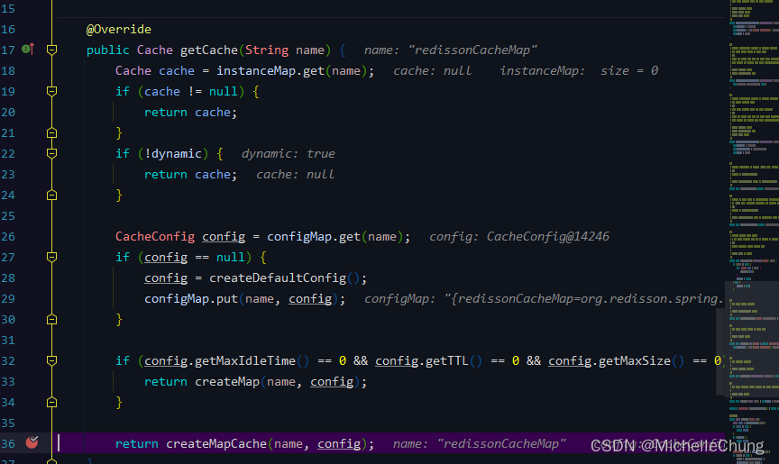

# Redisson（七）集成 Spring Cache 缓存分析

## 前言
先说句题外话，框架发布了 [V4.3.0 公测版本](https://gitee.com/JavaLionLi/RuoYi-Vue-Plus) 了，有兴趣的朋友可以去尝鲜。

最近没有更新不是在摆烂，而是在梳理 AOP 的相关内容，因为这篇博客的内容属实有点难搞，所以就去找了很多书籍、博客和视频去恶补相关的内容（其中有些很好的我会在下面的参考目录里面一一列举出来）。

**这篇博客可能更多的是偏向于个人学习的笔记，所以如果有错漏的地方烦请指正。**

## 参考目录
- [Redisson 官方文档 -  14.2. Spring Cache整合](https://github.com/redisson/redisson/wiki/14.-%E7%AC%AC%E4%B8%89%E6%96%B9%E6%A1%86%E6%9E%B6%E6%95%B4%E5%90%88#142-spring-cache%E6%95%B4%E5%90%88)
  提供了最简单的 Demo 演示如何整合 Spring Cache。
- [Spring 官方文档 - 8. Cache Abstraction](https://docs.spring.io/spring-framework/docs/current/reference/html/integration.html#cache)
  遇事不决，官方文档。
- [木子旭 - java-sping-cache 专栏](https://www.cnblogs.com/bjlhx/category/1233985.html)
  关于 Spring Cache 的专栏，写得很全面。
- [叔牙 - Spring cache原理详解](https://juejin.cn/post/6959002694539444231#heading-0)
  关于 Spring Cache 的博客，写得挺好的。
- [代码重工 - 第三章Spring AOP](https://www.wolai.com/t997N89dHDoHWqz9LpiNxY)
  一个博客网站，里面还有别的一些实用的知识总结。
- Spring 5 高级编程（第5版）
- Spring揭秘（第2版）
  两本书也是查看了关于 Spring AOP 的相关内容。

**Redisson 缓存是整合了 Spring Cache，而 Spring Cache 的实现又是基于 Spring AOP 的**，因此个人觉得对于这一部分的学习需要夯实基础才能更好地学习和理解。

## 框架集成
### 1、Maven
总工程 `pom.xml`，Redisson 版本 `V3.17.5`<br>
<br>

公共模块 `pom.xml`<br>
<br>
### 2、配置文件缓存配置
配置文件 `application.yml`<br>
<br>
### 3、Redis配置类
`com.ruoyi.framework.config.RedisConfig`<br>
<br>

其中，注解 `@EnableCaching` 开启缓存功能。<br>

Spring Cache 配置 `RedisConfig#cacheManager`<br>
<br>

（红线告警无视即可，在 `RedissonAutoConfiguration` 自动装配时已经在容器中注入了 `RedissonClient`）
### 4、缓存测试类
`com.ruoyi.demo.controller.RedisCacheController`<br>


该类提供了三个主要缓存注解的演示 Demo 以及说明：

| 注解          | 解析                                                                                      | 使用             | 注意事项                                                      |
|-------------|-----------------------------------------------------------------------------------------|----------------|-----------------------------------------------------------|
| @Cacheable  | 表示这个方法有了缓存的功能，方法的返回值会被缓存下来。下一次调用该方法前，会去检查是否缓存中已经有值：如果有就直接返回，不调用方法；如果没有，就调用方法，然后把结果缓存起来。 | 一般用在查询方法上      | 缓存注解严禁与其他筛选数据功能一起使用。例如: 数据权限注解会造成 ==缓存击穿== 与 ==数据不一致== 问题 |
| @CachePut   | 会把方法的返回值put到缓存里面缓存起来，供其它地方使用                                                            | 通常用在新增方法上      |                                                           |
| @CacheEvict | 清空指定缓存                                                                                  | 一般用在更新或者删除的方法上 |                                                           |

### 5、测试
### 5.1、`@Cacheable`
<br>

<br>
### 5.2、`@CachePut`
<br>

<br>

修改后 `@Cacheable` 接口请求结果：<br>
<br>
### 5.3、`@CacheEvict`
<br>

<br>

`test` 已被删除。
## 源码分析
在开始之前，我想先声明一下，最好是对于 Spring AOP 有一定程度的了解，知道什么是 `Pointcut`，`PointcutAdvisor`，`Advice`，`MethodInterceptor` 等。除此之外，了解 Spring AOP 的基本实现原理，否则看起来可能会比较费解（本文不会太详细去阐述相关概念，可以通过参考目录或者其他资料自行补充理解）。

### 1、Redisson 整合 Spring Cache 核心 API

先放一张简单的脑图，只是列举出了 Spring Cache 比较核心的 API：<br>

### 2、缓存自动装配
先来简单看下自动装配。<br>

在配置文件 `application.yml` 中，打开 debug 配置：<br>

```yml
debug: true
```
启动服务观察控制台输出。

### 2.1、`CacheAutoConfiguration`


这里的 `CacheManager` 正是 `RedisConfig` 中配置的缓存管理器：<br>

### 2.2、`RedissonCacheStatisticsAutoConfiguration `


### 2.3、`CacheMetricsAutoConfiguration`


这里引入了 `CacheMetricsRegistrarConfiguration`：<br>


该方法会绑定缓存管理器到注册表中：<br>


通过 `RedissonSpringCacheManager` 获取 Cache：<br>


`RedissonSpringCacheManager#createMapCache`<br>


`RedissonSpringCacheManager#getMapCache`<br>


`Redisson#getMapCache`<br>


最终得到的结果：<br>

### 3、`@EnableCaching`
首先从入口开始入手，参考 [叔牙 - Spring cache原理详解](https://juejin.cn/post/6959002694539444231#heading-0) 中的时序图：

> <br>

`org.springframework.cache.annotation.EnableCaching`<br>


要了解一个 `EnableXX` 注解干了啥，就看它导入 `@Import` 了什么内容。

### 3.1、`CachingConfigurationSelector`
`org.springframework.cache.annotation.CachingConfigurationSelector`<br>


### 3.1.1、自动代理注册器 `AutoProxyRegistrar`
`org.springframework.context.annotation.AutoProxyRegistrar#registerBeanDefinitions`<br>


`org.springframework.aop.config.AopConfigUtils#registerOrEscalateApcAsRequired`<br>

### 3.1.2*、代理缓存配置 `ProxyCachingConfiguration`
`org.springframework.cache.annotation.ProxyCachingConfiguration`<br>


最重要的配置类之一，这里面配置了缓存相关的内容，也是基于 AOP 相关的实现。下面一个个来说明。

### 3.1.2.1、`PointcutAdvisor`：`BeanFactoryCacheOperationSourceAdvisor`


首先来看下 UML 图：<br>
<br>
`PointcutAdvisor` 相当于 `Pointcut` 与`Advice` 的连接器（ `PointcutAdvisor` 继承自 `Advisor`，`Advisor` 是 `Advice` 的容器接口，他们是一对一关联的）。

### 3.1.2.2、`CacheOperationSource`
<br>

该方法 `new AnnotationCacheOperationSource()`。<br>


初始化了 Spring 缓存解析器 `SpringCacheAnnotationParser`：<br>


在方法 `SpringCacheAnnotationParser#parseCacheAnnotations` 进行缓存注解的解析操作：<br>

### 3.1.2.3、`Advice`（`MethodInterceptor`）：`CacheInterceptor`


熟悉 Spring AOP 的朋友都知道，Spring AOP 中提供了不同类型的 Advice，但是通过查看源码 `AdvisorAdapter` 可知，所有 Advice 底层实现都是用`MethodInterceptor` 来进行实现的。

查看 `CacheInterceptor` 的 UML 图：<br>


AspectJ 实现是通过拦截器反射（invoke）来实现的，因此在该类中也必然有 `invoke` 方法：<br>


`CacheInterceptor` 的能力来自于父类 `CacheAspectSupport`：<br>


稍后断点再进行说明。
### 4、缓存以及获取值（@Cacheable）
### 4.1、第一次请求，没有缓存值
`CacheAspectSupport#execute`<br>

### 4.1.1、从缓存中查找是否有值
`CacheAspectSupport#execute`<br>


`CacheAspectSupport#findCachedItem`<br>


`CacheAspectSupport#findInCaches`<br>


`AbstractCacheInvoker#doGet`<br>


`RedissonCache#get`<br>


第一次请求为空，回到主方法 `CacheAspectSupport#execute`，将结果进行缓存。
### 4.1.2、缓存


`CachePutRequest#apply`<br>


`AbstractCacheInvoker#doPut`<br>


缓存完成回到主方法，返回最终执行结果：<br>

### 4.2、第二次请求，有缓存值
`RedissonCache#get`<br>


获取到缓存值，直接返回到前端，不再进入请求方法体内。