# Redisson（十）发布 | 订阅功能分析
- - -

## 前言
本来承接上篇应该到 OSS 模块的初始化分析了，结果半路杀出个程咬金：在做分析的时候遇到了发布订阅的相关功能的一些问题，去请教了一下 [狮子大佬](https://lionli.blog.csdn.net/) ，所以决定这篇先简单分析一下发布订阅功能，下一篇再回归 OSS 功能。

## 参考目录
### 使用文档
- [Redisson 官方文档 - 6.7. 话题（订阅分发）](https://github.com/redisson/redisson/wiki/6.-%E5%88%86%E5%B8%83%E5%BC%8F%E5%AF%B9%E8%B1%A1#67-%E8%AF%9D%E9%A2%98%E8%AE%A2%E9%98%85%E5%88%86%E5%8F%91)
- [Redis 官方文档 - Redis Pub/Sub](https://redis.io/docs/manual/pubsub/)
### 发布订阅相关概念
- Redis设计与实现（黄健宏）第18章 发布与订阅
  后面的三篇文章应该都有参考此书。
- [观察者模式与订阅发布模式的区别](https://www.cnblogs.com/onepixel/p/10806891.html)
- [观察者模式与发布订阅模式真的不同](https://juejin.cn/post/6844903842501378055)
- [Redis进阶 - 消息传递：发布订阅模式详解](https://pdai.tech/md/db/nosql-redis/db-redis-x-pub-sub.html)

**对于相关概念，我就不再在此重复了，感兴趣的朋友可以自行查看或者查找。**

## 框架集成
### 版本信息
- RuoYi-Vue-Plus `V4.3.0`
- Redisson `V3.17.5`
### 发布消息 `RedisPubSubController#pub`

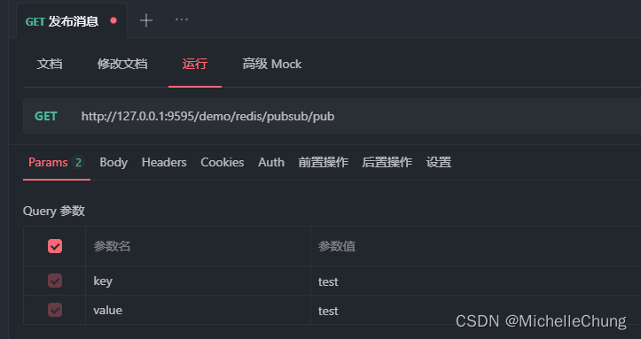

### 订阅消息 `RedisPubSubController#sub`
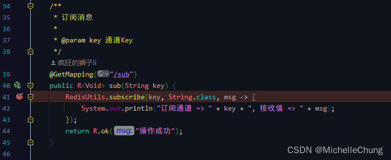

### 接口请求控制台打印

## 功能调用流程分析之【订阅流程】
### 1、`RedisPubSubController#sub`
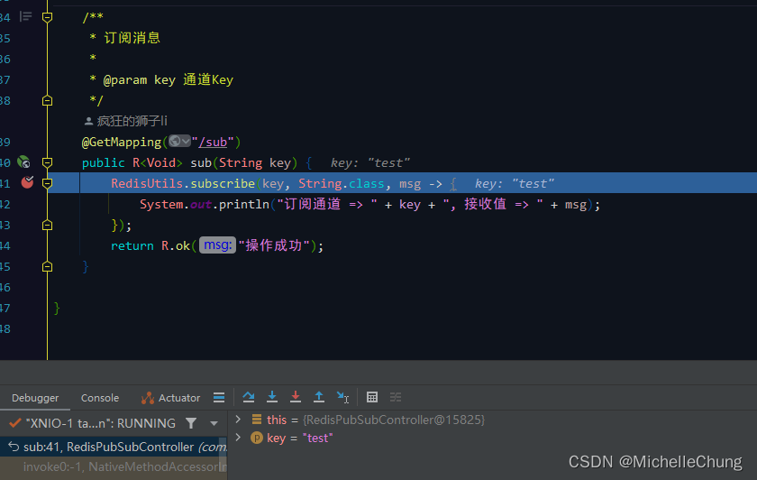
### 2、`RedisUtils#subscribe`
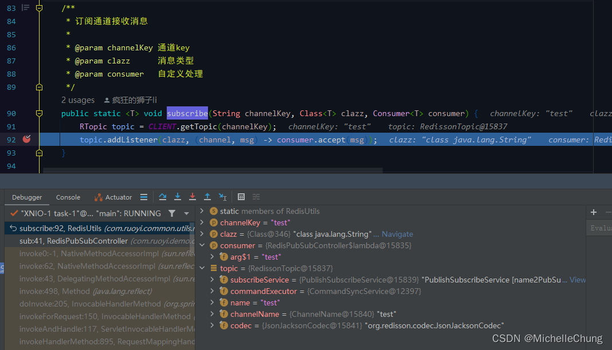

方法 `topic.addListener` 是为 RTopic 添加一个监听器，框架中对监听器的方法进行了重写，在后面发布的部分会详细说明。

### 3、`RedissonTopic#addListener`
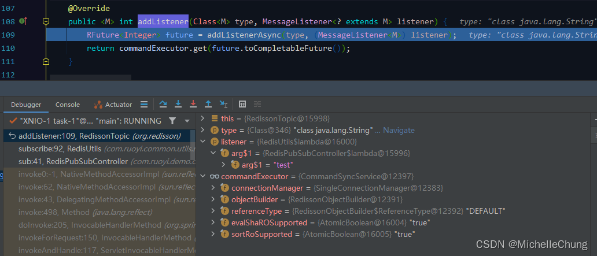
### 4、`RedissonTopic#addListenerAsync`
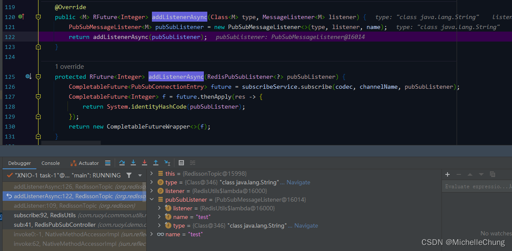

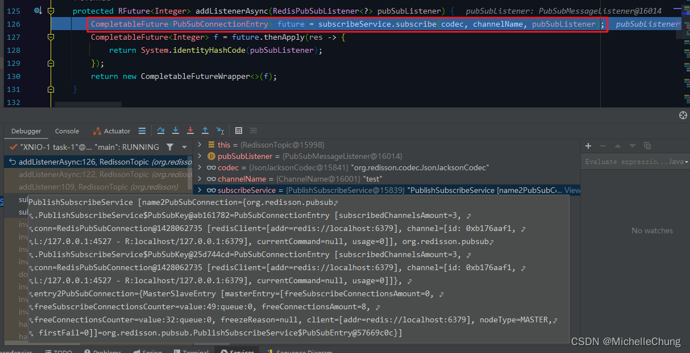
### 5、`PublishSubscribeService#subscribe`

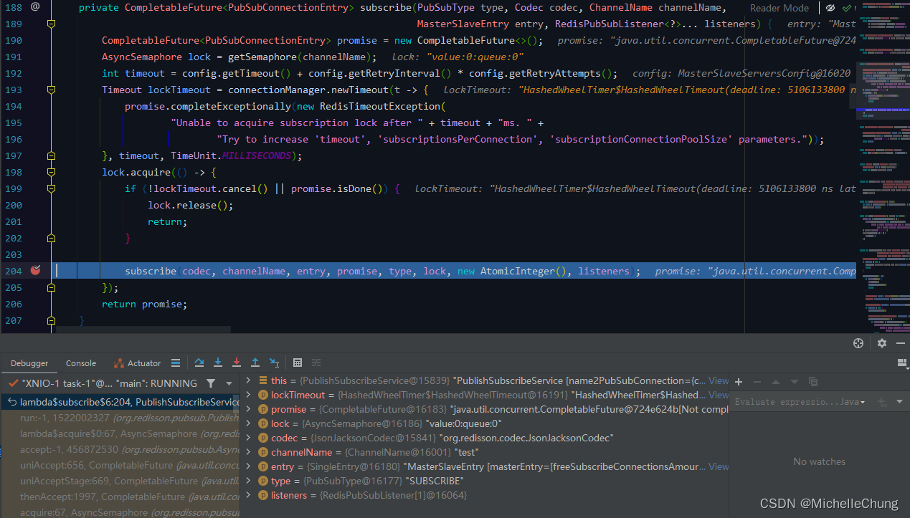

### 6、`PublishSubscribeService#subscribeNoTimeout`
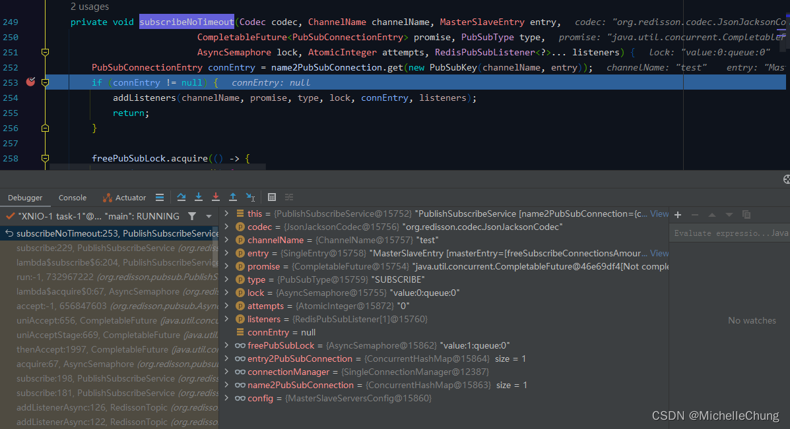

第一次请求时没有 `PubSubConnectionEntry` 对象，继续执行下面的逻辑（后面存入容器对象 name2PubSubConnection 中），后续请求如果存在对象则直接返回。

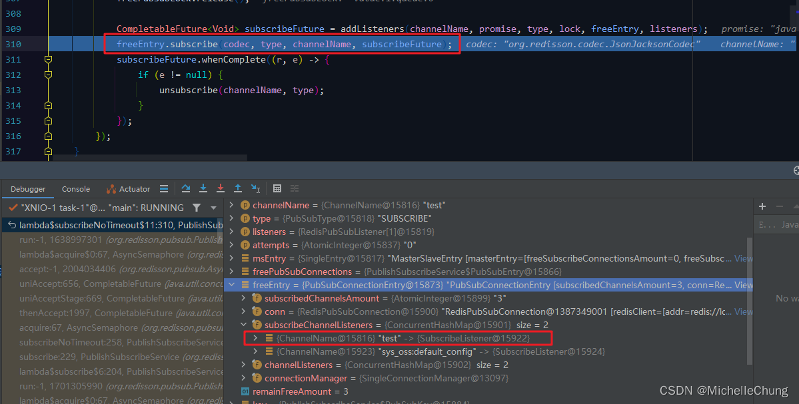

### 7、`PubSubConnectionEntry#subscribe`
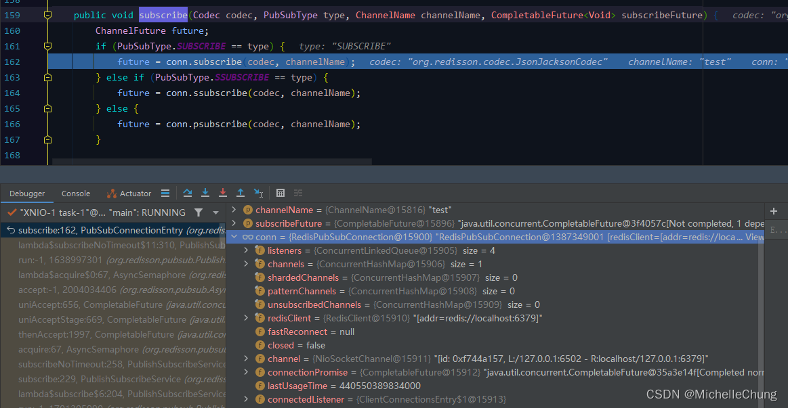

### 8、`RedisPubSubConnection#subscribe`

### 9、`RedisPubSubConnection#async`

断点到这里后面就不再深入了，是由`io.netty.channel.AbstractChannelHandlerContext#safeExecute` 这个方法完成底层订阅操作。
### 10、Redis 控制台打印结果

## 功能调用流程分析之【发布流程】
### 1、`RedisPubSubController#pub`
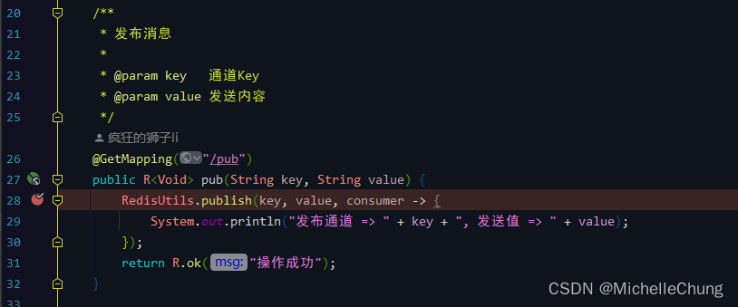

这里 `System.out.println("发布通道 => " + key + ", 发送值 => " + value);` 实际上就是上面第 `3` 步中重写的方法中的逻辑。
### 2、`RedisUtils#publish`

### 3、`RedissonTopic#publish`

### 4、`RedissonTopic#publishAsync`
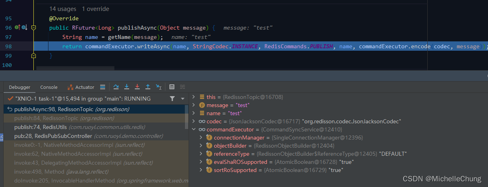

### 5、`CommandAsyncService#writeAsync`

### 6、`CommandAsyncService#async`
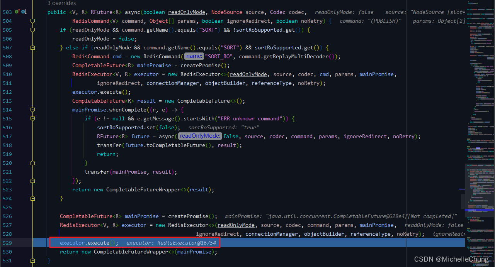

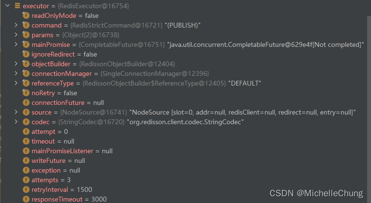

### 7、`RedisExecutor#execute`

### 8、`RedisExecutor#sendCommand`
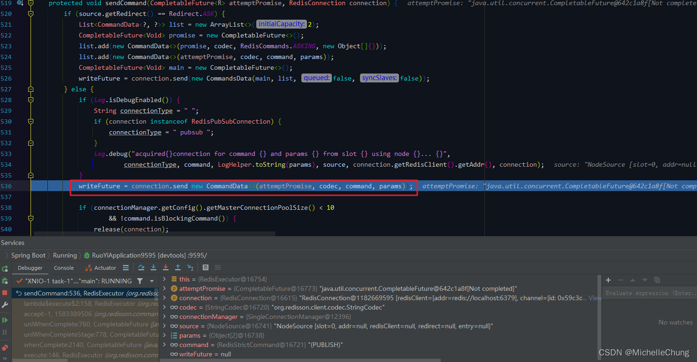

同样，断点到这里后面就不再深入了，最后发布操作同样是由`io.netty.channel.AbstractChannelHandlerContext#safeExecute` 这个方法完成。
### 9、Redis 控制台打印结果

## 功能调用流程分析之【订阅通道接收到发布消息】
特别说明：这里分析截图用的订阅通道是【test1】，发布消息内容是【test1】。

**如果先进行订阅操作，再进行发布操作，那么在发布完成后订阅通道就能够直接接收到消息，因此实际上这一部分内容在时间上是紧接着【发布流程】的。**

### 1、`CommandPubSubDecoder#decodeResult`
这里解码并根据消息类型进行对应的操作。 
 

这个方法前面还有一些操作步骤（参考以下序列图，只保留了关键方法）： 
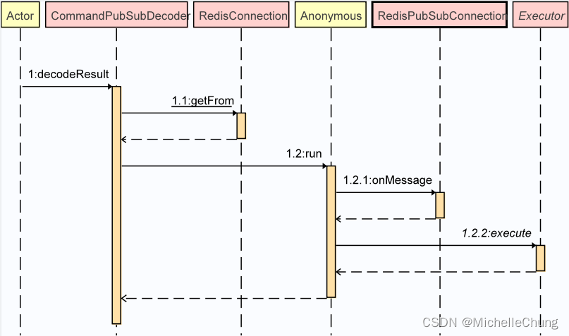
### 2、`RedisPubSubConnection#onMessage`
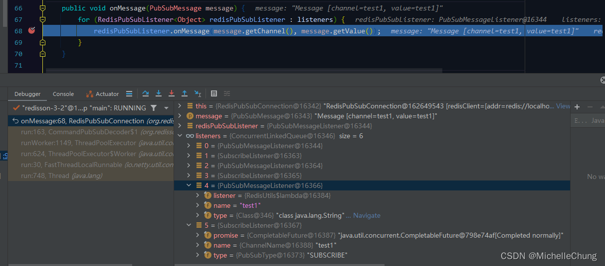

此处的逻辑是遍历所有的监听器，执行 `onMessage` 方法。

### 3、`PubSubMessageListener#onMessage`
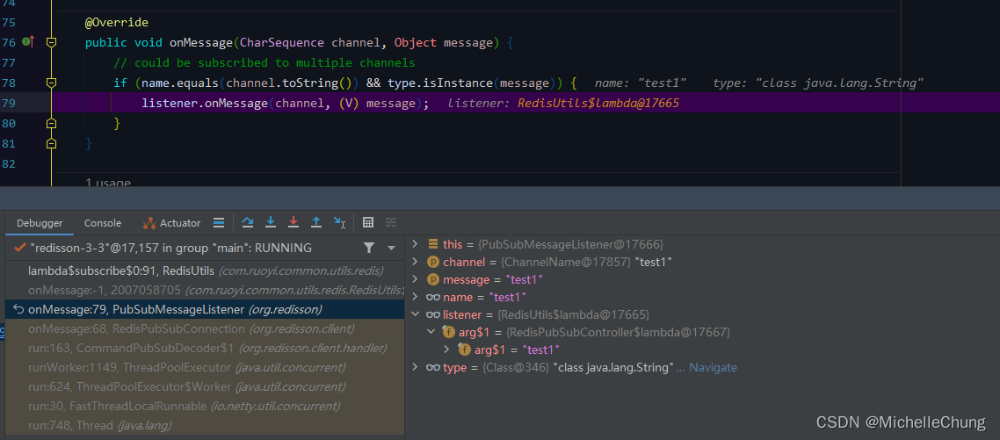

`MessageListener` 接口： 
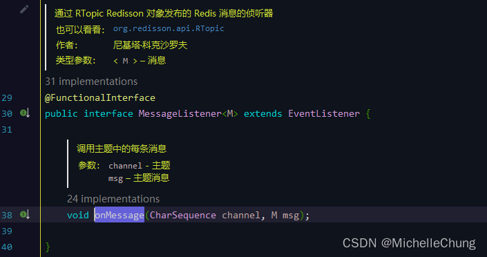
### 4、`RedisUtils#subscribe`
重写 `onMessage` 方法： 
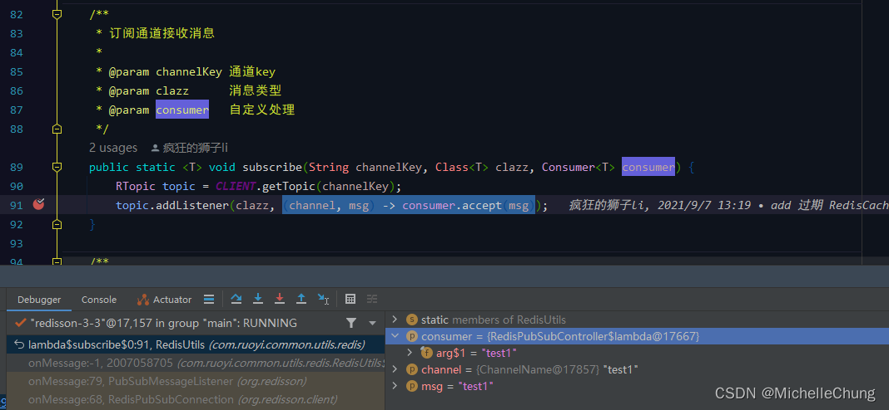

换种写法比较容易理解： 
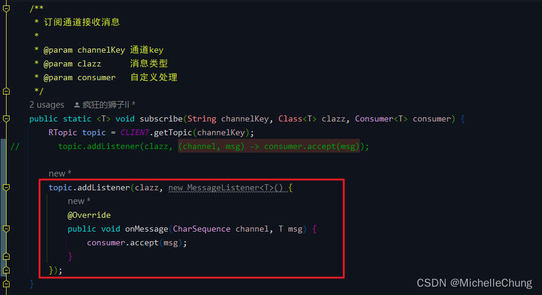
### 5、`RedisPubSubController#sub`

### 6、控制台打印结果

