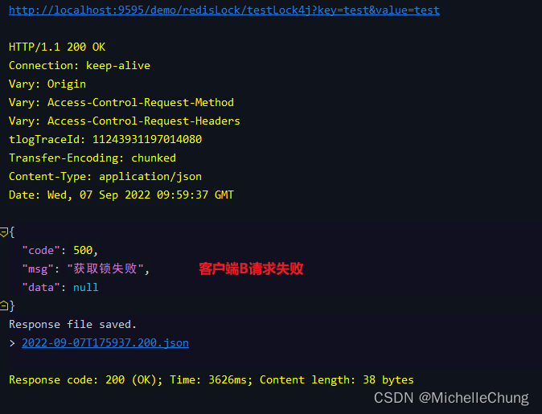
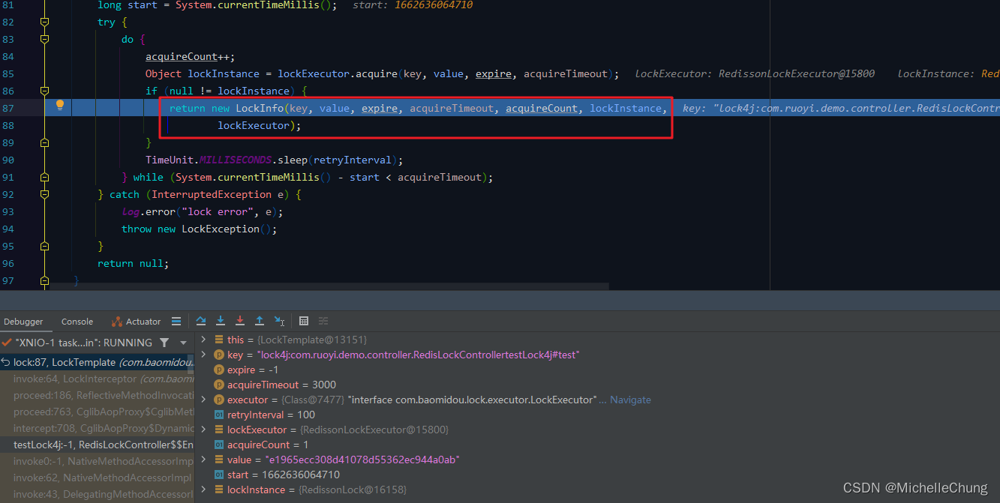

# Redisson（十一）分布式锁 lock4j 集成分析

## 前言
前段时间群里有聊到分布式锁，想起来框架中也有集成了这个功能，也使用了 lock4j 框架，所以这一篇就来简单分析一下。
## 参考目录
- [lock4j: 基于Spring AOP 的声明式和编程式分布式锁](https://gitee.com/baomidou/lock4j)
  lock4j 版本：V2.2.2
- [Redisson 官方文档 -  8.1. 可重入锁（Reentrant Lock）](https://github.com/redisson/redisson/wiki/8.-%E5%88%86%E5%B8%83%E5%BC%8F%E9%94%81%E5%92%8C%E5%90%8C%E6%AD%A5%E5%99%A8#81-%E5%8F%AF%E9%87%8D%E5%85%A5%E9%94%81reentrant-lock)
  Redisson 版本：V3.17.6
- [分布式中间件技术实战：Java版](https://weread.qq.com/web/bookDetail/84a3272071a1a78c84a17f9)
  一本不错的有介绍 Redisson 的书籍，里面有 Redisson 分布式锁的案例

首先简单说明一下，lock4j 目前只集成了 Redisson 可重入锁，但是 Redisson 还有其他几种锁（如下图），后面会再进行分析。不过因为我很少用锁，所以使用场景不是很熟悉，更新也会慢一点，请见谅。<br>


## 框架集成
### 1、Maven
总工程 `pom.xml`，Redisson 版本 `V3.17.6`，lock4j 版本 `V2.2.2`<br>
<br>

### 2、配置文件缓存配置
配置文件 `application.yml`<br>

<br>

### 3、测试类
`com.ruoyi.demo.controller.RedisLockController`<br>

<br>

该类演示了**两种使用方法**：
- 注解方式（`RedisLockController#testLock4j`）
- 模板方式（`RedisLockController#testLock4jLockTemplate`）

**两者进行比较**：
1. 模板方式本质上和注解方式底层调用的方法是一样的；

2. 注解方式设置了默认的参数，通过 AOP 方式实现，简单方便；<br>
   注解方式如果底层获取锁失败了，会直接抛出异常 `LockFailureException`，需要额外进行全局异常捕获并处理。

3. 模板方式需要手动上锁，也需要手动解锁；<br>
   模板方式获取锁失败可以根据业务进行处理，比较灵活。

**使用建议**：<br>
如果是实际场景建议使用模板方式，虽然没有注解方式方便，但是比较好控制，如果有问题也比较容易排查。

**鉴于学习为目的，本文的分析使用注解方式，并在原框架基础上加上简单的异常捕获演示获取锁超时的场景。**


全局异常捕获 `GlobalExceptionHandler#handleLockException`<br>

### 4、接口测试
### 4.1、单次请求


控制台输出：<br>


### 4.2、多次请求（超时获取异常）
请求方式：两个客户端同时发起请求（相同请求参数），客户端A（task-1）获取锁成功，执行业务流程，客户端B（task-2）获取锁失败，抛出异常。




控制台输出：<br>

```
2022-09-07 17:59:34 [XNIO-1 task-1] DEBUG c.r.f.i.PlusWebInvokeTimeInterceptor
 - <0><11243931196096576> [PLUS]开始请求 => URL[GET /demo/redisLock/testLock4j],参数类型[param],参数:[{"value":["test"],"key":["test"]}]
2022-09-07 17:59:34 [XNIO-1 task-2] DEBUG c.r.f.i.PlusWebInvokeTimeInterceptor
 - <0><11243931197014080> [PLUS]开始请求 => URL[GET /demo/redisLock/testLock4j],参数类型[param],参数:[{"value":["test"],"key":["test"]}]
start:test,time:17:59:34.874
2022-09-07 17:59:37 [XNIO-1 task-2] ERROR c.r.f.w.e.GlobalExceptionHandler
 - <0><11243931197014080> request failed,please retry it.
com.baomidou.lock.exception.LockFailureException: request failed,please retry it.
	at com.baomidou.lock.DefaultLockFailureStrategy.onLockFailure(DefaultLockFailureStrategy.java:34)
	at com.baomidou.lock.aop.LockInterceptor.invoke(LockInterceptor.java:69)
	at org.springframework.aop.framework.ReflectiveMethodInvocation.proceed(ReflectiveMethodInvocation.java:186)
	at org.springframework.aop.framework.CglibAopProxy$CglibMethodInvocation.proceed(CglibAopProxy.java:763)
	at org.springframework.aop.framework.CglibAopProxy$DynamicAdvisedInterceptor.intercept(CglibAopProxy.java:708)
	at com.ruoyi.demo.controller.RedisLockController$$EnhancerBySpringCGLIB$$e89da26c.testLock4j(<generated>)
	at sun.reflect.NativeMethodAccessorImpl.invoke0(Native Method)
	at sun.reflect.NativeMethodAccessorImpl.invoke(NativeMethodAccessorImpl.java:62)
	at sun.reflect.DelegatingMethodAccessorImpl.invoke(DelegatingMethodAccessorImpl.java:43)
	at java.lang.reflect.Method.invoke(Method.java:498)
	at org.springframework.web.method.support.InvocableHandlerMethod.doInvoke(InvocableHandlerMethod.java:205)
	at org.springframework.web.method.support.InvocableHandlerMethod.invokeForRequest(InvocableHandlerMethod.java:150)
	at org.springframework.web.servlet.mvc.method.annotation.ServletInvocableHandlerMethod.invokeAndHandle(ServletInvocableHandlerMethod.java:117)
	at org.springframework.web.servlet.mvc.method.annotation.RequestMappingHandlerAdapter.invokeHandlerMethod(RequestMappingHandlerAdapter.java:895)
	at org.springframework.web.servlet.mvc.method.annotation.RequestMappingHandlerAdapter.handleInternal(RequestMappingHandlerAdapter.java:808)
	at org.springframework.web.servlet.mvc.method.AbstractHandlerMethodAdapter.handle(AbstractHandlerMethodAdapter.java:87)
	at org.springframework.web.servlet.DispatcherServlet.doDispatch(DispatcherServlet.java:1070)
	at org.springframework.web.servlet.DispatcherServlet.doService(DispatcherServlet.java:963)
	at org.springframework.web.servlet.FrameworkServlet.processRequest(FrameworkServlet.java:1006)
	at org.springframework.web.servlet.FrameworkServlet.doGet(FrameworkServlet.java:898)
	at javax.servlet.http.HttpServlet.service(HttpServlet.java:497)
	at org.springframework.web.servlet.FrameworkServlet.service(FrameworkServlet.java:883)
	at javax.servlet.http.HttpServlet.service(HttpServlet.java:584)
	at io.undertow.servlet.handlers.ServletHandler.handleRequest(ServletHandler.java:74)
	at io.undertow.servlet.handlers.FilterHandler$FilterChainImpl.doFilter(FilterHandler.java:129)
	at org.springframework.web.filter.CorsFilter.doFilterInternal(CorsFilter.java:91)
	at org.springframework.web.filter.OncePerRequestFilter.doFilter(OncePerRequestFilter.java:117)
	at io.undertow.servlet.core.ManagedFilter.doFilter(ManagedFilter.java:61)
	at io.undertow.servlet.handlers.FilterHandler$FilterChainImpl.doFilter(FilterHandler.java:131)
	at com.alibaba.druid.support.http.WebStatFilter.doFilter(WebStatFilter.java:114)
	at io.undertow.servlet.core.ManagedFilter.doFilter(ManagedFilter.java:61)
	at io.undertow.servlet.handlers.FilterHandler$FilterChainImpl.doFilter(FilterHandler.java:131)
	at com.ruoyi.common.filter.RepeatableFilter.doFilter(RepeatableFilter.java:30)
	at io.undertow.servlet.core.ManagedFilter.doFilter(ManagedFilter.java:61)
	at io.undertow.servlet.handlers.FilterHandler$FilterChainImpl.doFilter(FilterHandler.java:131)
	at org.springframework.web.filter.RequestContextFilter.doFilterInternal(RequestContextFilter.java:100)
	at org.springframework.web.filter.OncePerRequestFilter.doFilter(OncePerRequestFilter.java:117)
	at io.undertow.servlet.core.ManagedFilter.doFilter(ManagedFilter.java:61)
	at io.undertow.servlet.handlers.FilterHandler$FilterChainImpl.doFilter(FilterHandler.java:131)
	at org.springframework.web.filter.FormContentFilter.doFilterInternal(FormContentFilter.java:93)
	at org.springframework.web.filter.OncePerRequestFilter.doFilter(OncePerRequestFilter.java:117)
	at io.undertow.servlet.core.ManagedFilter.doFilter(ManagedFilter.java:61)
	at io.undertow.servlet.handlers.FilterHandler$FilterChainImpl.doFilter(FilterHandler.java:131)
	at org.springframework.boot.actuate.metrics.web.servlet.WebMvcMetricsFilter.doFilterInternal(WebMvcMetricsFilter.java:96)
	at org.springframework.web.filter.OncePerRequestFilter.doFilter(OncePerRequestFilter.java:117)
	at io.undertow.servlet.core.ManagedFilter.doFilter(ManagedFilter.java:61)
	at io.undertow.servlet.handlers.FilterHandler$FilterChainImpl.doFilter(FilterHandler.java:131)
	at org.springframework.web.filter.CharacterEncodingFilter.doFilterInternal(CharacterEncodingFilter.java:201)
	at org.springframework.web.filter.OncePerRequestFilter.doFilter(OncePerRequestFilter.java:117)
	at io.undertow.servlet.core.ManagedFilter.doFilter(ManagedFilter.java:61)
	at io.undertow.servlet.handlers.FilterHandler$FilterChainImpl.doFilter(FilterHandler.java:131)
	at io.undertow.servlet.handlers.FilterHandler.handleRequest(FilterHandler.java:84)
	at io.undertow.servlet.handlers.security.ServletSecurityRoleHandler.handleRequest(ServletSecurityRoleHandler.java:62)
	at io.undertow.servlet.handlers.ServletChain$1.handleRequest(ServletChain.java:68)
	at io.undertow.servlet.handlers.ServletDispatchingHandler.handleRequest(ServletDispatchingHandler.java:36)
	at io.undertow.servlet.handlers.RedirectDirHandler.handleRequest(RedirectDirHandler.java:68)
	at io.undertow.servlet.handlers.security.SSLInformationAssociationHandler.handleRequest(SSLInformationAssociationHandler.java:117)
	at io.undertow.servlet.handlers.security.ServletAuthenticationCallHandler.handleRequest(ServletAuthenticationCallHandler.java:57)
	at io.undertow.server.handlers.PredicateHandler.handleRequest(PredicateHandler.java:43)
	at io.undertow.security.handlers.AbstractConfidentialityHandler.handleRequest(AbstractConfidentialityHandler.java:46)
	at io.undertow.servlet.handlers.security.ServletConfidentialityConstraintHandler.handleRequest(ServletConfidentialityConstraintHandler.java:64)
	at io.undertow.security.handlers.AuthenticationMechanismsHandler.handleRequest(AuthenticationMechanismsHandler.java:60)
	at io.undertow.servlet.handlers.security.CachedAuthenticatedSessionHandler.handleRequest(CachedAuthenticatedSessionHandler.java:77)
	at io.undertow.security.handlers.AbstractSecurityContextAssociationHandler.handleRequest(AbstractSecurityContextAssociationHandler.java:43)
	at io.undertow.server.handlers.PredicateHandler.handleRequest(PredicateHandler.java:43)
	at io.undertow.servlet.handlers.SendErrorPageHandler.handleRequest(SendErrorPageHandler.java:52)
	at io.undertow.server.handlers.PredicateHandler.handleRequest(PredicateHandler.java:43)
	at io.undertow.servlet.handlers.ServletInitialHandler.handleFirstRequest(ServletInitialHandler.java:275)
	at io.undertow.servlet.handlers.ServletInitialHandler.access$100(ServletInitialHandler.java:79)
	at io.undertow.servlet.handlers.ServletInitialHandler$2.call(ServletInitialHandler.java:134)
	at io.undertow.servlet.handlers.ServletInitialHandler$2.call(ServletInitialHandler.java:131)
	at io.undertow.servlet.core.ServletRequestContextThreadSetupAction$1.call(ServletRequestContextThreadSetupAction.java:48)
	at io.undertow.servlet.core.ContextClassLoaderSetupAction$1.call(ContextClassLoaderSetupAction.java:43)
	at io.undertow.servlet.handlers.ServletInitialHandler.dispatchRequest(ServletInitialHandler.java:255)
	at io.undertow.servlet.handlers.ServletInitialHandler.access$000(ServletInitialHandler.java:79)
	at io.undertow.servlet.handlers.ServletInitialHandler$1.handleRequest(ServletInitialHandler.java:100)
	at io.undertow.server.Connectors.executeRootHandler(Connectors.java:387)
	at io.undertow.server.HttpServerExchange$1.run(HttpServerExchange.java:852)
	at org.jboss.threads.ContextClassLoaderSavingRunnable.run(ContextClassLoaderSavingRunnable.java:35)
	at org.jboss.threads.EnhancedQueueExecutor.safeRun(EnhancedQueueExecutor.java:2019)
	at org.jboss.threads.EnhancedQueueExecutor$ThreadBody.doRunTask(EnhancedQueueExecutor.java:1558)
	at org.jboss.threads.EnhancedQueueExecutor$ThreadBody.run(EnhancedQueueExecutor.java:1423)
	at org.xnio.XnioWorker$WorkerThreadFactory$1$1.run(XnioWorker.java:1282)
	at java.lang.Thread.run(Thread.java:748)
2022-09-07 17:59:37 [XNIO-1 task-2] DEBUG c.r.f.i.PlusWebInvokeTimeInterceptor
 - <0><11243931197014080> [PLUS]结束请求 => URL[GET /demo/redisLock/testLock4j],耗时:[3192]毫秒
end :test,time:17:59:44.895
2022-09-07 17:59:44 [XNIO-1 task-1] DEBUG c.r.f.i.PlusWebInvokeTimeInterceptor
 - <0><11243931196096576> [PLUS]结束请求 => URL[GET /demo/redisLock/testLock4j],耗时:[10129]毫秒

```
## 简单源码分析
### 1、包

### 2、`spring.factories`
<br>

Spring Boot 启动时会自动装配 `LockAutoConfiguration`<br>
### 3、自动配置类 `LockAutoConfiguration`
<br>

<br>
### 4、默认配置 `Lock4jProperties`
<br>
### 5、`LockInterceptor`
<br>

AOP 主要逻辑方法 `com.baomidou.lock.aop.LockInterceptor#invoke`<br>

## 执行流程分析1：单次请求
### 1、执行流程对比图
为了便于理解 AOP 注解的作用所以画了下面这个对比图。<br>

左边是普通方法的执行逻辑：<br>
```
请求 —— 业务流程 —— 完成
```
右边是 AOP 增强后的执行逻辑：<br>
```
正常获取锁：
请求 —— AOP 增强（加锁）—— 业务流程 —— AOP 增强（释放锁）—— 完成

没有获取到锁：
请求 —— AOP 增强（等待加锁，没有获取到锁根据异常策略抛出异常）—— 全局异常捕获，返回异常信息 
```


### 2、（#2）AOP 增强 `LockInterceptor#invoke`

### 2.1、（#2）LockTemplate 加锁 `LockTemplate#lock`

由于是单次请求，所以必然能够获取到锁：<br>

### 2.2、（#2）`RedissonLockExecutor#acquire`

### 2.3、（#2）Redisson 加锁 `RedissonLock#tryLock`

`org.redisson.RedissonLock#tryAcquire` 方法里面有执行 Lua 脚本，在后面再进行分析。<br>

此处返回 `true` 说明加锁成功。<br>

### 2.4、（#2）加锁成功 `RedissonLockExecutor#acquire`

### 2.5、（#2）加锁成功 `LockTemplate#lock`

### 2.6、（#2）加锁成功 `LockInterceptor#invoke`

### 3、（#2.1）执行业务流程 `RedisLockController#testLock4j`

### 4、（#3）释放锁 `LockInterceptor#invoke`

### 4.1、（#3）释放锁 `LockTemplate#releaseLock`

### 4.2、（#3）释放锁 `RedissonLockExecutor#releaseLock`

### 4.3、（#3）释放完成 `LockInterceptor#invoke`

如果释放失败，会打印控制台日志。<br>

至此请求执行完成。<br>
## 执行流程分析2：多次请求（超时获取异常）

### 1、（#2）LockTemplate 获取锁失败 `LockTemplate#lock`

### 2、（#2）AOP 获取锁失败 `LockInterceptor#invoke`

### 3、（#2.2）默认锁策略抛出加锁失败异常 `DefaultLockFailureStrategy#onLockFailure`

### 4、异常捕获 `GlobalExceptionHandler#handleLockException`


至此请求执行完成。<br>
## 执行流程分析3：Redisson 加锁 Lua 脚本分析
在前面单次请求分析中（`2.3`）有调用 Redisson 底层代码进行加锁，下面就来分析一下。<br>

### 1、执行流程

`RedissonLock#tryAcquire`<br>
<br>

`RedissonLock#tryLockInnerAsync`<br>
<br>


### 2、Lua 脚本
```lua
if (redis.call('exists', KEYS[1]) == 0) then 
	redis.call('hincrby', KEYS[1], ARGV[2], 1); 
	redis.call('pexpire', KEYS[1], ARGV[1]); 
	return nil; 
end; 
if (redis.call('hexists', KEYS[1], ARGV[2]) == 1) then 
	redis.call('hincrby', KEYS[1], ARGV[2], 1); 
	redis.call('pexpire', KEYS[1], ARGV[1]); 
	return nil; 
end; 
return redis.call('pttl', KEYS[1]);
```


| 脚本参数名   | Java参数名                  | 参数值                                                                   | 含义             |
|---------|--------------------------|-----------------------------------------------------------------------|----------------|
| KEYS[1] | getRawName()             | "lock4j:com.ruoyi.demo.controller.RedisLockControllertestLock4j#test" | lockKey        |
| ARGV[1] | unit.toMillis(leaseTime) | "30000"                                                               | 分布式锁超时时间       |
| ARGV[2] | getLockName(threadId)    | "33fcf656-7511-4cdb-86e5-61475d408b32:80"                             | lockValue:线程id |

### 3、Lua 脚本代码分析
```lua
if (redis.call('exists', KEYS[1]) == 0) then 
-- 判断 lockKey 是否存在（若 key 存在返回 1 ，否则返回 0 。）
-- "exists" "lock4j:com.ruoyi.demo.controller.RedisLockControllertestLock4j#test"

	-- 如果 lockKey 不存在，执行以下逻辑
	redis.call('hincrby', KEYS[1], ARGV[2], 1); 
	-- 为 lockKey 的值 lockValue 加上 1
	-- "hincrby" "lock4j:com.ruoyi.demo.controller.RedisLockControllertestLock4j#test" "33fcf656-7511-4cdb-86e5-61475d408b32:80" "1"
	
	redis.call('pexpire', KEYS[1], ARGV[1]); 
	-- 为 lockKey 设置超时时间
	-- "pexpire" "lock4j:com.ruoyi.demo.controller.RedisLockControllertestLock4j#test" "30000"
	
	return nil; 
end; 
if (redis.call('hexists', KEYS[1], ARGV[2]) == 1) then 
-- 判断哈希表中 lockKey 的值 lockValue 是否存在
-- "HEXISTS" "lock4j:com.ruoyi.demo.controller.RedisLockControllertestLock4j#test" "33fcf656-7511-4cdb-86e5-61475d408b32:80"

	-- 如果 lockKey 存在，执行以下逻辑
	redis.call('hincrby', KEYS[1], ARGV[2], 1); 
	-- 为 lockKey 的值 lockValue 加上 1
	
	redis.call('pexpire', KEYS[1], ARGV[1]); 
	-- 为 lockKey 设置超时时间
	
	return nil; 
end; 
return redis.call('pttl', KEYS[1]);
-- 以毫秒为单位返回 key 的剩余过期时间
```

### 4、Redis 实际执行结果
```bash
1662644206.029870 [5 lua] "exists" "lock4j:com.ruoyi.demo.controller.RedisLockControllertestLock4j#test"
1662644206.029908 [5 lua] "hincrby" "lock4j:com.ruoyi.demo.controller.RedisLockControllertestLock4j#test" "33fcf656-7511-4cdb-86e5-61475d408b32:80" "1"
1662644206.029948 [5 lua] "pexpire" "lock4j:com.ruoyi.demo.controller.RedisLockControllertestLock4j#test" "30000"
1662644216.042830 [5 127.0.0.1:2520] "HEXISTS" "lock4j:com.ruoyi.demo.controller.RedisLockControllertestLock4j#test" "33fcf656-7511-4cdb-86e5-61475d408b32:80"
```
## 执行流程分析4：Redisson 释放锁 Lua 脚本分析
### 1、执行流程
`RedissonLockExecutor#releaseLock`<br>
<br>

`RedissonLock#forceUnlockAsync`<br>
<br>
### 2、Lua 脚本

```lua
if (redis.call('del', KEYS[1]) == 1) then 
	redis.call('publish', KEYS[2], ARGV[1]); 
	return 1 
else 
	return 0 
end
```
| 脚本参数名   | Java参数名                   | 参数值                                                                                            | 含义                    |
|---------|---------------------------|------------------------------------------------------------------------------------------------|-----------------------|
| KEYS[1] | getRawName()              | "lock4j:com.ruoyi.demo.controller.RedisLockControllertestLock4j#test"                          | lockKey               |
| KEYS[2] | getChannelName()          | "redisson_lock__channel:{lock4j:com.ruoyi.demo.controller.RedisLockControllertestLock4j#test}" | Redisson 锁 Channel 名称 |
| ARGV[1] | LockPubSub.UNLOCK_MESSAGE | "0"                                                                                            | Redisson 解锁信息         |
### 3、Lua 脚本代码分析
```lua
if (redis.call('del', KEYS[1]) == 1) then 
-- 删除 lockKey，并判断是否成功
-- "del" "lock4j:com.ruoyi.demo.controller.RedisLockControllertestLock4j#test"

	-- 删除成功
	redis.call('publish', KEYS[2], ARGV[1]); 
	-- 发布解锁消息
	-- "publish" "redisson_lock__channel:{lock4j:com.ruoyi.demo.controller.RedisLockControllertestLock4j#test}" "0"
	
	return 1 
else 
	-- 删除失败
	return 0 
end
```
### 4、Redis 实际执行结果
```bash
1662644216.043850 [5 lua] "del" "lock4j:com.ruoyi.demo.controller.RedisLockControllertestLock4j#test"
1662644216.043864 [5 lua] "publish" "redisson_lock__channel:{lock4j:com.ruoyi.demo.controller.RedisLockControllertestLock4j#test}" "0"
```
## 附文
### Redis monitor 模式下控制台输出完整内容
```bash
PS F:\dev\Redis-x64-5.0.14.1> .\redis-cli.exe
127.0.0.1:6379> monitor
OK
1662644158.557465 [5 127.0.0.1:2514] "PING"
1662644158.557519 [5 127.0.0.1:2512] "PING"
1662644158.558031 [5 127.0.0.1:2513] "PING"
1662644158.558150 [5 127.0.0.1:2515] "PING"
1662644158.558389 [5 127.0.0.1:2516] "PING"
1662644158.558469 [5 127.0.0.1:2517] "PING"
1662644158.558503 [5 127.0.0.1:2518] "PING"
1662644158.558606 [5 127.0.0.1:2519] "PING"
1662644158.558653 [5 127.0.0.1:2520] "PING"
1662644206.022902 [5 127.0.0.1:2512] "PING"
1662644206.022966 [5 127.0.0.1:2515] "PING"
1662644206.023027 [5 127.0.0.1:2519] "PING"
1662644206.023049 [5 127.0.0.1:2513] "PING"
1662644206.023167 [5 127.0.0.1:2520] "PING"
1662644206.023218 [5 127.0.0.1:2516] "PING"
1662644206.023324 [5 127.0.0.1:2514] "PING"
1662644206.023384 [5 127.0.0.1:2518] "PING"
1662644206.023537 [5 127.0.0.1:2517] "PING"
1662644206.029679 [5 127.0.0.1:2519] "EVAL" "if (redis.call('exists', KEYS[1]) == 0) then redis.call('hincrby', KEYS[1], ARGV[2], 1); redis.call('pexpire', KEYS[1], ARGV[1]); return nil; end; if (redis.call('hexists', KEYS[1], ARGV[2]) == 1) then redis.call('hincrby', KEYS[1], ARGV[2], 1); redis.call('pexpire', KEYS[1], ARGV[1]); return nil; end; return redis.call('pttl', KEYS[1]);" "1" "lock4j:com.ruoyi.demo.controller.RedisLockControllertestLock4j#test" "30000" "33fcf656-7511-4cdb-86e5-61475d408b32:80"
1662644206.029870 [5 lua] "exists" "lock4j:com.ruoyi.demo.controller.RedisLockControllertestLock4j#test"
1662644206.029908 [5 lua] "hincrby" "lock4j:com.ruoyi.demo.controller.RedisLockControllertestLock4j#test" "33fcf656-7511-4cdb-86e5-61475d408b32:80" "1"
1662644206.029948 [5 lua] "pexpire" "lock4j:com.ruoyi.demo.controller.RedisLockControllertestLock4j#test" "30000"
1662644216.042830 [5 127.0.0.1:2520] "HEXISTS" "lock4j:com.ruoyi.demo.controller.RedisLockControllertestLock4j#test" "33fcf656-7511-4cdb-86e5-61475d408b32:80"
1662644216.043751 [5 127.0.0.1:2513] "EVAL" "if (redis.call('del', KEYS[1]) == 1) then redis.call('publish', KEYS[2], ARGV[1]); return 1 else return 0 end" "2" "lock4j:com.ruoyi.demo.controller.RedisLockControllertestLock4j#test" "redisson_lock__channel:{lock4j:com.ruoyi.demo.controller.RedisLockControllertestLock4j#test}" "0"
1662644216.043850 [5 lua] "del" "lock4j:com.ruoyi.demo.controller.RedisLockControllertestLock4j#test"
1662644216.043864 [5 lua] "publish" "redisson_lock__channel:{lock4j:com.ruoyi.demo.controller.RedisLockControllertestLock4j#test}" "0"
```
