# Redisson（十二）布隆过滤器 BloomFilter 简单分析
- - -
## 前言
在开始这篇文章之前，可以尝试着思考一个问题：有两张关联表A和B，它们是一对多的关系，或者也可以叫作主子表，其中A是主表，B是子表，假如需要更新B表中的数据时，要如何处理？举个具体例子，B表中有id为b1，b2，b3的三条数据与A表id为a1的数据关联，现在需要更新id为b2的数据。

这是一般业务中很常见的操作，和 [狮子大佬](https://blog.csdn.net/weixin_40461281?type=blog) 讨论了一下这个问题，处理的方式多种多样，例如：

- 方式一：删除b1，b2，b3，重新插入三条数据。
- 方式二：对比处理，比较数据是否有更新（包括新增、修改、删除）。
- 方式三：由前端记录并告知后端更新的内容。
- ……

在讨论对比处理时，狮子大佬有提出一个概念，就是今天这篇文章的主角 —— 布隆过滤器。虽然之前没用过，但是简单了解之后发现还挺有趣的，所以打算通过这篇文章简单分析一下。

## 参考目录
- [大数据处理 - Bitmap & Bloom Filter](https://pdai.tech/md/algorithm/alg-domain-bigdata-bloom-filter.html)
  概念以及推导过程文章，就是数学公式看得有点头大。
- [程序员都必须会的技术，面试必备【布隆过滤器详解】，Redis缓存穿透解决方案](https://www.bilibili.com/video/BV1zK4y1h7pA/?from=search&seid=14763921415889895354&spm_id_from=333.337.0.0&vd_source=dca8759c991b506f3d448d193ec9c4ca)
  关于布隆过滤器原理的视频讲解。
- [Redisson 官方文档 - 6.8. 布隆过滤器（Bloom Filter）](https://github.com/redisson/redisson/wiki/6.-%E5%88%86%E5%B8%83%E5%BC%8F%E5%AF%B9%E8%B1%A1#68-%E5%B8%83%E9%9A%86%E8%BF%87%E6%BB%A4%E5%99%A8bloom-filter)

布隆过滤器的使用并不难，关键是理解底层是如何进行处理的，布隆过滤器有很多实现方式，并不需要自己去手写，本文采用的是 Redisson 实现的布隆过滤器。

Hutool 也有布隆过滤器，但是只能对字符进行比较，类型太单一，如果是简单的比较也可以尝试使用 Hutool 的，本文将不再展开说明。

## 测试方法
### 配置说明
- 框架版本：`V4.4.0`
- Redisson 版本：`V3.19.0`

注意，如果想要测试 Hutool 的布隆过滤器，需要单独引入相关jar包：

```xml
<dependency>
    <groupId>cn.hutool</groupId>
    <artifactId>hutool-bloomFilter</artifactId>
</dependency>
```

### Demo 方法
布隆过滤器在框架中并没有使用，所以写了一个简单的测试方法进行验证说明。<br>

`com.ruoyi.demo.controller.TestDemoController`<br>
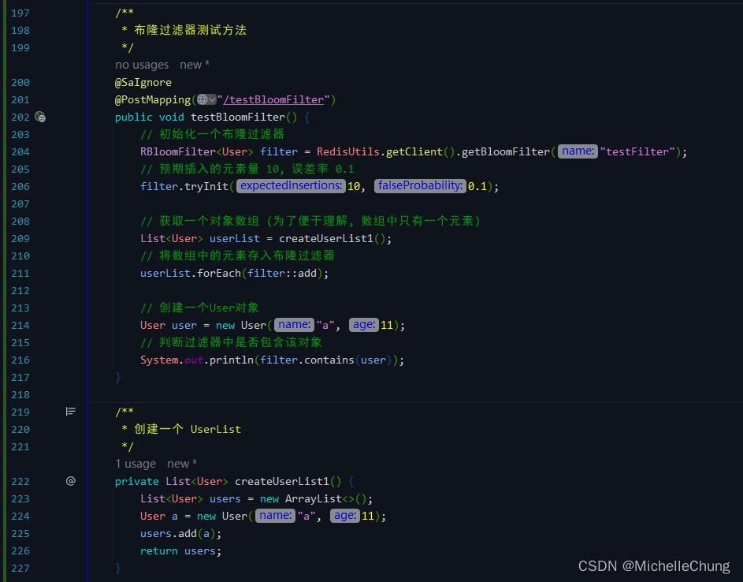<br>
## 功能调用流程分析
从上面Demo可以看出可以分成三个部分来说明。

如果不熟悉或者是第一次听说布隆过滤器的朋友建议先把参考目录的文章和视频看一看，了解原理之后再看下面的分析。
### 1、布隆过滤器的初始化 `tryInit`
### 1.1、创建布隆过滤器
`RedissonClient#getBloomFilter`<br>
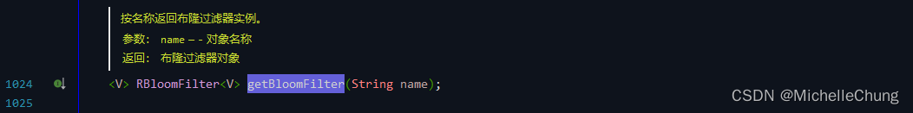

`Redisson#getBloomFilter`<br>
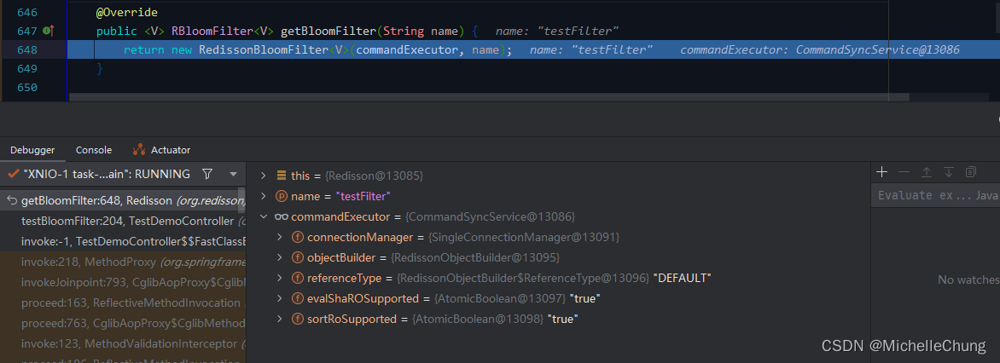

`RedissonBloomFilter#RedissonBloomFilter`<br>
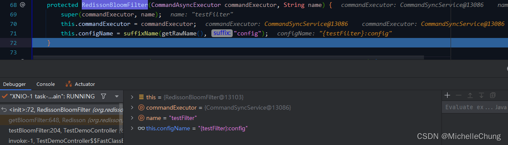
### 1.2、初始化布隆过滤器
`RedissonBloomFilter#tryInit`<br>
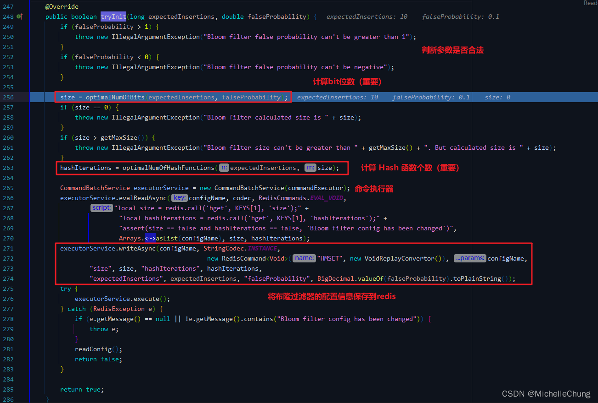
### 1.2.1、计算 bit 位数
`RedissonBloomFilter#optimalNumOfBits`<br>
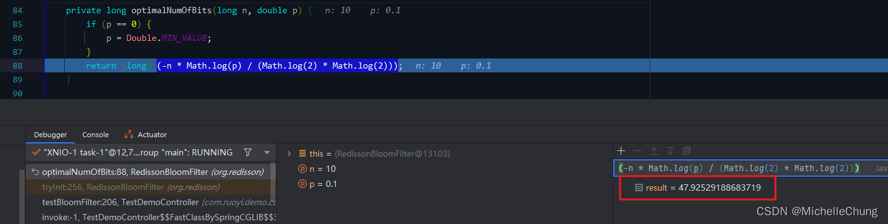
### 1.2.2、计算 Hash 函数个数
`RedissonBloomFilter#optimalNumOfHashFunctions`<br>
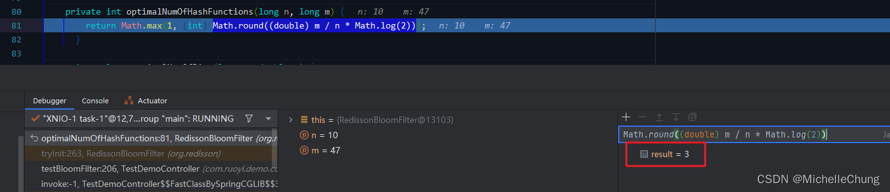
### 1.2.3、保存过滤器配置
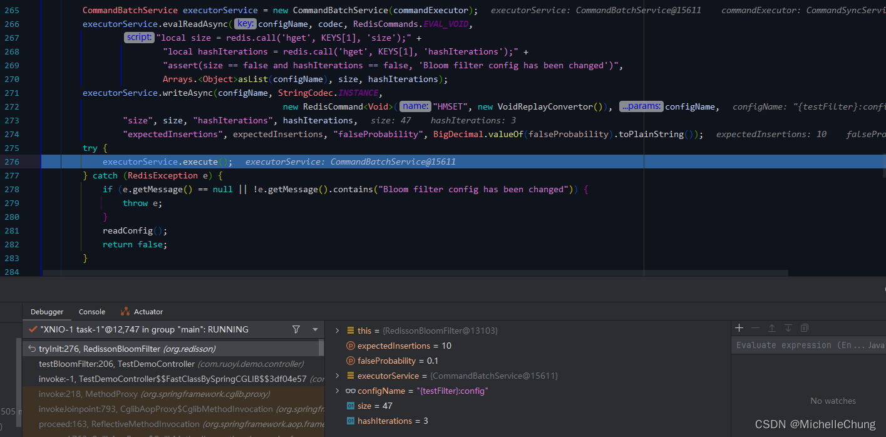

查看 Redis 中保存的配置：<br>
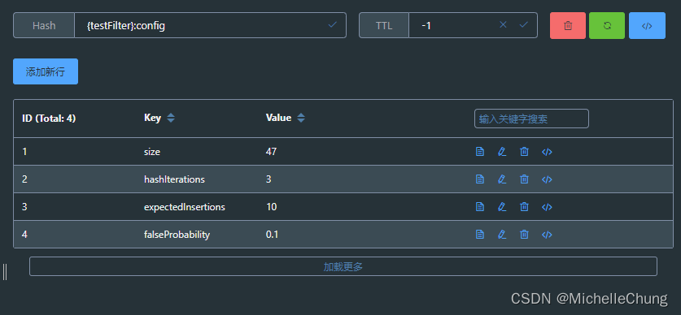

**bit 位数以及 Hash 函数的个数都是由输入的预期元素量和误差率决定的。元素量越大，误差率越小，bit 位数以及 Hash 函数的数量也会越大。**

### Redis 实际执行结果

```bash
1671609384.509600 [0 127.0.0.1:9476] "EVAL" "local size = redis.call('hget', KEYS[1], 'size');local hashIterations = redis.call('hget', KEYS[1], 'hashIterations');assert(size == false and hashIterations == false, 'Bloom filter config has been changed')" "1" "{testFilter}:config" "47" "3"
1671609384.509677 [0 lua] "hget" "{testFilter}:config" "size"
1671609384.509684 [0 lua] "hget" "{testFilter}:config" "hashIterations"
1671609384.509693 [0 127.0.0.1:9476] "HMSET" "{testFilter}:config" "size" "47" "hashIterations" "3" "expectedInsertions" "10" "falseProbability" "0.1"
```

### 2、将待比较元素存入布隆过滤器 `add`
`RBloomFilter#add`<br>
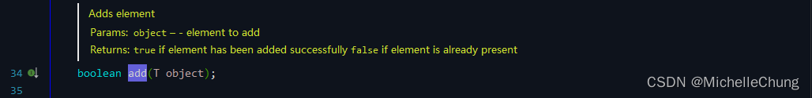

`RedissonBloomFilter#add`<br>
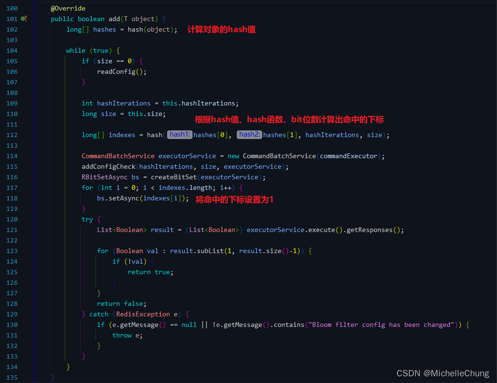

计算结果：<br>
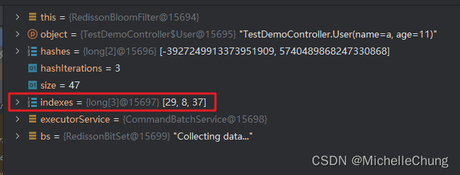

查看 Redis 中保存的结果：<br>
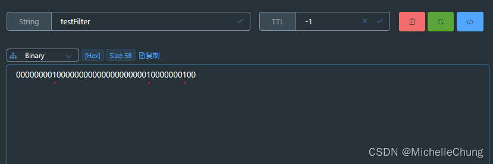

### Redis 实际执行结果

```bash
1671609384.522289 [0 127.0.0.1:9477] "EVAL" "local size = redis.call('hget', KEYS[1], 'size');local hashIterations = redis.call('hget', KEYS[1], 'hashIterations');assert(size == ARGV[1] and hashIterations == ARGV[2], 'Bloom filter config has been changed')" "1" "{testFilter}:config" "47" "3"
1671609384.522336 [0 lua] "hget" "{testFilter}:config" "size"
1671609384.522344 [0 lua] "hget" "{testFilter}:config" "hashIterations"
1671609384.522352 [0 127.0.0.1:9477] "SETBIT" "testFilter" "29" "1"
1671609384.522361 [0 127.0.0.1:9477] "SETBIT" "testFilter" "8" "1"
1671609384.522366 [0 127.0.0.1:9477] "SETBIT" "testFilter" "37" "1"
```

### 3、判断布隆过滤器是否存在某元素 `contains`
`RBloomFilter#contains`<br>


`RedissonBloomFilter#contains`<br>
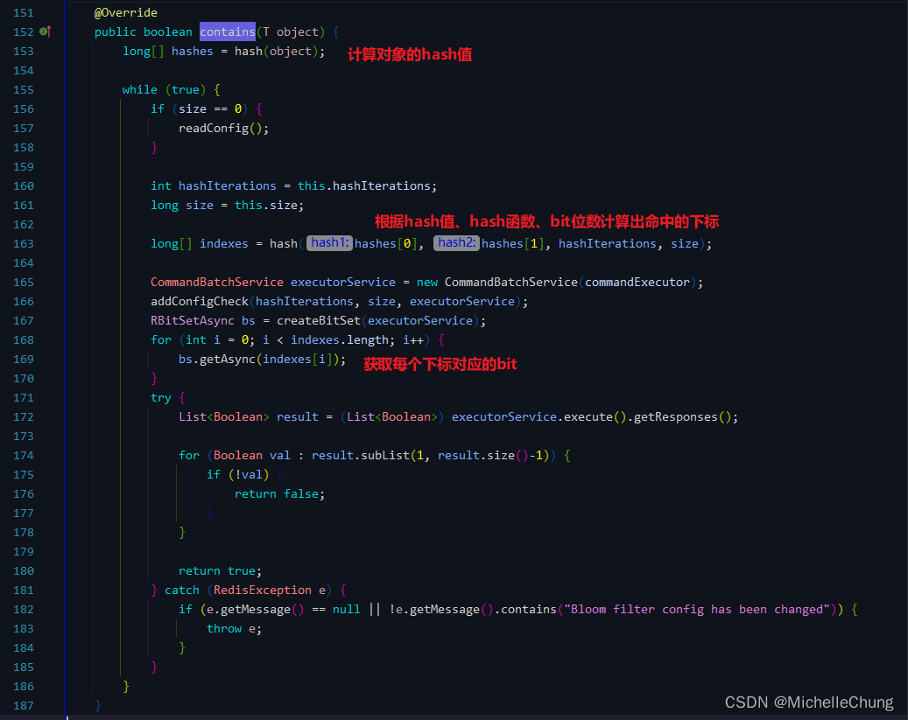

计算结果：<br>
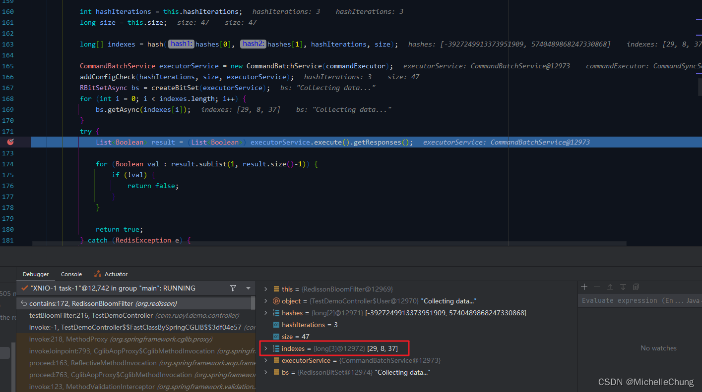
### Redis 实际执行结果

```bash
1671609384.523688 [0 127.0.0.1:9469] "EVAL" "local size = redis.call('hget', KEYS[1], 'size');local hashIterations = redis.call('hget', KEYS[1], 'hashIterations');assert(size == ARGV[1] and hashIterations == ARGV[2], 'Bloom filter config has been changed')" "1" "{testFilter}:config" "47" "3"
1671609384.523741 [0 lua] "hget" "{testFilter}:config" "size"
1671609384.523750 [0 lua] "hget" "{testFilter}:config" "hashIterations"
1671609384.523759 [0 127.0.0.1:9469] "GETBIT" "testFilter" "29"
1671609384.523763 [0 127.0.0.1:9469] "GETBIT" "testFilter" "8"
1671609384.523767 [0 127.0.0.1:9469] "GETBIT" "testFilter" "37"
```

## 拓展思考
关于布隆过滤器，它是有比较明显的缺点的，其中一个是可能存在误差，所以一般使用场景是对于误差的结果要求没有那么精确的情况下。

布隆过滤器在大数据场景下使用比较多，具体的场景可以自行查找资料，在此就不再展开。

（完）