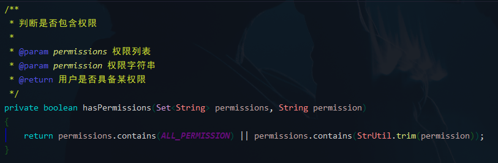

# 角色权限

## 一、概述
本文主要整理了若依框架中角色权限（即菜单权限）的功能实现，页面功能位于【系统管理 > 角色管理 > 修改】。<br>


角色权限一般用于控制前端展示的菜单功能，包括 **目录**、**按钮** 等。

---

## 二、功能实现
*前置条件：若依框架 (RuoYi-Vue) 中使用了 Spring Security 进行权限控制。*

*本文以获取 **获取用户列表** 接口为例进行说明。*

#### 1. 使用方式
<br>

若依对于角色权限进行了封装，使用起来非常方便，只需要加上相对应的注解即可。[若依官方文档](https://doc.ruoyi.vip/ruoyi-vue/document/htsc.html#%E6%9D%83%E9%99%90%E6%B3%A8%E8%A7%A3) 中也对权限注解的使用列举了示例。<br>
<br>
#### 2. Spring Security 配置
前面有提及框架使用了 Spring Security 作为权限框架，而上面使用的注解 ```@PreAuthorize```便是 Spring Security 的注解之一。

该注解表示在方法调用之前生效，基于表达式的计算结果来限制对方法的访问[1]。如果访问没有权限的接口，就会返回以下错误：


想要使用该注解，首先需要在 Spring Security 配置文件上加上注解：```@EnableGlobalMethodSecurity(prePostEnabled = true)```


#### 3、权限处理逻辑
```@PreAuthorize("@ss.hasPermi('system:user:list')")```
- 权限标签（方法标签）：```'system:user:list'```一般是用户根据接口自定义。
- 权限处理方法：```ss.hasPermi```<br>
  <br>
  <br>
  <br>
  获取当前登录用户的角色权限，判断是否包含注解标签上的权限，根据返回值判断用户是否具有访问权限。

参考文献：

[1]：[spring security 注解@EnableGlobalMethodSecurity详解](https://www.cnblogs.com/520playboy/p/7286085.html)