# Sa-Token（一）集成 Sa-Token 实现登录认证流程
- - -
## 前言
之前在交流群里面进行了一次投票，关于框架分支的使用情况，结果显示 Sa-Token 分支的使用比例也很高，因此狮子大佬决定在下个版本就会把 Sa-Token 接入主分支中。这篇文章主要是基于框架现有 Sa-Token 分支进行分析。

现版本 V3.5.0 主分支使用的还是 Spring Security 作为权限认证框架，作为 Spring 全家桶的一员功能强大，但是对于一般人而言上手也不容易，如果想了解更多的关于框架中 Spring Security 的内容可以查看我之前整理的一篇文章[【若依】开源框架学习笔记 07 - 登录认证流程（Spring Security 源码）](https://blog.csdn.net/Michelle_Zhong/article/details/117483769)。

最开始接触若依框架的时候框架中使用的是 Shiro 作为权限框架，相对 Spring Security 而言上手简单一些，如果想要了解的话也可以参考我整理的另外一篇文章[【若依】开源框架学习笔记 02 - Shiro 权限框架 ](https://blog.csdn.net/Michelle_Zhong/article/details/116396364)。

因为是之前整理的文章，可能版本更新迭代之后可能会有不一样的地方，请见谅。

## 参考目录
- [Sa-Token 官方文档](https://sa-token.dev33.cn/doc/index.html#/)

## 代码分析
### 1、框架集成
| 类                  | 说明                                       |
|--------------------|------------------------------------------|
| SaTokenConfig      | Sa-Token 配置                              |
| SaInterfaceImpl    | Sa-Token 权限认证接口实现类                       |
| PlusSaTokenDao     | Sa-Token 持久层接口 (使用框架自带RedisUtils实现 协议统一) |
| UserActionListener | 用户行为 侦听器的实现                              |

依赖添加 `pom.xml` ： 

 

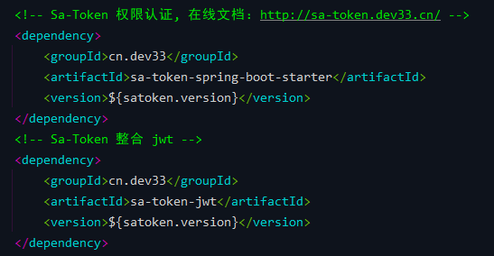 

配置文件 `application.yml` ： 
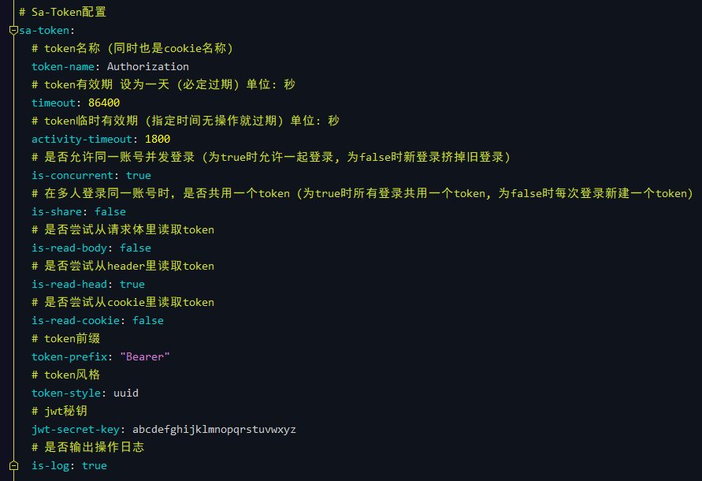

### 2、登录流程源码分析
登录验证方法：`SysLoginService#login()` 
 

在该方法中前面验证通过后，会调用 Sa-Token 的方法生成 token，然后返回。这里主要分析生成 token 的过程。

`LoginUtils#loginByDevice()` 
 

用户类型枚举： 

 

设备类型枚举： 

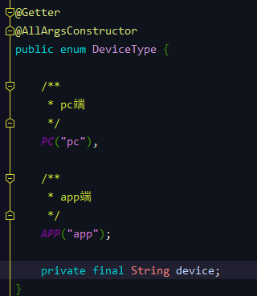 
#### 2.1、`StpLogic#login()`
 

源码的注释挺清楚的，`login()` 方法的主要逻辑如下： 
##### 2.1.1、前置检查：如果此账号已被封禁
`StpLogic#isDisable` 
 

`StpLogic#splicingKeyDisable` 
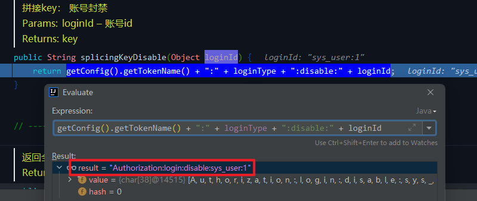 

`PlusSaTokenDao#get` 
 

结果为 `null`，继续接下来的流程。

##### 2.1.2、初始化 loginModel

##### 2.1.3、生成一个token
先判断是否允许并发登录，配置文件里面为 true；再判断是否共享 token，配置为 false；直接生成一个 token。 
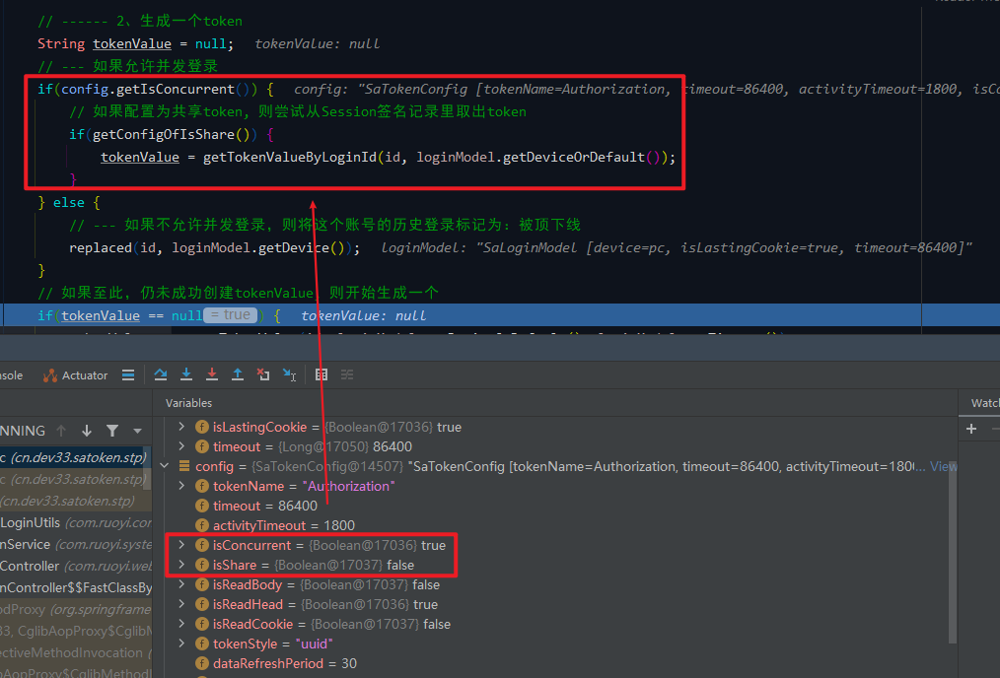 

 

`StpLogicJwtForStyle#createTokenValue()` 
 

根据配置文件中的 secretKey 生成一个 token。 

##### 2.1.4、获取 User-Session , 续期

`StpLogic#getSessionByLoginId` 
 

`StpLogic#splicingKeySession` 
 

`StpLogic#getSessionBySessionId` 
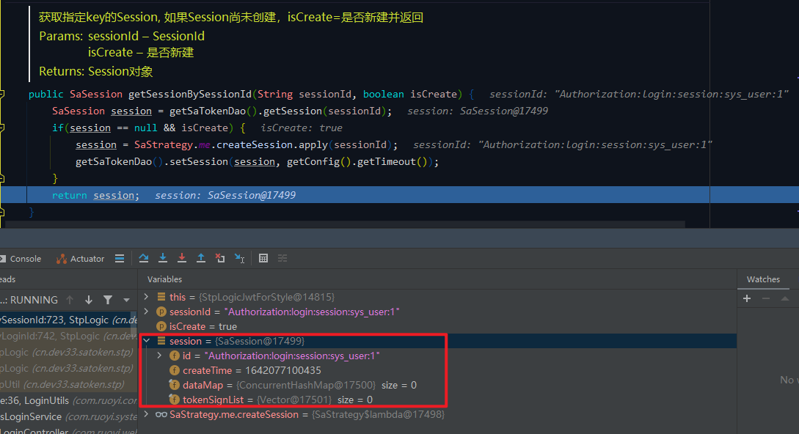 

返回 session，在 User-Session 上记录 token 签名。 
 
##### 2.1.5、持久化其它数据
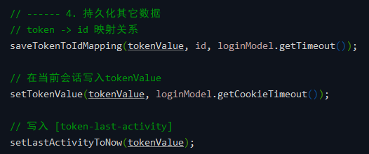 

`StpLogic#saveTokenToIdMapping` 
 

`StpLogic#setTokenValue` 
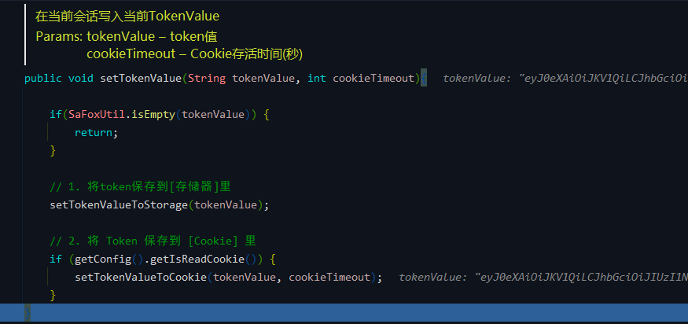 

`StpLogic#setLastActivityToNow` 
 
##### 2.1.6、通知监听器，账号xxx登录成功
 
`UserActionListener#doLogin` 
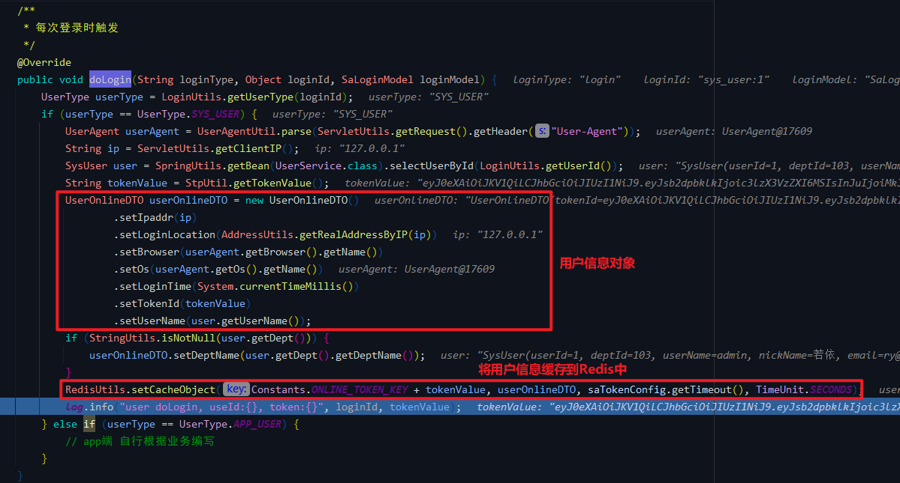 
#### 2.2、`StpLogic#getTokenValue`
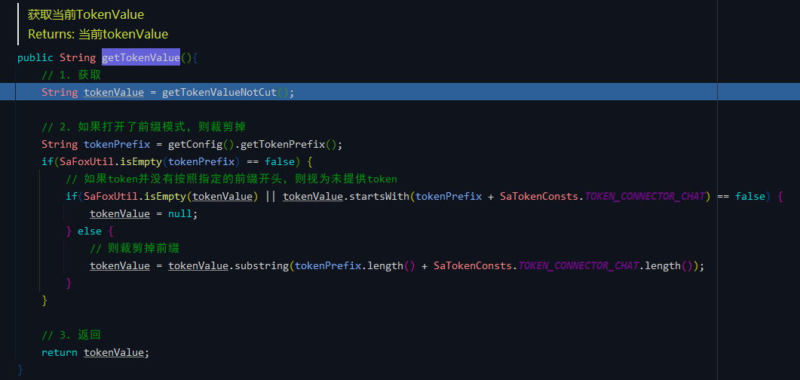
##### 2.2.1、获取
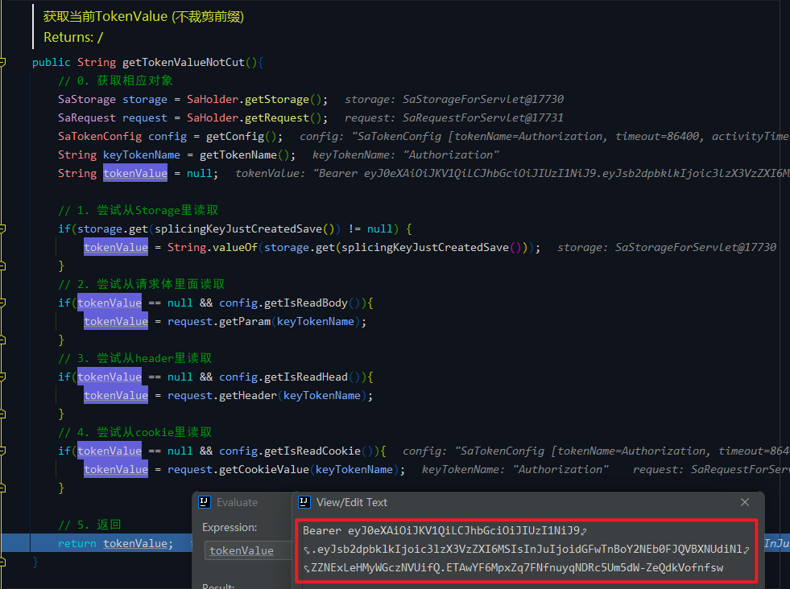
##### 2.2.2、如果打开了前缀模式，则裁剪掉

##### 2.2.3、返回

