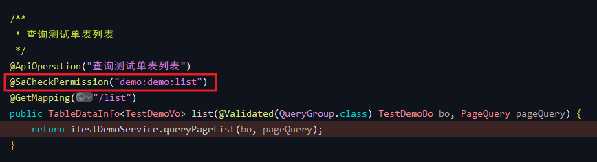
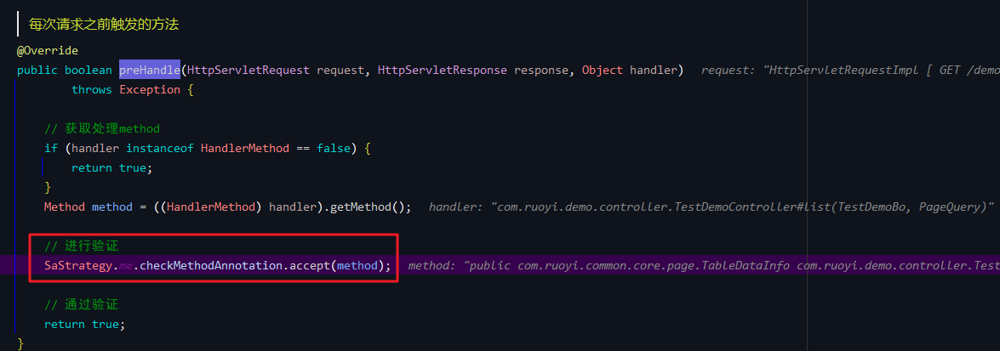
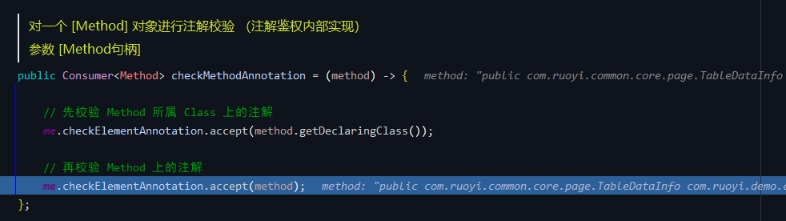
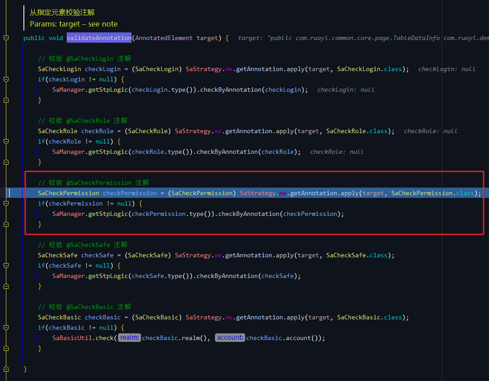
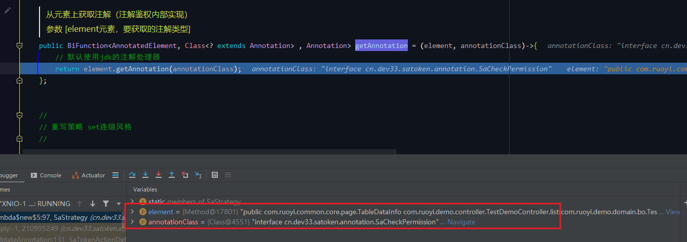
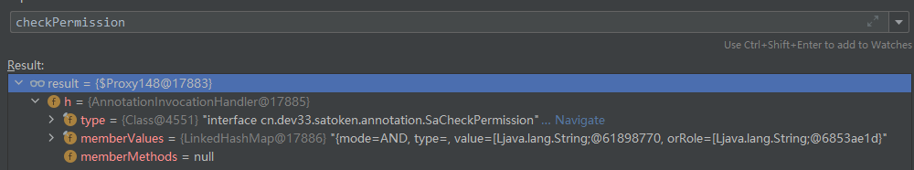
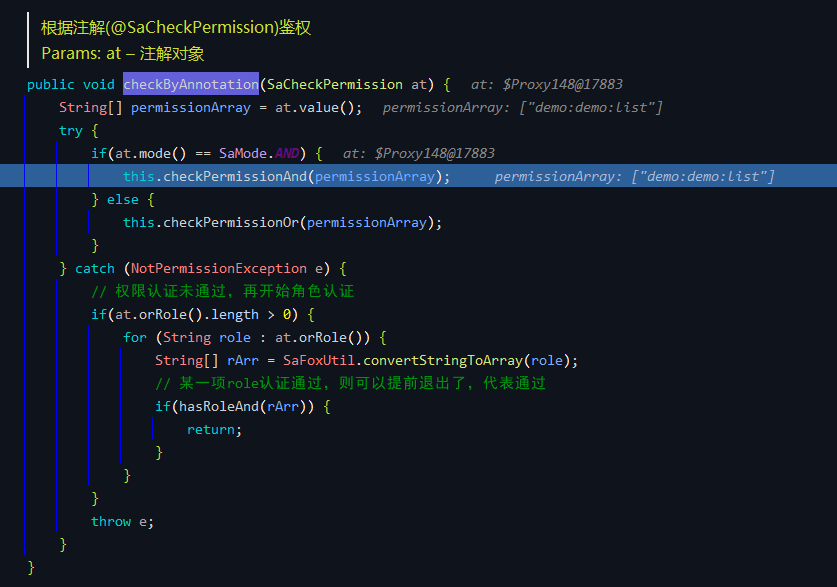
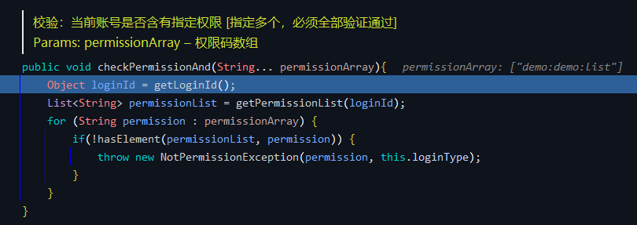
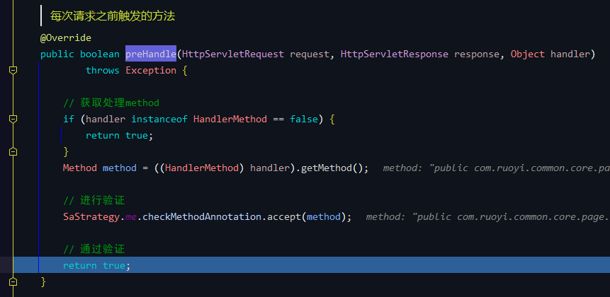

# Sa-Token（二）通过注解校验用户权限
- - -
## 前言
上一篇文章主要介绍了 Sa-Token 登录认证流程，本篇文章是对于权限注解的校验流程分析。

## 参考目录
- [Sa-Token 官方文档](https://sa-token.dev33.cn/doc/index.html#/)

## 代码分析
请求接口：`TestDemoController#list` 
 

每次请求之前触发的方法：`SaAnnotationInterceptor#preHandle` 
 

首先被注解拦截器进行拦截，如果验证通过，则拦截器放行。

查看验证方法：`SaStrategy#checkMethodAnnotation` 
 

先校验 Method 所属 Class 上的注解，类上没有标注注解，所以校验 Method 上的注解。

`SaTokenActionDefaultImpl#validateAnnotation` 
 

获取注解信息：`SaStrategy#getAnnotation` 
 

 

根据注解 (`@SaCheckPermission`) 鉴权：`StpLogic#checkByAnnotation` 
 

`StpLogic#checkPermissionAnd` 
 

对所有权限进行校验，循环判断登录用户是否拥有该权限参数（用户登录时会把所有权限集合保存到指定对象中），如果没有则抛出没有权限的异常。

所有校验通过后则校验完成，返回 true。 
 

至此，Sa-Token 完成了关于权限注解的校验。