# Sa-Token（三）退出登录流程

## 前言
前两篇文章简单分析了一下登录以及通过注解校验权限的流程，有登录就有登出，所以这篇文章就来分析一下登出的流程源码。

## 参考目录
- [Sa-Token 官方文档](https://sa-token.dev33.cn/doc/index.html#/)

## 代码分析
请求接口：`SysLoginController#logout` 
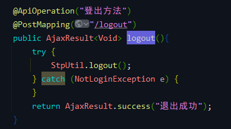 

方法很简单，就一行代码。看看官方文档的说法： 
> 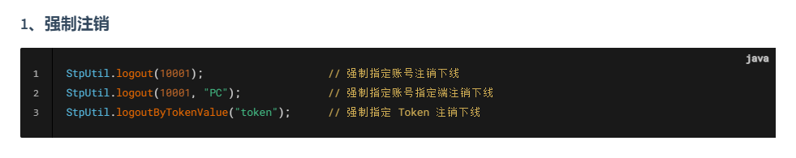 
强制注销等价于对方主动调用了注销方法，再次访问会提示：Token无效。

### `StpLogic#logout`
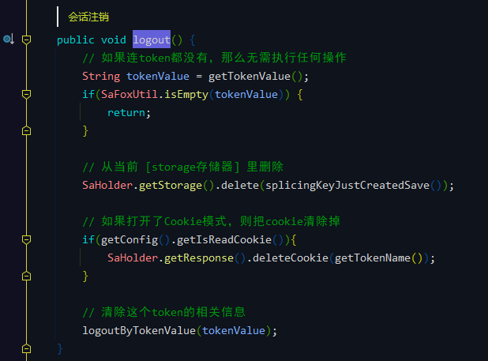

方法的步骤主要有以下几点：
- 如果连token都没有，那么无需执行任何操作
- 从当前 [storage存储器] 里删除
- 如果打开了Cookie模式，则把cookie清除掉
- 清除这个token的相关信息

下面来对每一步骤进行 Debug 分析。
#### 1、获取当前用户 token，判断是否存在
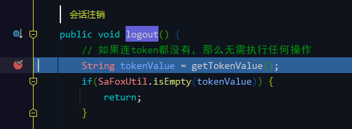
###### `StpLogic#getTokenValue`
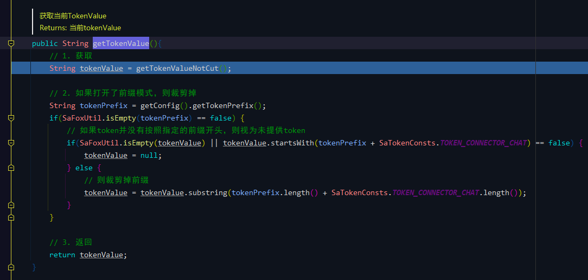

获取 token 的方法，在登录流程里面也有用到这个方法。
###### `StpLogic#getTokenValueNotCut`
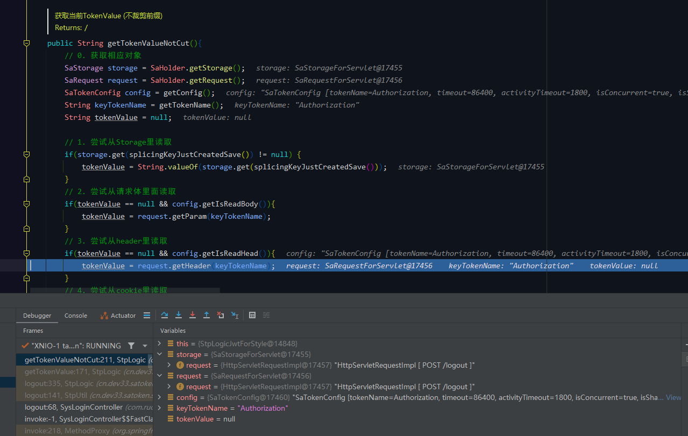 

从请求头中获取到 token (未裁剪前缀) 并返回。 
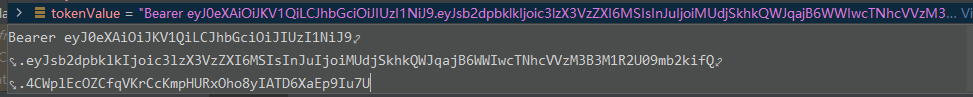 

去掉前缀，得到最终的 token 并返回到上一级。 
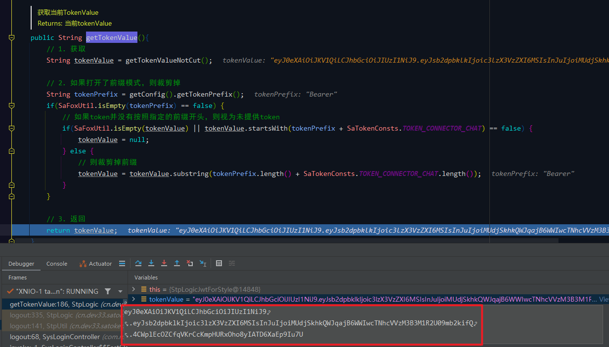 

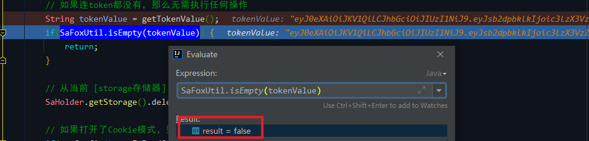 

token 不为空，继续执行下面的代码。
#### 2、从当前【storage 存储器】里删除
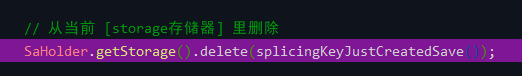 

先获取 storage 存储器。 
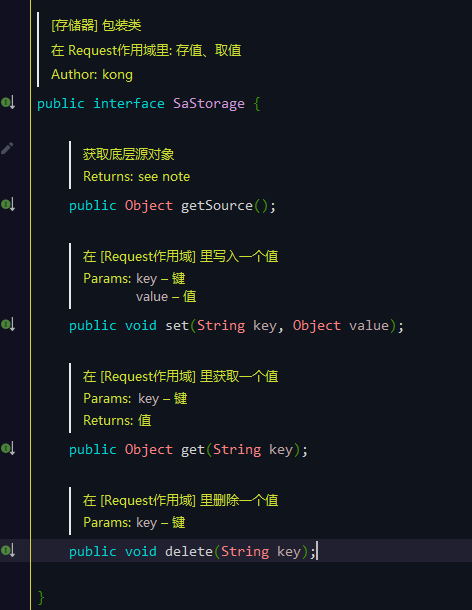
###### `SaTokenContextForSpring#getStorage`

实际上就是根据 `request` 请求数据 new 了一个 `SaStorageForServlet`。 
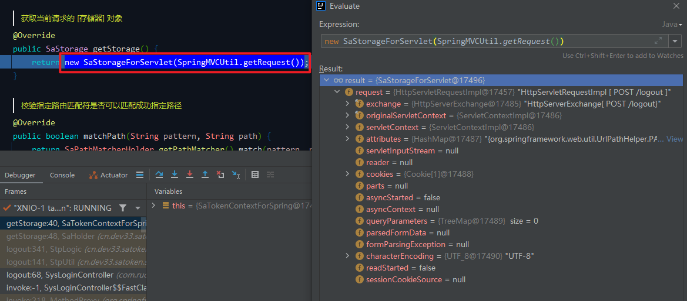 

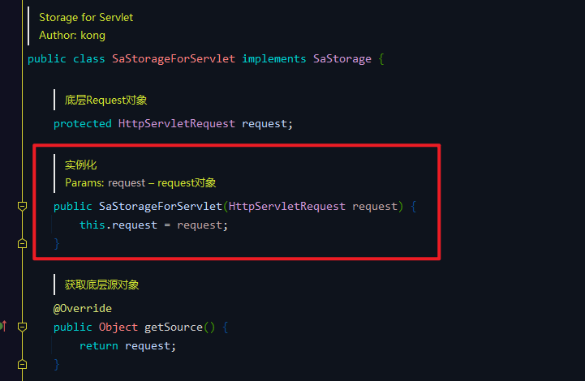 
###### `StpLogic#splicingKeyJustCreatedSave`
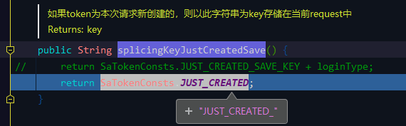
###### `SaStorageForServlet#delete`
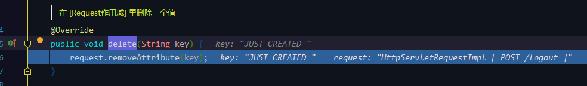

#### 3、判断配置，把 cookie 清除掉
配置文件： 
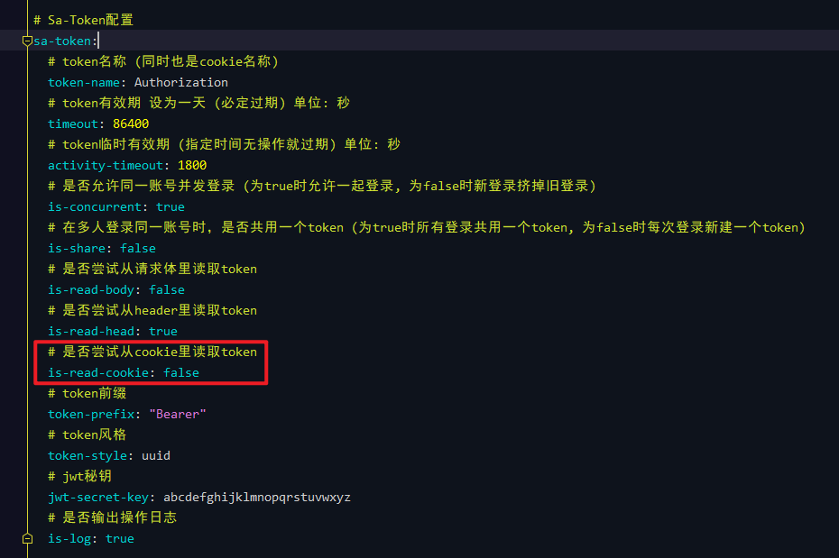 

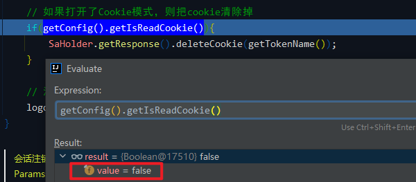 

没有配置 Cookie 模式，继续执行下面的代码。

#### 4、清除 token 的相关信息
###### `StpLogic#logoutByTokenValue`
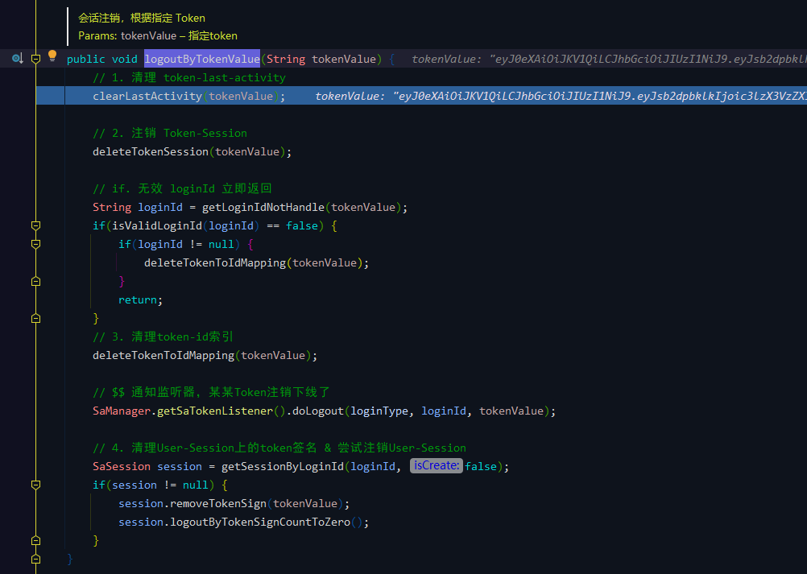
##### 4.1、清理 token-last-activity
###### `StpLogic#clearLastActivity`
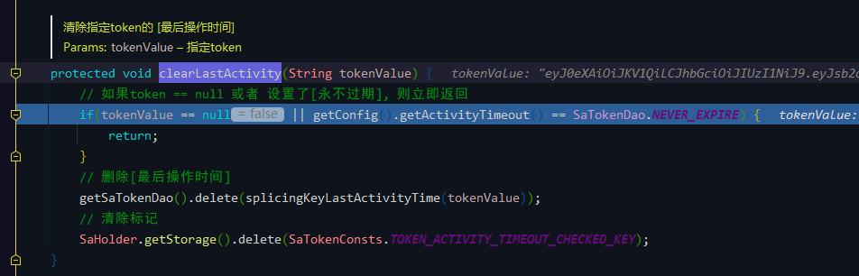 

判断是否是用不过期：false（配置时间是 1800 秒）。 

删除最后操作时间： 
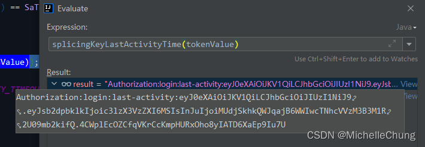 

清除标记，调用 storage 存储器删除 `request` 中的值。 
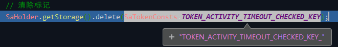 

完成操作返回上一级。
##### 4.2、注销 Token-Session
###### `StpLogic#deleteTokenSession`

##### 4.3、根据 token 获取 loginId，清理 token-id 索引
###### `StpLogic#getLoginIdNotHandle`
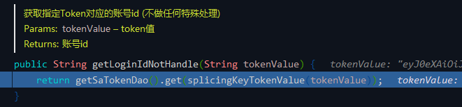 

loginId 值为 `sys_user:1`。 
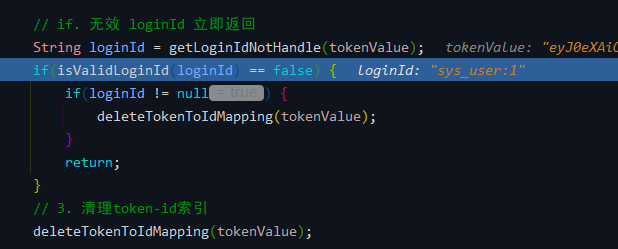 

删除 token-id 映射。 
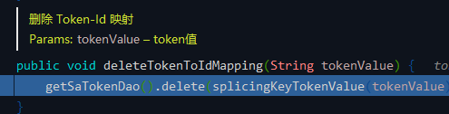 
##### 4.4、通知监听器，某某 Token 注销下线了
###### `UserActionListener#doLogout`
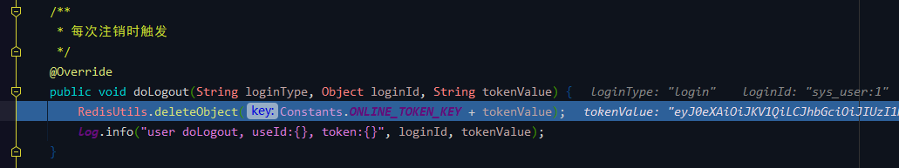 

控制台输出： 
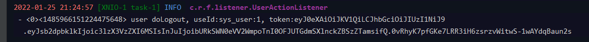 
##### 4.5、清理 User-Session 上的 token 签名 & 尝试注销 User-Session
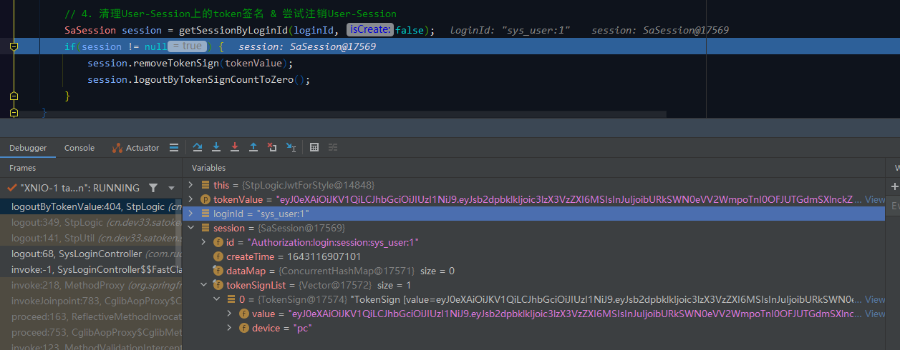

移除 session 中的相关信息： 
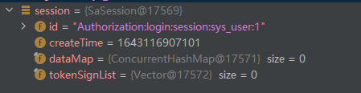 

至此 `StpLogic#logout` 方法全部执行完成。用户退出成功： 
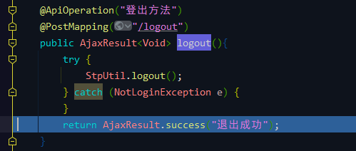
