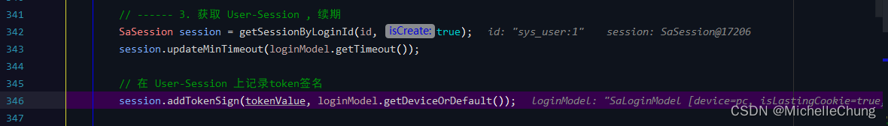

# Sa-Token（四）V1.30.0 登录流程分析

## 前言
之前已经写过一篇 Sa-Token 登录流程分析的 [文章](01%20-%20集成%20Sa-Token%20实现登录认证流程.md)，好像那篇文章的阅读量也不算低（在本人博客专栏中），但是因为版本更新以及本人想要提高一下内容质量，所以重新写了一下分析的内容，并且加上了流程图，便于流程的梳理。

## 参考目录
- [Sa-Token 官方文档](https://sa-token.dev33.cn/doc/index.html#/)

## 框架集成
基于 Sa-Token 最新版本：<br>
<br>

yaml 配置文件：<br>
<br>
## 功能调用流程分析
### ##、流程简图（重点）
首先按照惯例，请记住这张图（后面的流程截图都是基于此）：<br>

**温馨提醒，由于流程步骤较多，结合这张图走不容易迷路。**
### #1、登录请求 `SysLoginController#login`

### #2、登录方法 `SysLoginService#login`

登录方法大致可以分为七个步骤：

1. 检查验证码开关是否开启，如果开启则校验验证码是否正确。`(#2)`
2. 根据用户名获取用户信息；验证用户密码是否正确。`(#3)`
3. 构建登录用户对象。`(#4)`
4. 生成 Token。`(#5)`
5. 记录登录信息日志。`(#20)`
6. 更新用户登录信息。`(#21)`
7. 获取用户 Token 值。 `(#22)`

因为把验证码开关关掉了，所以这里没有进入校验方法 `SysLoginService#validateCaptcha`。<br>

### #3、获取用户信息并校验密码是否正确 `SysLoginService#checkLogin`
如果密码错误，会记录错误次数，如果达到指定次数（默认5次）则账号会被锁定一段时间（默认10分钟）。<br>

### #4、构建登录用户对象 `SysLoginService#buildLoginUser`
经过步骤 `#3` 说明登录校验通过，可以构建登录对象。<br>
<br>

<br>
### #5、生成 Token `LoginHelper#loginByDevice`
<br>
该方法一共有三个步骤：

1. 将用户信息存入request对象中，方便后面信息共享。`(#6)`
2. 调用 Sa-Token 登录方法。`(#7)`
3. 设置用户数据多级缓存。 `(#19)`

`SaHolder.getStorage()` 获取 request 对象：<br>

### #8、Sa-Token 登录方法 `StpUtil#login`
<br>

id 是 `loginUser.getLoginId` 方法所得，在方法内做了拼接：<br>

### #9、`StpLogic#login`
<br>


### #10、创建登录会话 `StpLogic#createLoginSession`（核心）


整个登录流程的核心方法，在源码注释中也包含了主要的流程步骤：

0. 前置检查：此账号是否已被封禁。`(#11)`
1. 初始化 loginModel。`(#12)`
2. 生成一个 Token。`(#13)`
3. 获取 User-Session 并续期。`(#14)`
4. 持久化其他数据。`(#15)`
5. 通知监听器账号登录成功。`(#16)`
6. 检查此账号会话数量是否超出最大值。`(#17)`

### #11、前置检查：此账号是否已被封禁 `StpLogic#isDisable`
<br>

`StpLogic#splicingKeyDisable`<br>
<br>

执行结果：<br>
<br>

<br>
### #12、初始化 loginModel

### #13、生成一个 Token


`StpLogicJwtForSimple#createTokenValue`<br>


`SaJwtUtil#createToken`<br>

### #14、获取 User-Session 并续期
<br>

前面登录了3次，此次流程是第4次。<br>
<br>

`SaSession#addTokenSign`<br>
<br>

将新的 Token 保存到集合中，并且更新缓存：<br>
<br>


### #15、持久化其它数据

```
// token -> id 映射关系  
saveTokenToIdMapping(tokenValue, id, loginModel.getTimeout());
```

```
// 写入 [token-last-activity] ：
setLastActivityToNow(tokenValue); 
```

### #16、通知监听器账号登录成功 `UserActionListener#doLogin`


### #17、检查此账号会话数量是否超出最大值
<br>

`StpLogic#logoutByMaxLoginCount`<br>
<br>

至此会话创建成功，回到上一层方法 `StpLogic#login` 继续执行。<br>
### #18、在当前客户端注入 Token `StpLogic#setTokenValue`
<br>

`StpLogic#setTokenValueToStorage`<br>
<br>

Sa-Token 登录方法执行完成，回到框架登录方法设置用户多级缓存。
### #19、设置用户数据（多级缓存）`LoginHelper#setLoginUser`


用户登录流程生成 Token 方法执行完成，继续回到主方法 `SysLoginService#login` 执行余下的逻辑。
### #20、记录登录信息 `SysLogininforServiceImpl#recordLogininfor`

### #21、更新用户登录信息 `SysLoginService#recordLoginInfo`

### #22、获取用户 Token 值 `StpLogic#getTokenValue`


将 Token 值返回给前端，登录方法执行结束。