# Sa-Token（六）SaInterceptor 拦截器调用流程分析以及对比
- - -
## 前言
前段时间 Sa-Token 也迎来了大版本（V1.31.0）的更新，在框架的下一个版本也会升级 Sa-Token（dev 分支已经更新），有些地方也有相应变动，因此本篇文章来分析一下底层的新功能 —— 综合拦截器 `SaInterceptor` 以及注解 `@SaIgnore`。

## 参考文档
- [Sa-Token 官方文档 - 注解鉴权](https://sa-token.dev33.cn/doc/index.html#/use/at-check)
- [Sa-Token 官方文档 - 路由拦截鉴权](https://sa-token.dev33.cn/doc/index.html#/use/route-check)
- [Spring 官方文档 - Interception](https://docs.spring.io/spring-framework/docs/5.2.22.RELEASE/spring-framework-reference/web.html#mvc-handlermapping-interceptor)

## 框架集成
### 1、版本说明
- 框架版本：`V4.3.0` dev 分支
- Sa-Token版本：`V1.31.0`

### 2、升级变动说明
拦截器配置 `SaTokenConfig` 
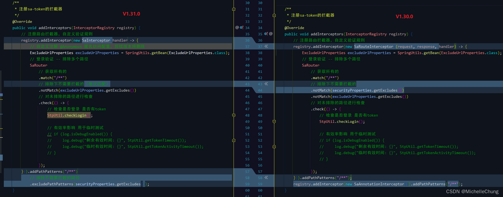 

注解使用更新（以 `SysLoginController#login` 方法为例） 
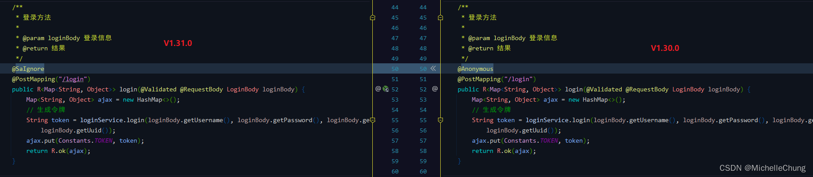 

## 功能调用流程分析
很久之前有写过关于 [Sa-Token 注解校验用户权限的分析](02_annotation.md)，新的拦截器实际上是结合了原本的路由拦截器 `SaRouteInterceptor` 和注解拦截器 `SaAnnotationInterceptor` 进行了升级，所以本文也是对两个版本进行对比说明。

### 1、流程简图（重点）
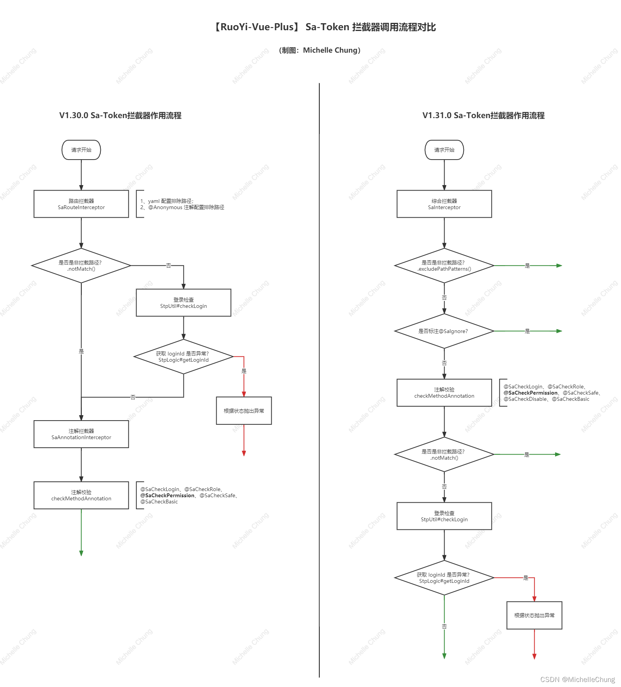

结合流程图看更容易理解底层的调用逻辑。

**注：本文重点是分析新版的流程，旧版流程可查看上面提及的文章。**

### 2、拦截器注册 `SaTokenConfig#addInterceptors`
容器启动会对拦截器 `SaInterceptor` 进行注册，并传入自定义认证函数，然后将配置文件 `application.yml` 中配置的路径缓存到 `InterceptorRegistry`。 

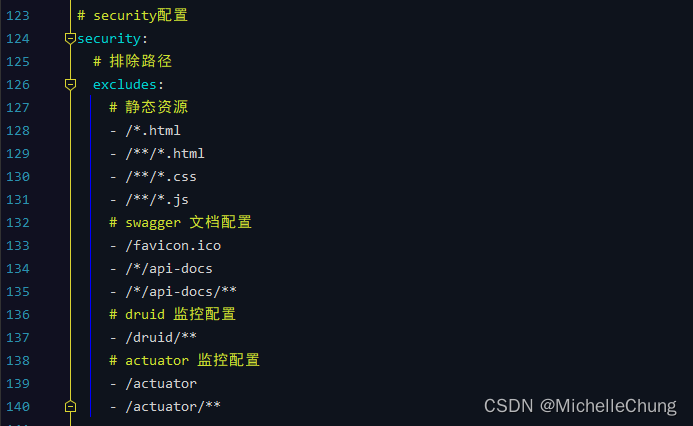 

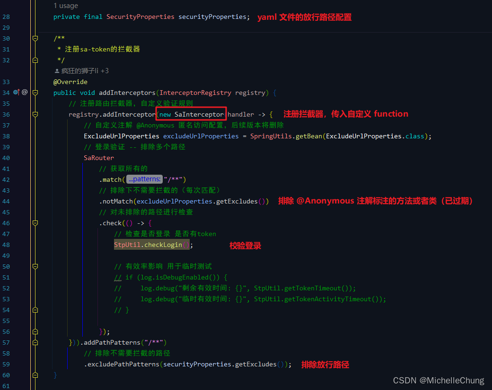 

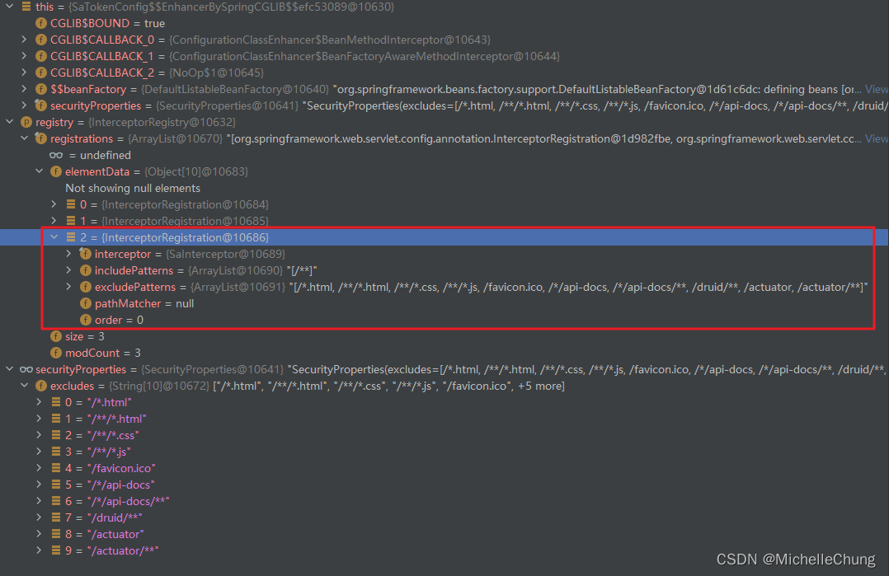 

### 3、拦截器验证方法 `SaInterceptor#preHandle`
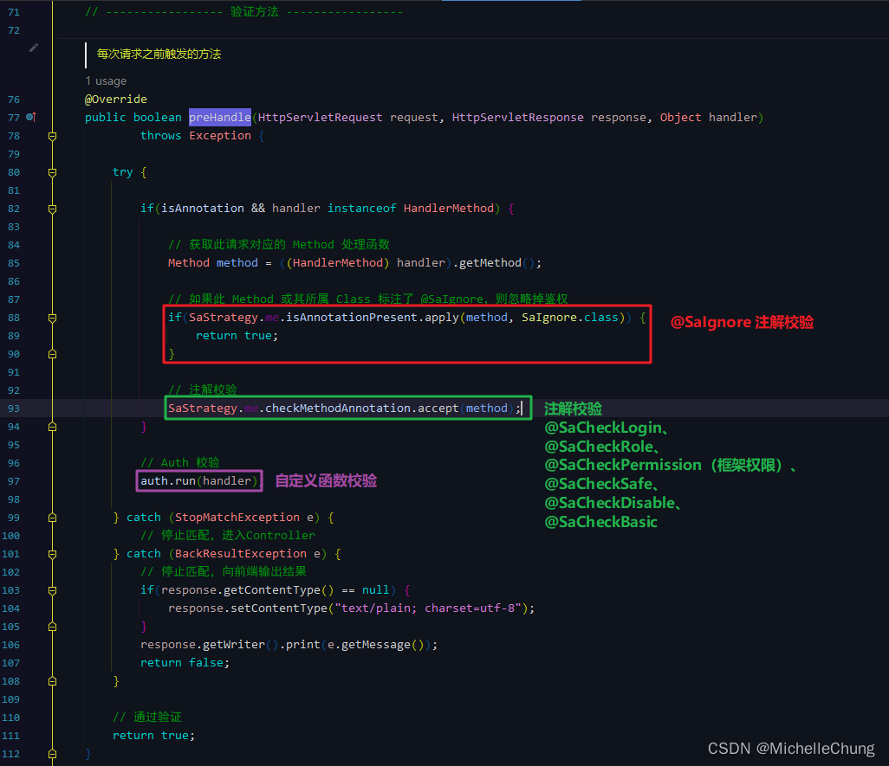

### 3.1、忽略拦截注解 `@SaIgnore`
注解 `@SaIgnore` 可以理解成是 `@Anonymous` 注解的升级替代版，如果当前版本中已经使用了 `@Anonymous` 注解的方法或者类，也建议在新版本发布后替换为 `@SaIgnore`。

下面先来看下 Debug 执行流程（以 `SysLoginController#login` 方法为例）。 

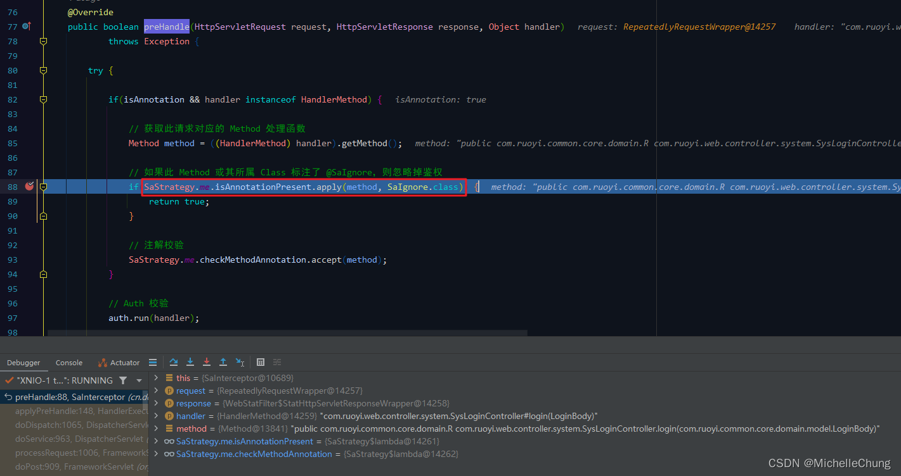 

`SaStrategy#isAnnotationPresent` 
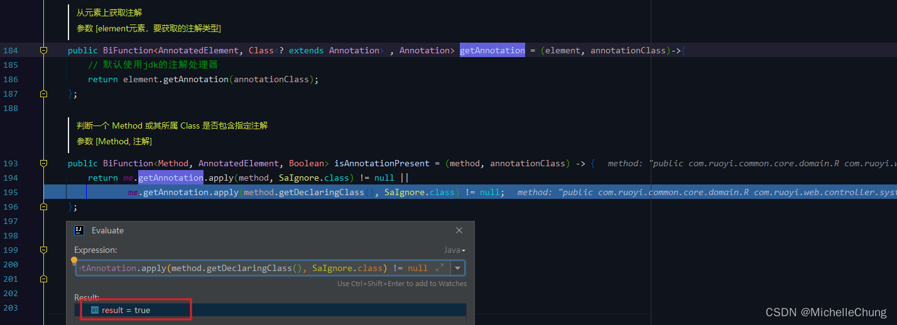 

此方法用于判断是否包含注解。 

说句题外话，目前 Sa-Token 正式版 `V1.31.0` 传参有点问题（BiFunction 的第二参数写错了，**实际不影响使用**），不过在 dev 分支已经修复了： 
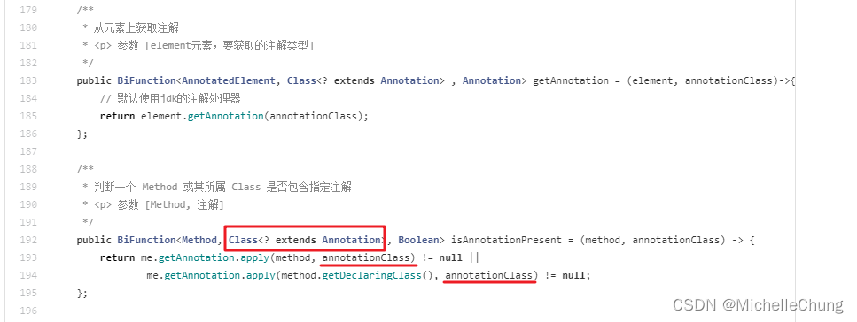 

校验完成回到主方法： 
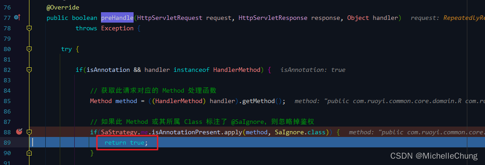 

校验成功，不再执行拦截器后续方法。

### 3.2、注解校验 `SaStrategy#checkMethodAnnotation`
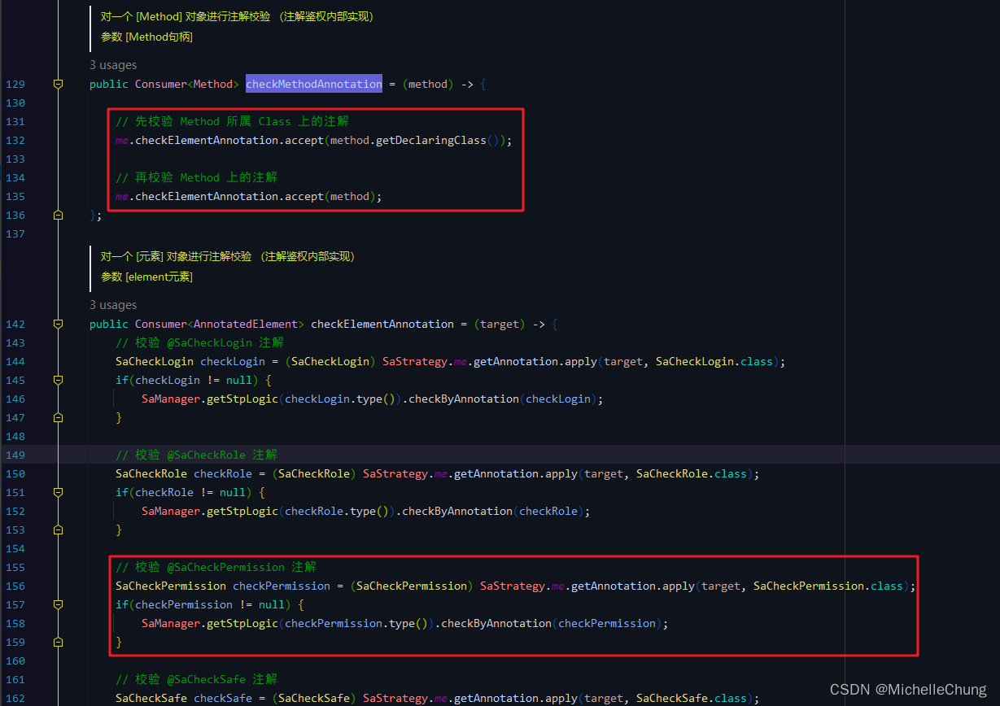 

这一步的校验和以前是一样的，在这里就不再赘述了，可以回头看一下以前的分析：[传送门](02_annotation.md)。 
### 3.3、自定义函数
经过步骤 `3.1` 如果没有返回，并且步骤 `3.2` 校验通过后，就会进入自定义函数的校验，也就是 `SaTokenConfig` 中定义的部分。 

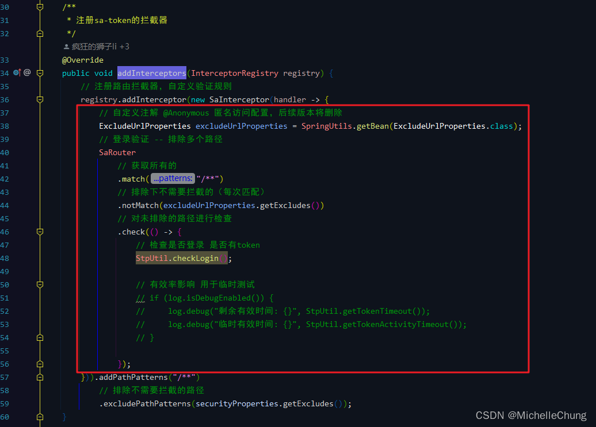

关于 `ExcludeUrlProperties` 如果有兴趣了解的话可以看看之前的分析（[传送门](05_intercepter.md)）： 
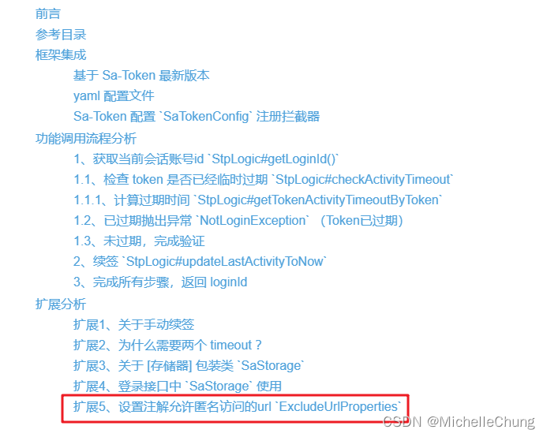 

除了设置放行路径以外主要的逻辑就是检查登录 `StpUtil.checkLogin()`，这个方法也不用多说什么了，之前也有过很详细的分析（[传送门](04_V1.30.0_login.md)）。 

## 扩展分析
### 扩展1、为什么建议 `@Anonymous` 注解换成 `@SaIgnore` ？
如果看流程图其实也能够看出来，`@SaIgnore` 优先级比 `@Anonymous` 高，如果使用 `@Anonymous`，前面还需要执行注解校验方法 `SaStrategy#checkMethodAnnotation`，执行效率低。

### 扩展2、`SaInterceptor` 对比原本的两个拦截器还有什么优势？
我个人觉得整合在一起除了比之前方便以外，还能 **提高代码执行效率** 以及 **规避代码逻辑上的错误**。

从流程图可以看到，如果是两个拦截器，则每一次请求都会校验注解。有一个问题就是，如果同时标注了 `@Anonymous` 注解以及 `@SaCheckPermission` 注解，那么此时会出现前后逻辑矛盾（虽然这个很无厘头但是确实会出现）：
- 在 `V1.30.0` 中，因为先执行的是路由拦截器 `SaRouteInterceptor`，后执行注解拦截器 `SaAnnotationInterceptor`，所以会抛出权限校验异常。
- 在 `V1.31.0` 中，`@SaIgnore` 是最高优先级，所以如果同时标注了 `@SaIgnore` 注解（替换 `@Anonymous`）以及 `@SaCheckPermission` 注解，那么会直接返回，不会执行后面的逻辑。