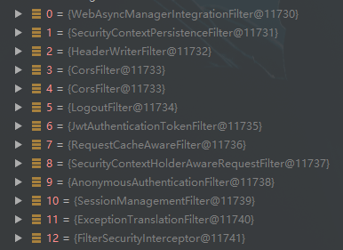

# 过滤器链


```java
 - Creating filter chain: any request, 
 - [
 - org.springframework.security.web.context.request.async.WebAsyncManagerIntegrationFilter@72a45b71, 
 - org.springframework.security.web.context.SecurityContextPersistenceFilter@2f271ae2, 
 - org.springframework.security.web.header.HeaderWriterFilter@653fbbfc, 
 - org.springframework.web.filter.CorsFilter@44e08a7a, 
 - org.springframework.web.filter.CorsFilter@44e08a7a, 
 - org.springframework.security.web.authentication.logout.LogoutFilter@6f55aef7, 
 - com.ruoyi.framework.security.filter.JwtAuthenticationTokenFilter@64eeddd8, 
 - org.springframework.security.web.savedrequest.RequestCacheAwareFilter@632a7680, 
 - org.springframework.security.web.servletapi.SecurityContextHolderAwareRequestFilter@70720b78, 
 - org.springframework.security.web.authentication.AnonymousAuthenticationFilter@3eed0375, 
 - org.springframework.security.web.session.SessionManagementFilter@c925ae1, 
 - org.springframework.security.web.access.ExceptionTranslationFilter@5c0d876c, 
 - org.springframework.security.web.access.intercept.FilterSecurityInterceptor@465e9090
 - ]
```
<br>

```java
public DefaultSecurityFilterChain(RequestMatcher requestMatcher, List<Filter> filters) {
	logger.info("Creating filter chain: " + requestMatcher + ", " + filters);
	this.requestMatcher = requestMatcher;
	this.filters = new ArrayList<>(filters);
}
```
#### WebAsyncManagerIntegrationFilter
```java
private static final Object CALLABLE_INTERCEPTOR_KEY = new Object();

@Override
protected void doFilterInternal(HttpServletRequest request,
		HttpServletResponse response, FilterChain filterChain)
		throws ServletException, IOException {
	// 根据请求封装 WebAsyncManager
	WebAsyncManager asyncManager = WebAsyncUtils.getAsyncManager(request);

	SecurityContextCallableProcessingInterceptor securityProcessingInterceptor = (SecurityContextCallableProcessingInterceptor) asyncManager
			.getCallableInterceptor(CALLABLE_INTERCEPTOR_KEY);
	if (securityProcessingInterceptor == null) {
		// 注册 SecurityContextCallableProcessingInterceptor
		asyncManager.registerCallableInterceptor(CALLABLE_INTERCEPTOR_KEY,
				new SecurityContextCallableProcessingInterceptor());
	}

	filterChain.doFilter(request, response);
}
```
#### SecurityContextPersistenceFilter
```java
static final String FILTER_APPLIED = "__spring_security_scpf_applied";

private SecurityContextRepository repo;

private boolean forceEagerSessionCreation = false;

public void doFilter(ServletRequest req, ServletResponse res, FilterChain chain)
		throws IOException, ServletException {
	HttpServletRequest request = (HttpServletRequest) req;
	HttpServletResponse response = (HttpServletResponse) res;

	if (request.getAttribute(FILTER_APPLIED) != null) {
		// ensure that filter is only applied once per request
		// 确保每个请求仅应用一次过滤器
		chain.doFilter(request, response);
		return;
	}

	final boolean debug = logger.isDebugEnabled();

	request.setAttribute(FILTER_APPLIED, Boolean.TRUE);

	if (forceEagerSessionCreation) {
		HttpSession session = request.getSession();

		if (debug && session.isNew()) {
			logger.debug("Eagerly created session: " + session.getId());
		}
	}

	// 用于将传入的请求传递给 SecurityContextRepository.loadContext（HttpRequestResponseHolder），
	// 从而允许该方法将请求交换为包装的版本，并返回 SecurityContext 值。
	HttpRequestResponseHolder holder = new HttpRequestResponseHolder(request,
			response);
	SecurityContext contextBeforeChainExecution = repo.loadContext(holder);

	try {
		SecurityContextHolder.setContext(contextBeforeChainExecution);

		chain.doFilter(holder.getRequest(), holder.getResponse());

	}
	finally {
		SecurityContext contextAfterChainExecution = SecurityContextHolder
				.getContext();
		// Crucial removal of SecurityContextHolder contents - do this before anything
		// else.
		// 至关重要的是删除 SecurityContextHolder 内容 - 在执行其他任何操作之前先执行此操作。
		SecurityContextHolder.clearContext();
		repo.saveContext(contextAfterChainExecution, holder.getRequest(),
				holder.getResponse());
		request.removeAttribute(FILTER_APPLIED);

		if (debug) {
			// 随着请求处理完成，SecurityContextHolder 现在已清除
			logger.debug("SecurityContextHolder now cleared, as request processing completed");
		}
	}
}
```
#### HeaderWriterFilter

```java
/**
 * The {@link HeaderWriter} to write headers to the response.
 * {@see CompositeHeaderWriter}
 */
private final List<HeaderWriter> headerWriters;

/**
 * Indicates whether to write the headers at the beginning of the request.
 * 指示是否在请求的开始处写入标头。
 */
private boolean shouldWriteHeadersEagerly = false;

@Override
protected void doFilterInternal(HttpServletRequest request,
		HttpServletResponse response, FilterChain filterChain)
		throws ServletException, IOException {

	if (this.shouldWriteHeadersEagerly) {
		doHeadersBefore(request, response, filterChain);
	} else {
		doHeadersAfter(request, response, filterChain);
	}
}

private void doHeadersBefore(HttpServletRequest request, HttpServletResponse response, FilterChain filterChain) throws IOException, ServletException {
	writeHeaders(request, response);
	filterChain.doFilter(request, response);
}

private void doHeadersAfter(HttpServletRequest request, HttpServletResponse response, FilterChain filterChain) throws IOException, ServletException {
	HeaderWriterResponse headerWriterResponse = new HeaderWriterResponse(request,
			response);
	HeaderWriterRequest headerWriterRequest = new HeaderWriterRequest(request,
			headerWriterResponse);
	try {
		filterChain.doFilter(headerWriterRequest, headerWriterResponse);
	} finally {
		headerWriterResponse.writeHeaders();
	}
}

void writeHeaders(HttpServletRequest request, HttpServletResponse response) {
	for(HeaderWriter writer : this.headerWriters) {
		writer.writeHeaders(request, response);
	}
}
```
#### CorsFilter

```java
private final CorsConfigurationSource configSource;

protected void doFilterInternal(HttpServletRequest request, HttpServletResponse response, FilterChain filterChain) throws ServletException, IOException {
    CorsConfiguration corsConfiguration = this.configSource.getCorsConfiguration(request);
    boolean isValid = this.processor.processRequest(corsConfiguration, request, response);
    if (isValid && !CorsUtils.isPreFlightRequest(request)) {
        filterChain.doFilter(request, response);
    }
}
```
#### LogoutFilter

```java
private RequestMatcher logoutRequestMatcher;
private final LogoutHandler handler;
private final LogoutSuccessHandler logoutSuccessHandler;

public void doFilter(ServletRequest req, ServletResponse res, FilterChain chain)
		throws IOException, ServletException {
	HttpServletRequest request = (HttpServletRequest) req;
	HttpServletResponse response = (HttpServletResponse) res;

	if (requiresLogout(request, response)) {
		Authentication auth = SecurityContextHolder.getContext().getAuthentication();

		if (logger.isDebugEnabled()) {
			logger.debug("Logging out user '" + auth
					+ "' and transferring to logout destination");
		}

		this.handler.logout(request, response, auth);

		logoutSuccessHandler.onLogoutSuccess(request, response, auth);

		return;
	}

	chain.doFilter(request, response);
}

/**
 * Allow subclasses to modify when a logout should take place.
 * 允许子类在应注销时进行修改。
 *
 * @param request the request
 * @param response the response
 *
 * @return <code>true</code> if logout should occur, <code>false</code> otherwise
 */
protected boolean requiresLogout(HttpServletRequest request,
		HttpServletResponse response) {
	return logoutRequestMatcher.matches(request);
}
```
#### JwtAuthenticationTokenFilter

```java
@Autowired
private TokenService tokenService;

@Override
protected void doFilterInternal(HttpServletRequest request, HttpServletResponse response, FilterChain chain)
        throws ServletException, IOException
{
	// 获取用户身份信息
    LoginUser loginUser = tokenService.getLoginUser(request);
    if (Validator.isNotNull(loginUser) && Validator.isNull(SecurityUtils.getAuthentication()))
    {
    	// 验证令牌有效期，相差不足20分钟，自动刷新缓存
        tokenService.verifyToken(loginUser);
        UsernamePasswordAuthenticationToken authenticationToken = new UsernamePasswordAuthenticationToken(loginUser, null, loginUser.getAuthorities());
        authenticationToken.setDetails(new WebAuthenticationDetailsSource().buildDetails(request));
        SecurityContextHolder.getContext().setAuthentication(authenticationToken);
    }
    chain.doFilter(request, response);
}
```
#### RequestCacheAwareFilter

```java
private RequestCache requestCache;

public void doFilter(ServletRequest request, ServletResponse response,
			FilterChain chain) throws IOException, ServletException {

	// 如果已保存的请求与当前请求匹配，则返回包装器。保存的请求应从缓存中删除。
	HttpServletRequest wrappedSavedRequest = requestCache.getMatchingRequest(
			(HttpServletRequest) request, (HttpServletResponse) response);

	chain.doFilter(wrappedSavedRequest == null ? request : wrappedSavedRequest,
			response);
}
```
#### SecurityContextHolderAwareRequestFilter

```java
public void doFilter(ServletRequest req, ServletResponse res, FilterChain chain)
			throws IOException, ServletException {
	// 给定一个 HttpServletRequest 会返回一个 HttpServletRequest，
	// 该 HttpServletRequest 在大多数情况下会包装原始 HttpServletRequest。
	chain.doFilter(this.requestFactory.create((HttpServletRequest) req,
			(HttpServletResponse) res), res);
}
```
#### AnonymousAuthenticationFilter

```java
public void doFilter(ServletRequest req, ServletResponse res, FilterChain chain)
			throws IOException, ServletException {

	if (SecurityContextHolder.getContext().getAuthentication() == null) {
		// 更改当前已认证的主体，或删除认证信息。
		SecurityContextHolder.getContext().setAuthentication(
				createAuthentication((HttpServletRequest) req));

		if (logger.isDebugEnabled()) {
			// Populated SecurityContextHolder with anonymous token: 'org.springframework.security.authentication.AnonymousAuthenticationToken@6d7e94e2: 
			// Principal: anonymousUser; 
			// Credentials: [PROTECTED]; 
			// Authenticated: true; 
			// Details: org.springframework.security.web.authentication.WebAuthenticationDetails@957e: 
			// RemoteIpAddress: 127.0.0.1; 
			// SessionId: null; 
			// Granted Authorities: ROLE_ANONYMOUS'
			logger.debug("Populated SecurityContextHolder with anonymous token: '"
					+ SecurityContextHolder.getContext().getAuthentication() + "'");
		}
	}
	else {
		if (logger.isDebugEnabled()) {
			logger.debug("SecurityContextHolder not populated with anonymous token, as it already contained: '"
					+ SecurityContextHolder.getContext().getAuthentication() + "'");
		}
	}

	chain.doFilter(req, res);
}

protected Authentication createAuthentication(HttpServletRequest request) {
	AnonymousAuthenticationToken auth = new AnonymousAuthenticationToken(key,
			principal, authorities);
	auth.setDetails(authenticationDetailsSource.buildDetails(request));

	return auth;
}
```
#### SessionManagementFilter

```java
static final String FILTER_APPLIED = "__spring_security_session_mgmt_filter_applied";
private final SecurityContextRepository securityContextRepository;
private SessionAuthenticationStrategy sessionAuthenticationStrategy;
private AuthenticationTrustResolver trustResolver = new AuthenticationTrustResolverImpl();
private InvalidSessionStrategy invalidSessionStrategy = null;
private AuthenticationFailureHandler failureHandler = new SimpleUrlAuthenticationFailureHandler();

public void doFilter(ServletRequest req, ServletResponse res, FilterChain chain)
			throws IOException, ServletException {
	HttpServletRequest request = (HttpServletRequest) req;
	HttpServletResponse response = (HttpServletResponse) res;

	if (request.getAttribute(FILTER_APPLIED) != null) {
		chain.doFilter(request, response);
		return;
	}

	request.setAttribute(FILTER_APPLIED, Boolean.TRUE);

	// 允许查询存储库是否包含当前请求的安全上下文。
	if (!securityContextRepository.containsContext(request)) {
		// 获取当前已认证的主体或认证请求令牌。
		Authentication authentication = SecurityContextHolder.getContext()
				.getAuthentication();

		if (authentication != null && !trustResolver.isAnonymous(authentication)) {
			// The user has been authenticated during the current request, so call the
			// session strategy
			// 用户在当前请求期间已通过身份验证，因此调用会话策略
			try {
				// 发生新的身份验证时，执行与Http会话相关的功能。
				sessionAuthenticationStrategy.onAuthentication(authentication,
						request, response);
			}
			catch (SessionAuthenticationException e) {
				// The session strategy can reject the authentication
				logger.debug(
						"SessionAuthenticationStrategy rejected the authentication object",
						e);
				SecurityContextHolder.clearContext();
				failureHandler.onAuthenticationFailure(request, response, e);

				return;
			}
			// Eagerly save the security context to make it available for any possible
			// re-entrant
			// requests which may occur before the current request completes.
			// SEC-1396.
			// 认真保存安全上下文，以使其可用于在当前请求完成之前可能发生的任何可重入请求。  SEC-1396。
			securityContextRepository.saveContext(SecurityContextHolder.getContext(),
					request, response);
		}
		else {
			// No security context or authentication present. Check for a session
			// timeout
			if (request.getRequestedSessionId() != null
					&& !request.isRequestedSessionIdValid()) {
				if (logger.isDebugEnabled()) {
					logger.debug("Requested session ID "
							+ request.getRequestedSessionId() + " is invalid.");
				}

				if (invalidSessionStrategy != null) {
					invalidSessionStrategy
							.onInvalidSessionDetected(request, response);
					return;
				}
			}
		}
	}

	chain.doFilter(request, response);
}
```
#### ExceptionTranslationFilter

```java
private ThrowableAnalyzer throwableAnalyzer = new DefaultThrowableAnalyzer();

public void doFilter(ServletRequest req, ServletResponse res, FilterChain chain)
			throws IOException, ServletException {
	HttpServletRequest request = (HttpServletRequest) req;
	HttpServletResponse response = (HttpServletResponse) res;

	try {
		chain.doFilter(request, response);

		logger.debug("Chain processed normally");
	}
	catch (IOException ex) {
		throw ex;
	}
	catch (Exception ex) {
		// Try to extract a SpringSecurityException from the stacktrace
		// 尝试从 stacktrace 中提取 SpringSecurityException
		Throwable[] causeChain = throwableAnalyzer.determineCauseChain(ex);
		// 从传入的数组中返回可分配给所提供类型的第一个throwable。
		// 返回的实例可以安全地强制转换为指定的类型。
		// 如果传入的数组为null或为空，则此方法返回null。
		RuntimeException ase = (AuthenticationException) throwableAnalyzer
				.getFirstThrowableOfType(AuthenticationException.class, causeChain);

		if (ase == null) {
			ase = (AccessDeniedException) throwableAnalyzer.getFirstThrowableOfType(
					AccessDeniedException.class, causeChain);
		}

		if (ase != null) {
			if (response.isCommitted()) {
				throw new ServletException("Unable to handle the Spring Security Exception because the response is already committed.", ex);
			}
			handleSpringSecurityException(request, response, chain, ase);
		}
		else {
			// Rethrow ServletExceptions and RuntimeExceptions as-is
			// 照原样扔回 ServletException 和 RuntimeException
			if (ex instanceof ServletException) {
				throw (ServletException) ex;
			}
			else if (ex instanceof RuntimeException) {
				throw (RuntimeException) ex;
			}

			// Wrap other Exceptions. This shouldn't actually happen
			// as we've already covered all the possibilities for doFilter
			// 包装其他异常。 
			// 实际上，这应该不应该发生，因为我们已经介绍了doFilter的所有可能性
			throw new RuntimeException(ex);
		}
	}
}
```
#### FilterSecurityInterceptor

```java
private static final String FILTER_APPLIED = "__spring_security_filterSecurityInterceptor_filterApplied";
private boolean observeOncePerRequest = true;

/**
 * Method that is actually called by the filter chain. Simply delegates to the
 * {@link #invoke(FilterInvocation)} method.
 * 筛选器链实际调用的方法。只需委托给 {@link #invoke(FilterInvocation)}方法即可。
 *
 * @param request the servlet request
 * @param response the servlet response
 * @param chain the filter chain
 *
 * @throws IOException if the filter chain fails
 * @throws ServletException if the filter chain fails
 */
public void doFilter(ServletRequest request, ServletResponse response,
		FilterChain chain) throws IOException, ServletException {
	FilterInvocation fi = new FilterInvocation(request, response, chain);
	invoke(fi);
}

public void invoke(FilterInvocation fi) throws IOException, ServletException {
	if ((fi.getRequest() != null)
			&& (fi.getRequest().getAttribute(FILTER_APPLIED) != null)
			&& observeOncePerRequest) {
		// filter already applied to this request and user wants us to observe
		// once-per-request handling, so don't re-do security checking
		// 已应用于此请求的过滤器，用户希望我们遵守每个请求一次的处理，因此请勿重新进行安全检查
		fi.getChain().doFilter(fi.getRequest(), fi.getResponse());
	}
	else {
		// first time this request being called, so perform security checking
		// 第一次调用此请求，因此请执行安全检查
		if (fi.getRequest() != null && observeOncePerRequest) {
			fi.getRequest().setAttribute(FILTER_APPLIED, Boolean.TRUE);
		}

		InterceptorStatusToken token = super.beforeInvocation(fi);

		try {
			fi.getChain().doFilter(fi.getRequest(), fi.getResponse());
		}
		finally {
			// 安全对象调用完成后，清理 AbstractSecurityInterceptor 的工作。
			// 无论安全对象调用是否成功返回，都应在安全对象调用之后和 afterInvocation 之前调用此方法（即应在finally块中完成）。
			super.finallyInvocation(token);
		}

		// 安全对象调用完成后，完成 AbstractSecurityInterceptor 的工作。
		super.afterInvocation(token, null);
	}
}
```

#### 参考文献

[Spring Security 核心过滤器链分析](https://juejin.cn/post/6844903542306668551#heading-3) 