# 登录认证流程

## 一、概述
本文主要整理了若依框架中有关登录认证的功能流程。

**需要特别说明一下的是，本文是综合了B站视频以及他人博客整理的笔记，所以有些地方可能不能很好地说明，还望见谅。**

## 二、登录过程代码实现
登录接口<br>
`com.ruoyi.web.controller.system.SysLoginController#login(LoginBody)`<br>
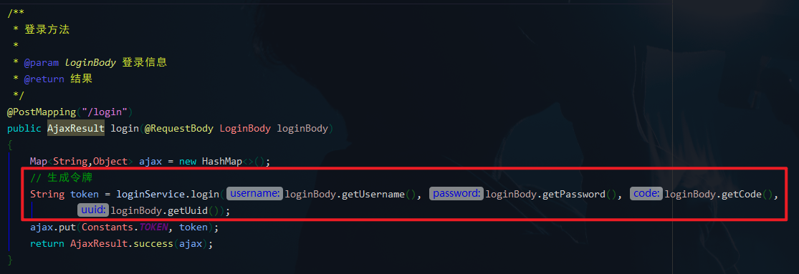<br>

登录验证方法<br>
`com.ruoyi.framework.web.service.SysLoginService.login(String, String, String, String)`<br>
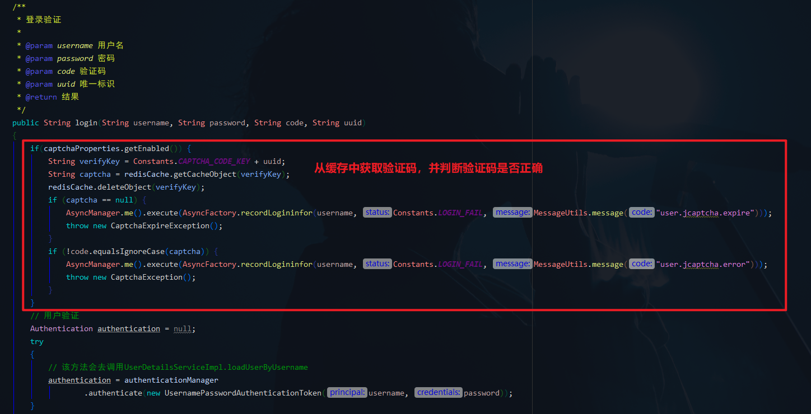<br>

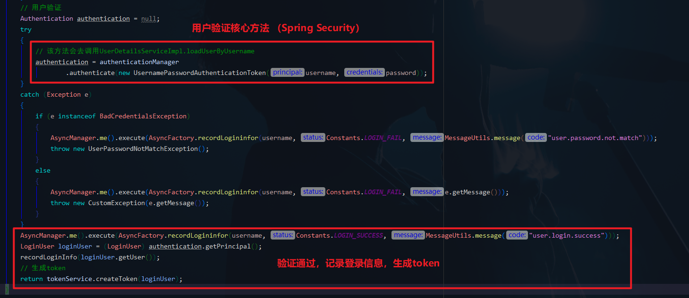<br>

由上图，用户验证方法，注释中有写 “该方法会去调用`UserDetailsServiceImpl.loadUserByUsername`”，这里放到下面验证流程再详细说明。

## 三、用户验证流程（Spring Security 源码）
对于这一部分，我推荐看下B站视频：<br>
[尚硅谷SpringSecurity框架教程（spring security源码剖析从入门到精通）](https://www.bilibili.com/video/BV15a411A7kP)

还有一篇博客（写得很详细，但是需要梯子），也是下面这张图的来源：<br>
[Spring-Security登录认证授权原理](https://wanglinyong.github.io/2018/07/10/Spring-Security%E7%99%BB%E5%BD%95%E8%AE%A4%E8%AF%81%E6%8E%88%E6%9D%83%E5%8E%9F%E7%90%86/)<br>
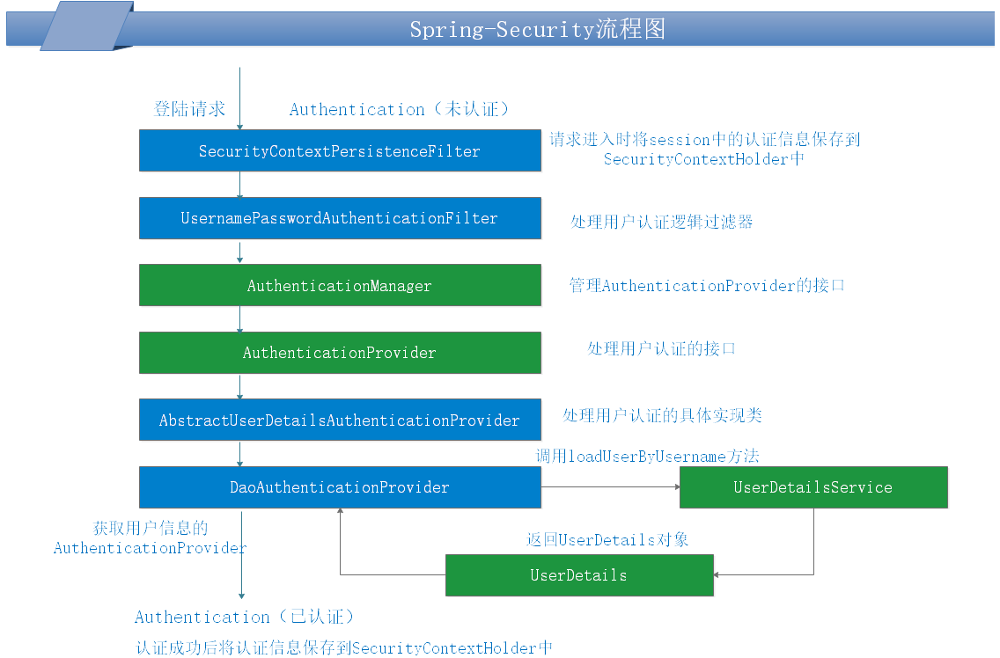<br>

**重要的事情说三遍：**
- 请跟着这张图来分析~
- 请跟着这张图来分析~
- 请跟着这张图来分析~

#### 1、处理用户认证逻辑过滤器 `UsernamePasswordAuthenticationFilter`

```java
public Authentication attemptAuthentication(HttpServletRequest request,
		HttpServletResponse response) throws AuthenticationException {
	// 默认的登录请求 url 是"/login"，并且只允许 POST 方式的请求
	if (postOnly && !request.getMethod().equals("POST")) {
		throw new AuthenticationServiceException(
				"Authentication method not supported: " + request.getMethod());
	}

	// 从 HttpServletRequest 中获取用户名、密码
	String username = obtainUsername(request);
	String password = obtainPassword(request);

	if (username == null) {
		username = "";
	}

	if (password == null) {
		password = "";
	}

	username = username.trim();

	// 创建 UsernamePasswordAuthenticationToken 对象
	// 任何希望创建 UsernamePasswordAuthenticationToken 的代码都可以安全地使用此构造函数，因为 isAuthenticated() 将返回 false。
	UsernamePasswordAuthenticationToken authRequest = new UsernamePasswordAuthenticationToken(
			username, password);

	// 提供以便子类可以配置放入身份验证请求的详细信息属性中的内容。
	// Allow subclasses to set the "details" property
	setDetails(request, authRequest);

	// 获取 AuthenticationManager，调用认证方法
	return this.getAuthenticationManager().authenticate(authRequest);
}
```
#### 2、ProviderManager
`AuthenticationManager` 实现类 `ProviderManager`<br>
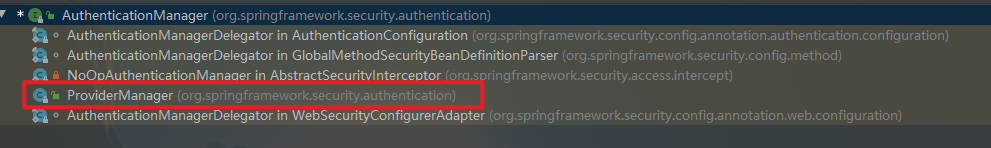<br>

查看 `authenticate(Authentication)` 方法：<br>
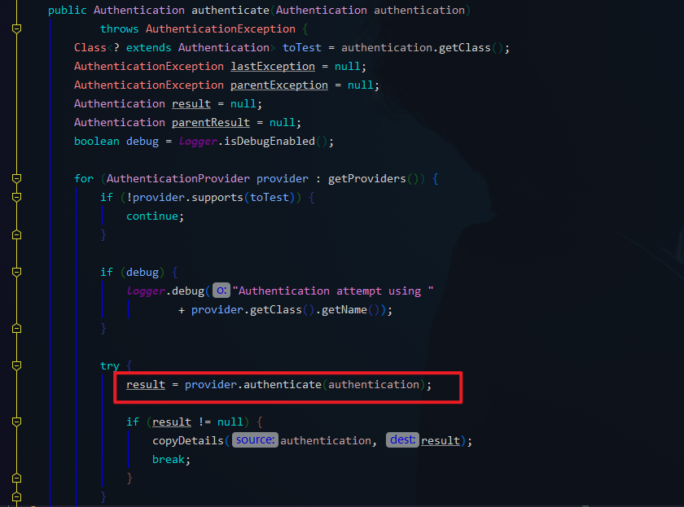<br>

通过 for 循环遍历 `AuthenticationProvider` 对象的集合，找到支持当前认证方式的 `AuthenticationProvider`，找到之后调用该 `AuthenticationProvider` 的 `authenticate` 方法进行认证处理。
#### 3、处理用户认证接口 `AuthenticationProvider `
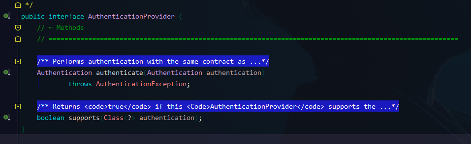
接口方法：
- 认证方法 `authenticate `
- 是否支持某种类型token的方法 `supports`
  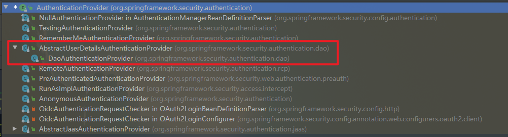
#### 4、用户认证实现类 `AbstractUserDetailsAuthenticationProvider`
`AbstractUserDetailsAuthenticationProvider` 抽象类，查看 `supports` 方法：<br>
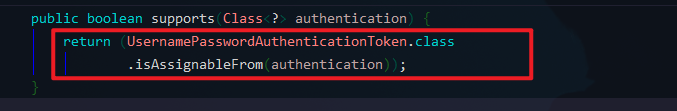<br>

说明支持 `UsernamePasswordAuthenticationToken` 类型。<br>

查看 `authenticate(Authentication)` 方法：<br>
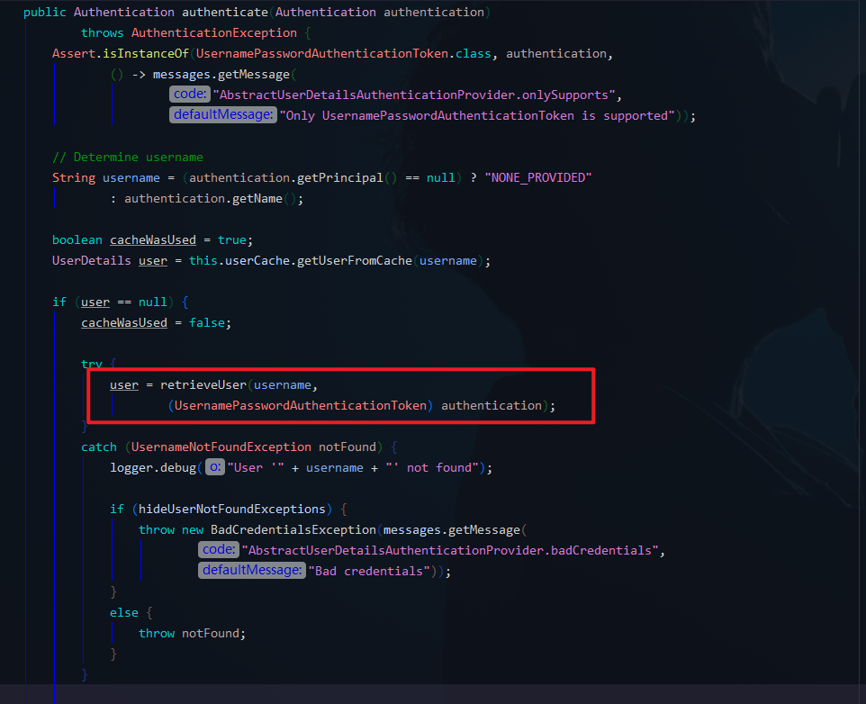<br>

由上图，从缓存中获取 `UserDetails` ，如果没有则调用 `retrieveUser` 方法获取。<br>

`UserDetails` 是保存用户信息的接口。若依中的 `LoginUser` 也实现了这个接口用于保存登录用户的相关信息。<br>
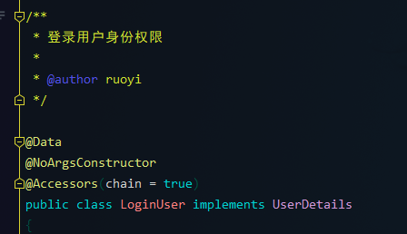<br>

接着往下查看 `authenticate(Authentication)` 方法：<br>
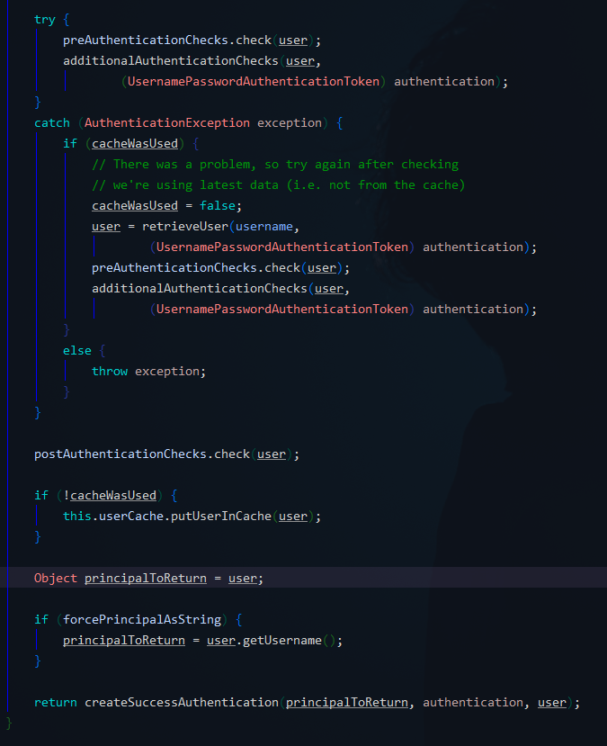<br>

预检查 `preAuthenticationChecks` ：<br>
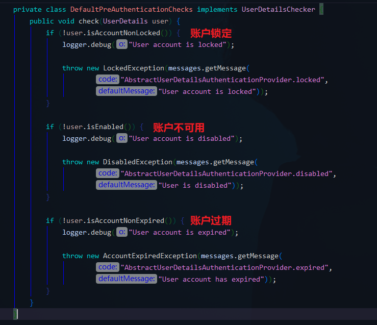<br>

附加检查 `additionalAuthenticationChecks` 是一个抽象方法，稍后再看子类具体实现。<br>

后检查 `postAuthenticationChecks` ：<br>
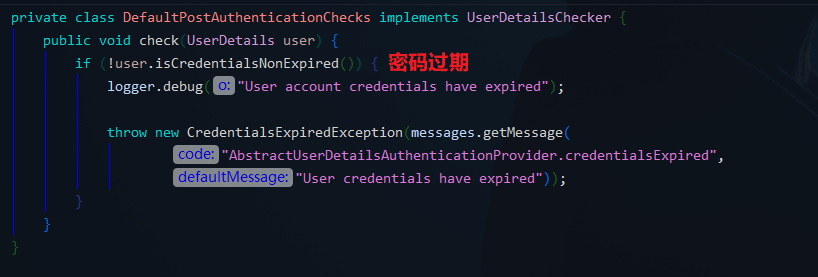<br>

如果上面的检查都通过并且没有异常，表示认证通过，会调用下面的方法：<br>
`createSuccessAuthentication(principalToReturn, authentication, user);`<br>
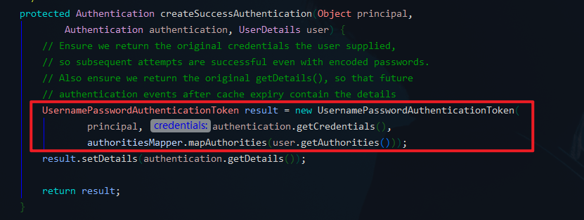<br>

此时会调用父类的构造方法设置权限信息，并调用父类的 `setAuthenticated(true)` 方法，到这里就表示认证通过了。<br>
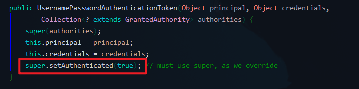
#### 5、用户认证实现类子类 `DaoAuthenticationProvider`
附加检查 `additionalAuthenticationChecks` 实现：<br>
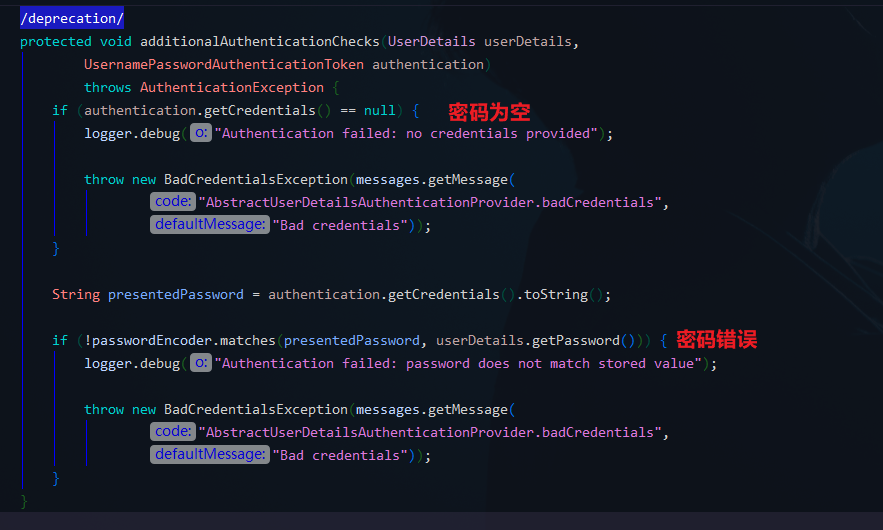<br>

获取用户信息 `UserDetails` 的方法 `retrieveUser` ：<br>
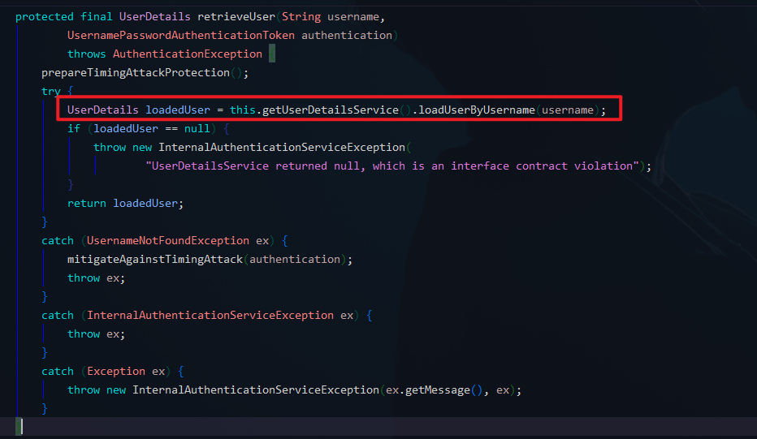<br>

`this.getUserDetailsService()` 获取的 `UserDetailsService` 是一个接口，若依也实现了该接口。<br>
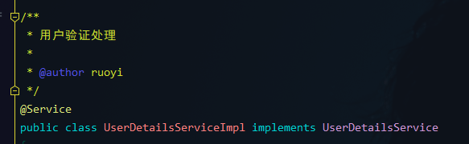<br>

至此，终于到刚才第二部分所说的 `UserDetailsServiceImpl.loadUserByUsername` 的实现。<br>
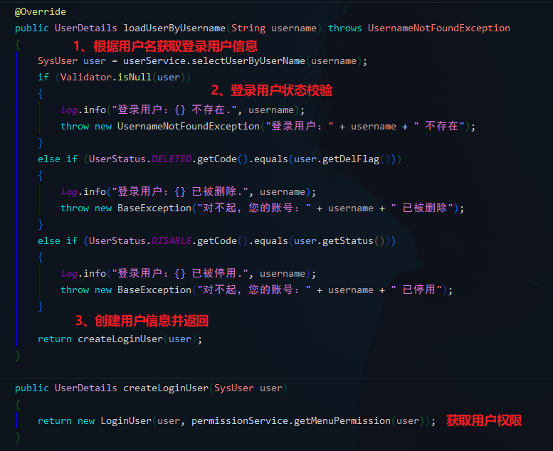
## 四、认证信息共享
#### 1、`AbstractAuthenticationProcessingFilter`
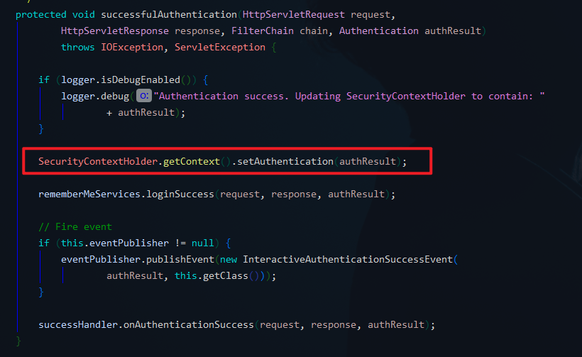<br>

进入 `SecurityContextHolder.getContext()` ：<br>
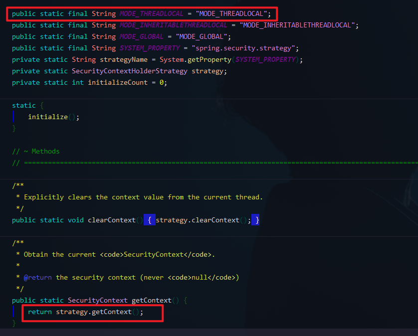<br>

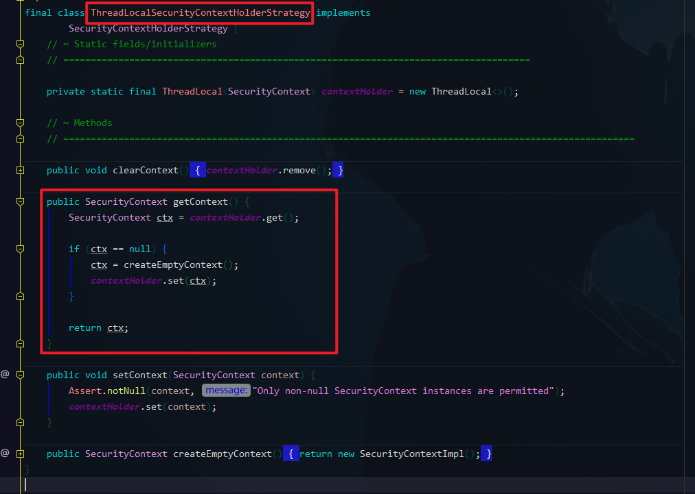<br>
#### 2、`SecurityContextPersistenceFilter`
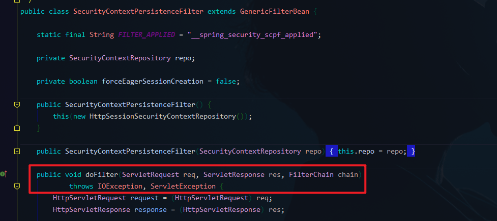

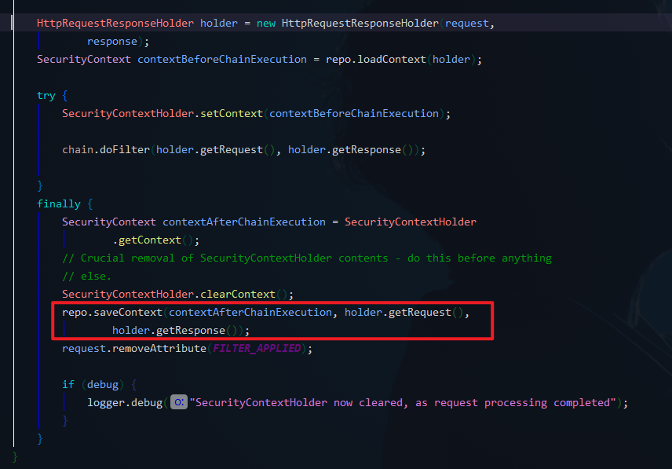

