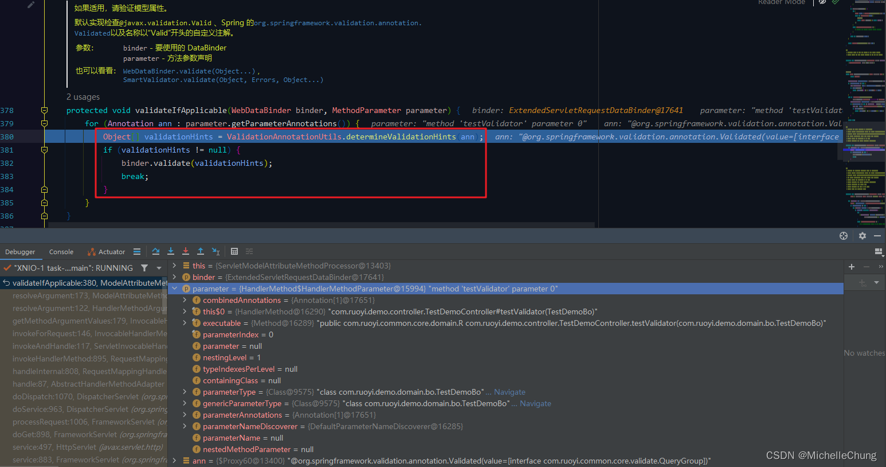
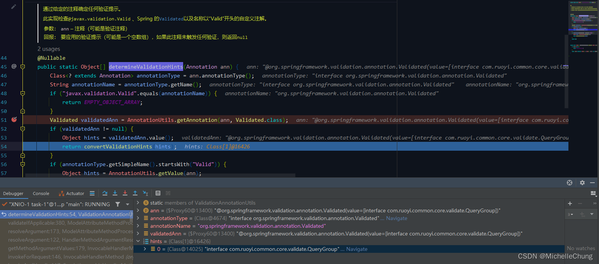
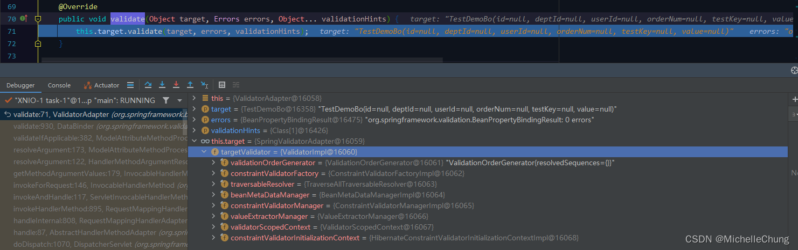

# Validator（一）校验器对 Model 属性校验调用流程分析
- - -
## 前言
前几天群里聊到了有关 EasyExcel 导入校验的问题，因为用到了 `Spring Validation` 校验（底层是 `Hibernate Validator`），加上涉及到监听器等方面的组件，所以本篇先对 `Hibernate Validator` 校验流程进行分析，后面会单独再出一篇关于 EasyExcel 导入流程校验的文章。

## 参考目录
- [Hibernate Validator 6.2.4.Final - Jakarta Bean Validation Reference Implementation: Reference Guide](https://docs.jboss.org/hibernate/validator/6.2/reference/en-US/html_single/)
  Hibernate Validator V6.2.4.Final 官方文档（Spring Boot V2.7.3 集成）
- [Java Bean Validation](https://docs.spring.io/spring-framework/docs/5.3.22/reference/html/core.html#validation-beanvalidation)
  Spring Framework V5.3.22 官方文档（Spring Boot V2.7.3 集成）
- [springboot 配置 Validator 校验框架国际化 支持快速返回（@疯狂的狮子Li）](https://blog.csdn.net/weixin_40461281/article/details/121597834)
  框架集成 Validator 介绍
- [Validated、Valid 、Validator，他们的区别你知道几个（@琦彦）](https://blog.csdn.net/fly910905/article/details/119850168)
  关于 @Validated、@Valid 的介绍，很详细，建议读一读
- [Spring Boot 从入门到实战 - 4.4 数据验证（@章为忠）](https://weread.qq.com/web/bookDetail/0f832150727abda40f80656)
- [SpringBoot 如何进行参数校验，老鸟们都这么玩的！（@飘渺Jam）](https://blog.csdn.net/jianzhang11/article/details/119632467)

## 框架集成
### 1、Maven
`ruoyi-common` 模块 `pom.xml` 
 

由 Spring Boot 引入 `spring-boot-dependencies-2.7.3.pom` 
 
### 2、校验框架配置类 `ValidatorConfig`
 

`fail_fast` 模式实际上就是报错了之后立即返回，不再校验后面的参数，如果需要返回所有的错误信息（例如 Excel 导入数据验证），则此处可以不设置或者设置为 `false`。
### 3、测试方法
简单起见，我用了原有的 `TestDemoBo` 对象，对属性 `id` 进行非空校验。 

`com.ruoyi.demo.controller.TestDemoController#testValidator` 

**注：这里的测试方法只是为了演示方便，所以直接在 Controller 调用了 mapper 的方法，实际开发中请遵守代码规范进行编写。**

`com.ruoyi.demo.domain.bo.TestDemoBo` 
 

估计很多朋友看我的博客的时候都不会去看参考文档，所以我在此再强调一下，`@Validated` 是 Spring 官方提供的校验注解，里面增加了对分组 `groups` 的支持。

分组的好处是：同一个对象，可以根据不同的业务功能进行不同的分组校验（例如，新增——`AddGroup`，编辑——`EditGroup`），无需再重复编写类似的多个对象（例如，新增——`AddBo`，编辑——`EditBo`），避免过多的冗余代码。

### 4、接口测试
### 4.1、校验失败（参数为 null）

控制台输出（部分）： 

### 4.2、校验成功（参数不为 null）

控制台输出： 

下面对于校验失败的流程进行简单分析。

## 执行流程分析
在 Spring 处理请求时，需要先对请求参数进行解析，Validator 校验器就是在参数解析前根据注解来进行校验。
### `InvocableHandlerMethod#invokeForRequest`

### `InvocableHandlerMethod#getMethodArgumentValues`

### Model 参数解析 `ModelAttributeMethodProcessor#resolveArgument`
 

### 验证适用判断 `ModelAttributeMethodProcessor#validateIfApplicable`
 

`ValidationAnnotationUtils#determineValidationHints` 
 

请求参数标注了 `@Validated`，返回适配的验证提示（`QueryGroup`）。 

`ValidationAnnotationUtils#convertValidationHints` 
 

`validationHints` 不为 null，需要进行校验。 

### `DataBinder#validate`
 

### `ValidatorAdapter#validate`

### `SpringValidatorAdapter#validate`

### Hibernate 校验器 `ValidatorImpl#validate`

### 上下文分组校验 `ValidatorImpl#validateInContext`

`ValidatorImpl#validateConstraintsForCurrentGroup` 

此处循环校验所有的约束。
### 校验约束 `ValidatorImpl#validateMetaConstraint`

判断是否需要验证 `ValidatorImpl#isValidationRequired`，此处只有属性 `id` 需要校验。 

判断完成，回到 `ValidatorImpl#validateMetaConstraint` 继续进行校验。 

`MetaConstraint#doValidateConstraint` 

### 校验约束 `ConstraintTree#validateConstraints`

### `SimpleConstraintTree#validateConstraints`

### 单一约束判断 `ConstraintTree#validateSingleConstraint`

### Not Null 校验器 `NotNullValidator#isValid`

至此可知校验结果为 `false`。

### 返回校验结果
`ConstraintTree#validateSingleConstraint`

`SimpleConstraintTree#validateConstraints` 

`ConstraintTree#validateConstraints` 

`MetaConstraint#doValidateConstraint` 

`ValidatorImpl#validateMetaConstraint` 

判断是否是 `fail_fast` 模式： 

`ValidatorImpl#validateInContext` 

### 抛出异常 `ModelAttributeMethodProcessor#resolveArgument`

### 全局异常捕获 `GlobalExceptionHandler#handleBindException`

