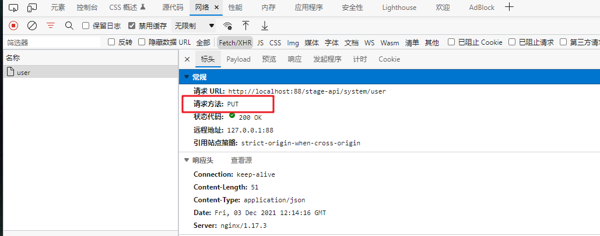

# 前端打包流程 + 通过 nginx 配置限制系统非正常请求操作（演示模式）

## 前言
昨晚在交流群里有大佬提及【[系统演示环境](http://ryplus.srcw.top/)】数据被人删除了，因而 [狮子大佬](https://blog.csdn.net/weixin_40461281) 去服务器上修改了 nginx 相关配置，限制了系统修改和删除数据的操作，感谢大佬的分享，所以我也在本地操作了一下，顺便记录一下这个流程。

## 一、概述
本文主要内容是关于配置 nginx 限制系统非正常请求操作，也包含了打包部署到本地的流程。
## 二、环境准备
| 名称       | 参数          | 备注      |
|----------|-------------|---------|
| 系统       | Win10 64位   | -       |
| Nginx    | 1.17.3      | -       |
| Node.js* | **10.15.3** | 14.16.1 |
| npm*     | **6.4.1**   | 6.14.12 |
| Maven    | 3.6.1       | -       |
| JDK      | 1.8         | -       |

**注：备注中的版本号是在另一部电脑的版本配置，但是用相同配置打包出来会报错，请留意。**

## 三、项目部署
### 参考目录
- [若依环境部署 - 前端部署](http://doc.ruoyi.vip/ruoyi-vue/document/hjbs.html#%E5%89%8D%E7%AB%AF%E9%83%A8%E7%BD%B2)
- [搭建Admin监控](https://gitee.com/JavaLionLi/RuoYi-Vue-Plus/wikis/%E5%BF%AB%E9%80%9F%E5%BC%80%E5%A7%8B/%E6%90%AD%E5%BB%BAAdmin%E7%9B%91%E6%8E%A7)
- [搭建任务调度中心](https://gitee.com/JavaLionLi/RuoYi-Vue-Plus/wikis/%E5%BF%AB%E9%80%9F%E5%BC%80%E5%A7%8B/%E6%90%AD%E5%BB%BA%E4%BB%BB%E5%8A%A1%E8%B0%83%E5%BA%A6%E4%B8%AD%E5%BF%83)

后端部署没什么好说的，配置好环境就可以了。主要是前端部署不大熟悉需要看下具体配置。<br>
<br>

本文使用的是演示环境打包，因此需要修改 `.env.staging` 文件配置如下：<br>
<br>

点击演示环境打包，等待控制台显示打包结束。<br>
<br>

打包完成会在 `ruoyi-ui` 目录下多一个 `dist` 文件夹，将文件夹内容复制到 Nginx 文件夹下的 `html` 目录下。<br>
<br>

修改 Nginx 配置文件 `nginx.conf` 。<br>


```conf
server {
        listen       88;
        server_name  localhost;
        
        location / {
            root   html;
            index  index.html index.htm;
			try_files $uri $uri/ /index.html;
        }
		
		# 配置转发
		location /stage-api/ {
			proxy_pass http://localhost:8080/;
		}
		
		# 演示模式，过滤非 GET|POST 请求
		if ($request_method !~* GET|POST) {
			rewrite ^/(.*)$ /403;
		}
		
		location = /403 {
			default_type application/json;
			return 200 '{"msg":"演示模式，不允许操作","code":500}';
		}
}
```
修改完成后，重启 Nginx 。

## 四、效果展示
### 修改用户



### 删除用户


因为同时配置了 Spring Boot Admin 和 XXL-Job，也顺便展示出来。具体配置可参照官方文档。这里不做赘述。
### Spring Boot Admin


### XXL-Job

