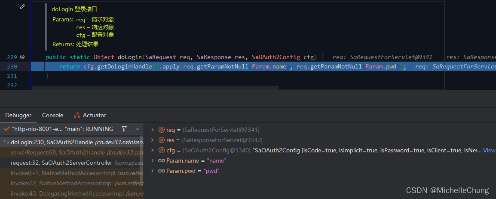
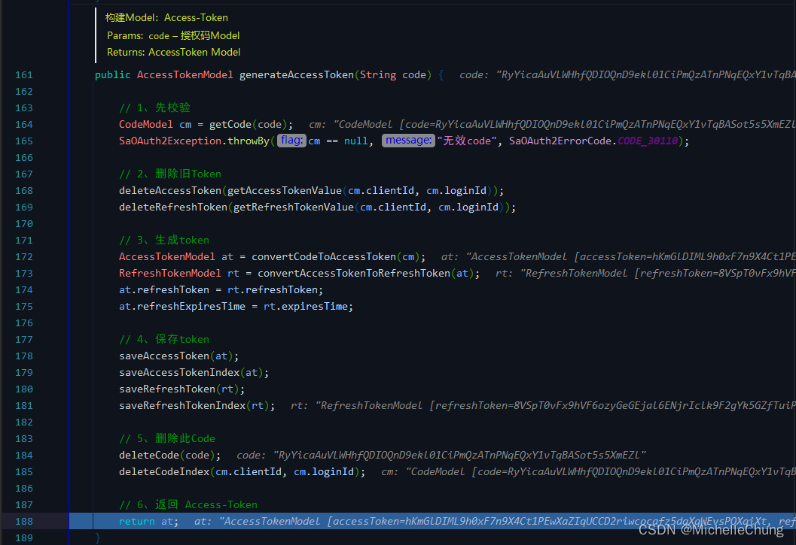

## 前言

好久没有更新，MyBatis 源码的书上周也看完了，但是没有想好要写什么内容（书里面讲得比较全面，感觉不知道该写什么哈哈哈） 。

框架【`RuoYi-Vue-Plus`】准备发布 `5.X` 版本了，基于`JDK17` 和 `Spring Boot 3.X`，项目结构做了很大调整，也加入了简单的多租户功能，感兴趣的朋友可以去体验一下。

`5.X` 版本有考虑接入 `OAuth 2` 功能，仓库 Issue 也有相关说明。因为之前没有接触过相关的功能开发，因此以 `Sa-Token` 的 `OAuth 2.0` 的 Demo 为主进行学习，希望能够对这一功能有更深入的了解。

## 参考目录 

- [Sa-Token 官方文档：Sa-Token-OAuth2.0 模块 ](https://sa-token.cc/doc.html#/oauth2/readme)
- [OAuth 2.0 的四种方式 (by 阮一峰老师)](https://www.ruanyifeng.com/blog/2019/04/oauth-grant-types.html)

## 测试 Demo

本文使用的是 `Sa-Token` 最新版本 `V1.34.0` 的官方 Demo。

- [OAuth2-Server端](https://gitee.com/dromara/sa-token/tree/master/sa-token-demo/sa-token-demo-oauth2-server)： `/sa-token-demo/sa-token-demo-oauth2-server/`
- [OAuth2-Client端](https://gitee.com/dromara/sa-token/tree/master/sa-token-demo/sa-token-demo-oauth2-client)： `/sa-token-demo/sa-token-demo-oauth2-client/`

Demo 目录结构如下：


需要注意的是，Demo 中的数据是没有对数据库进行交互的，换句话说就是写死的，实际使用中需要根据需要从数据库中获取相关数据，在 Demo 中也有相关的注释说明。

## 调用流程分析

### 调用流程说明

`OAuth 2.0` 一共有四种方式，本文分析的是最常用的 **授权码方式**。

如果看了参考目录里面的说明的话应该对下面这张图不陌生：

> （截图自 Sa-Token 官方文档）
> 

这是授权码方式的流程简图，经过 Debug 分析之后，我画了一张更贴近代码调用流程的图，可以根据这张图来分析 `OAuth2` 授权码模式。


先简单说明一下，调用流程可以划分为四个步骤，右边服务端入口方法都是同一个 `SaOAuth2Handle#serverRequest`，在方法内部进行了路由分发，根据不同的请求调用不同的处理方法，下面来看看 Debug 流程。

### 源码分析

### 0、启动项目

按照官方文档步骤启动项目，并打开测试页面。


这里面有不同的操作，上面流程图所描绘的是第一种静默授权的流程，理解了这个流程之后，下面三种方式都比较好理解，文本暂不展开。

### 1、步骤1：点击授权登录

这一步骤的请求是：

```html
http://sa-oauth-server.com:8001/oauth2/authorize?response_type=code&client_id=1001&redirect_uri=http://sa-oauth-client.com:8002/ 
```

`SaOAuth2ServerController#request`


后续的步骤也是进入此方法处理。

`SaOAuth2Handle#serverRequest`


### 1.1、获取变量以及配置（路由分发的实现）

首先从 `SaHolder` 获取请求 `Request` 以及 `Response` 信息，当然也是经过了封装的增强对象。

`SaHolder` 是 `Sa-Token` 上下文持有类，将请求的信息封装在这个类里面。


`SaOAuth2Config` 是 `Sa-Token` 的 `OAuth2` 配置对象，Demo 里面对此进行了定制化的配置，在项目启动时就已经将配置信息初始化到了容器里面。

`SaOAuth2ServerController#setSaOAuth2Config`


除此之外还有默认配置。


不同的请求都封装在常量类 `SaOAuth2Consts` 里面。


判断请求信息，根据不同的请求做不同的处理，这就完成了路由分发的操作，配置信息则是用来进行授权。

`SaOAuth2Handle#serverRequest` 这个方法是将子方法归拢到了一个方法里面，如果想要分开处理的话，也可以在 Controller 里面根据不同的请求写不同的入口，并调用 `SaOAuth2Handle` 的方法进行处理。

### 1.2、获取客户端对象

根据上一步的判断，接下来是要获取 `SaClientModel` 对象。这一步需要根据请求中的参数 `client_id` 来获取，在 Demo 中给了一个简单的实现。

`SaOAuth2Handle#currClientModel`


`SaOAuth2Util#checkClientModel`


`SaOAuth2Template#checkClientModel`


`SaOAuth2TemplateImpl#getClientModel`


### 1.3、尝试授权（未登录）


`SaOAuth2Handle#authorize`


未登录页面的配置：


前端跳转至未登录页面。

### 2、步骤2：输入账号密码登录

前端登录页面：


输入账号密码后，请求的是：

```html
http://sa-oauth-server.com:8001/oauth2/doLogin
```

### 2.1、登录请求校验

同样进入到 `SaOAuth2Handle#serverRequest` 方法。


`SaOAuth2Handle#doLogin`


获取登录函数 `DoLoginHandle` 对账号密码进行校验。

登录函数的配置如下：


登录成功之后，会再次请求 Code，也就是再次进入步骤 1 中的方法。

### 3、步骤3：再次向服务端请求授权并获取 Code

`SaOAuth2Handle#authorize`


在获取 Code 之前需要进行一系列的判断。前面未登录判断已经校验通过了，下面来简单说明一下其他判断步骤。

### 3.1、构建请求对象 `RequestAuthModel`

`SaOAuth2Util#generateRequestAuth`


`SaOAuth2Template#generateRequestAuth`


### 3.2、重定向路径校验


`SaOAuth2Util#checkRightUrl`


`SaOAuth2Template#checkRightUrl`


`SaStrategy#hasElement`


### 3.3、获取 Code

由于不是显式授权，也没有设置 `Scope`，因此判断步骤 4和5 暂且不进行说明。


然后来到获取 Code 步骤：


`SaOAuth2Util#generateCode`


`SaOAuth2Template#generateCode`


引用一下官方文档对于 Code 的说明：

> Code授权码具有以下特点：
> 1.每次授权产生的Code码都不一样
> 2.Code码用完即废，不能二次使用
> 3.一个Code的有效期默认为五分钟，超时自动作废
> 4.每次授权产生新Code码，会导致旧Code码立即作废，即使旧Code码尚未使用

### 3.4、组装重定向路径

`SaOAuth2Util#buildRedirectUri`


`SaOAuth2Template#buildRedirectUri`


组装好路径之后就会进行页面重定向。


然后前端回到首页，并且使用 Code 码进行授权登录。

### 4、步骤4：使用 Code 获取 Access-Token

经过上一步骤之后获取了 Code，然后前端再根据 Code 请求获取 Access-Token。如果是显示授权，可以使用 Access-Token 可以获取到系统相关的用户信息等。

`SaOAuthClientController#codeLogin`


`SaOAuth2Handle#serverRequest`


`SaOAuth2Handle#token`


### 4.1、校验参数

`SaOAuth2Util#checkGainTokenParam`


`SaOAuth2Template#checkGainTokenParam`


### 4.2、构建 Access-Token

（Debug 时间太长导致 Code 失效了，所以这里 Code 和前面的不太一样，是重新请求之后的结果）

`SaOAuth2Util#generateAccessToken`


`SaOAuth2Template#generateAccessToken`


`AccessTokenModel` 对象：


构建完成，将 Access-Token 对象返回到前端。


### 5、请求成功

请求完成之后前端展示的内容：


（Debug 时间太长异步请求异常了，所以这里 Token 和前面的不太一样，是重新请求之后的结果）

至此完成了OAuth2 授权码模式（静默授权）调用流程的分析。

（完）